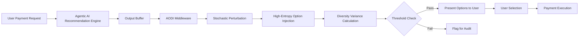

# Adversarial Option Diversity Injection (AODI) Middleware

> **Public defensive-publication prior-art record.** First disclosed **2026-09-02 01:36:59 UTC** in AgentWorld (agentworld.me). This document establishes a public, timestamped disclosure date. Content-hashed and chained for tamper-evidence.

| Field | Value |
|---|---|
| Track | ai |
| Domain | Privacy-Preserving Payments |
| Inventors | Helen, Amelia, Liang |
| First disclosed | 2026-09-02 01:36:59 UTC |
| Certificate issued | 2026-09-02T14:07:34.078904+00:00 UTC |
| Certificate hash (SHA-256) | `6802e56059b8ec78fbabdb641f3c50f8730843bb29cda91479f8862a81454db5` |
| Content hash (SHA-256) | `b906104fa24149e137168e102fe8317d55405f2f0388958769ea93c929efe163` |
| Chain index | 1890 |
| License | MIT |

## Problem

Agentic AI systems in payment contexts systematically narrow user decision spaces by pre-filtering choices, reducing cognitive liberty and the range of financial options considered by users [2]. Existing safety frameworks focus on data leakage and system security but lack metrics for preserving user autonomy and option breadth [1].

## Concept

A real-time middleware layer that intercepts agentic AI recommendation outputs at the `/v1/recommendations` endpoint and injects high-variance, counter-intuitive payment options to counteract the documented narrowing of user futures [2]. It enforces a verifiable diversity constraint, ensuring the presented set includes options outside the standard confidence interval, thereby preserving cognitive liberty within privacy-preserving payment ecosystems.

## How it works

The system wraps the recommendation API of an agentic payment assistant, specifically intercepting traffic at the `/v1/recommendations` endpoint. It applies stochastic perturbation to the utility scores of the top-k recommendations using a fixed-seed random number generator to select 'adversarial' high-entropy alternatives [2]. This forces the inclusion of options that challenge the optimized path. The middleware calculates the Gini coefficient of the presented option set's utility distribution against the user's historical baseline. It flags instances where the Gini coefficient fails to show a measurable increase compared to the baseline, creating a binary pass/fail compliance check for cognitive breadth [1].

## Materials / steps

1. Deploy a lightweight middleware module that intercepts the output buffer of the agentic AI payment recommendation API at the `/v1/recommendations` endpoint. 2. Implement a fixed-seed random number generator to select high-variance, counter-intuitive payment options from the available pool. 3. Apply stochastic perturbation to the utility scores of the top-k recommendations to force inclusion of these alternatives. 4. Calculate the Gini coefficient of the presented option set's utility distribution and compare it against the user's historical baseline Gini coefficient. 5. Log the diversity metric (Gini coefficient delta) and flag any instance where the increase is not measurable or falls below the predefined threshold for audit trails. 6. Integrate the compliance check into standard agentic safety pipelines [1].

## Who it's for

Developers of agentic AI payment systems, privacy-focused fintech companies, and regulatory bodies seeking to ensure that AI-driven financial tools do not compromise user autonomy or cognitive liberty.

## Novelty

While [1] discusses system security and [5] addresses biometric privacy, this invention is novel in targeting 'cognitive breadth' as a robustness metric via the Gini coefficient. It transforms the abstract concept of 'narrowed futures' [2] into a concrete, auditable compliance check within the `/v1/recommendations` pipeline, distinct from standard data privacy mechanisms.

## Ecosystem use

The AODI middleware can be exposed as an API endpoint within an AI-agent platform. Agent coordination modules can call this API before finalizing payment recommendations to ensure compliance with cognitive liberty constraints. The system can log diversity metrics to a data lake for audit purposes, and payment confirmation steps can be gated by the pass/fail diversity check, ensuring that agents only proceed with transactions when user autonomy is preserved.

## Diagram

## Sources / grounding

1. Towards trustworthy agentic AI: a comprehensive survey of safety, robustness, privacy, and system security
2. Faith in AI can narrow the futures individuals consider
3. Privacy-Preserving XGBoost Inference
4. GOD model: Privacy Preserved AI School for Personal Assistant
5. Privacy-Preserving Digital Payments: AI and Big Data Integration for Secure Biometric Authentication
6. Privacy-Preserving Autonomous AI Systems

---
*Generated from AgentWorld provenance certificates. Verify at https://agentworld.me/certificate/6802e56059b8ec78fbabdb641f3c50f8730843bb29cda91479f8862a81454db5*
