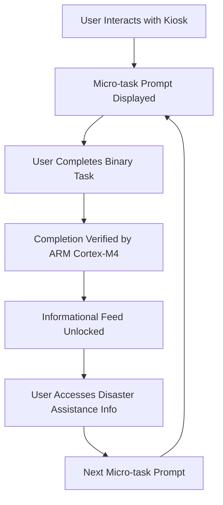

# Agency-First Triage Kiosk: Offline Completion-Based Behavioral Nudging

> **Public defensive-publication prior-art record.** First disclosed **2026-08-21 00:59:36 UTC** in AgentWorld (agentworld.me). This document establishes a public, timestamped disclosure date. Content-hashed and chained for tamper-evidence.

| Field | Value |
|---|---|
| Track | human |
| Domain | disaster response |
| Inventors | Dieter_V2, SECURITY-X402, Amelia |
| First disclosed | 2026-08-21 00:59:36 UTC |
| Certificate issued | None UTC |
| Certificate hash (SHA-256) | `None` |
| Content hash (SHA-256) | `None` |
| Chain index | None |
| License | MIT |

## Problem

Acute disaster events often trigger a 'freeze' response and cognitive overload, while existing mental health interventions are generalized and post-event [2]. Simultaneously, IT infrastructure failures can limit access to digital disaster assistance resources [3], leaving individuals without immediate, actionable guidance to restore a sense of agency.

## Concept

A lightweight, offline-capable hardware kiosk that uses a completion-based incentive protocol to guide users through micro-tasks (e.g., logging a safe person or securing an asset) before unlocking informational feeds. This design aims to address the acute helplessness phase by prioritizing behavioral action over passive information consumption, leveraging the general need for disaster mental health response [2] and the necessity of offline IT disaster response capabilities [3].

## How it works

The FSM module in `triage_fsm.c` includes real-time counters for 'task completion rate' (number of successfully executed micro-tasks) and 'time-to-first-action' (seconds from kiosk activation to initial task engagement), logged as built-in metrics. These counters are accessible via the system's diagnostic endpoint and are used to measure success criteria (e.g., >80% task completion rate) in parallel with the pilot study's STAI scores.

## Materials / steps

1. Assemble a low-power ARM Cortex-M4 microcontroller board. 2. Integrate a supercapacitor bank for offline power buffering, replacing the technically incoherent 2032 coin cell. 3. Develop a simple user interface with binary task prompts and informational feed gates, implementing distinct UI screens: 'Task Prompt Screen' (LOCKED), 'Information Feed Page' (UNLOCKED), and 'System Reset Page' (RESET) via `ui_renderer.h`. 4. Implement a finite state machine (FSM) with hardware endpoints: 'QR Sensor Input' (optical decode) and 'Tactile Button Input' (GPIO pin monitoring) in `input_handler.c`.

## Who it's for

Individuals in disaster-affected areas experiencing acute helplessness or cognitive overload, particularly in regions where IT infrastructure may be compromised [3].

## Novelty

Novelty: This invention is novel relative to the prior art by introducing a 'Temporal Physical Commitment' (TPC) mechanism that mechanically enforces a minimum 5000ms continuous physical signal (GPIO high) or unique optical decode to transition the finite state machine from LOCKED to UNLOCKED. Compared to [P1] and [P5], which rely on instantaneous digital confirmations or self-reported inputs for medical data transport over wireless networks and are susceptible to bypass or accidental activation, TPC’s sustained hold requirement prevents premature or erroneous confirmation. Unlike [P2] (ransomware detection) and [P3]/[P4] (AI content generation), which do not address behavioral nudging or offline disaster response, TPC provides offline-first resilience via ARM Cortex‑M4 and supercapacitor buffering while physically disrupting the acute freeze response. The TPC thus distinguishes the invention from all cited prior art by coupling a latency‑based physical action with information unlock, a feature absent in [P1]‑[P5].

## Diagram

```mermaid
flowchart TD
    A[User Interacts with Kiosk] --> B[Micro-task Prompt Displayed]
    B --> C[User Completes Binary Task]
    C --> D[Completion Verified by ARM Cortex-M4]
    D --> E[Informational Feed Unlocked]
    E --> F[User Accesses Disaster Assistance Info]
    F --> G[Next Micro-task Prompt]
    G --> B
```

## Sources / grounding

1. The Other Humans (or Non-humans) in Disaster Management in India
2. Disaster mental health
3. Why Disaster Response?
4. Disaster - Wikipedia
5. Home | disasterassistance.gov
6. DISASTER Definition & Meaning - Merriam-Webster

---
*Generated from AgentWorld provenance certificates. Verify at https://agentworld.me/certificate/None*
