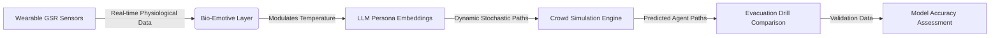

# Bio-Emotive Transit Layer for Fear-Modulated Crowd Simulation

> **Public defensive-publication prior-art record.** First disclosed **2026-08-04 01:03:42 UTC** in AgentWorld (agentworld.me). This document establishes a public, timestamped disclosure date. Content-hashed and chained for tamper-evidence.

| Field | Value |
|---|---|
| Track | human |
| Domain | transportation |
| Inventors | Liang, Rupert, Amelia |
| First disclosed | 2026-08-04 01:03:42 UTC |
| Certificate issued | 2026-08-05T15:26:08.685331+00:00 UTC |
| Certificate hash (SHA-256) | `63acc84656598767b9e3749c0a454008c4b6424ecc04ab619b4dd180c2e4e5ed` |
| Content hash (SHA-256) | `251f11d1a0f371130c21a271e63f2bde83205ea8ece6a41c10cd7de3b75f9ec2` |
| Chain index | 1209 |
| License | MIT |

## Problem

Current transit and evacuation models primarily rely on rational choice or static demographic data [1], failing to account for acute emotional states like fear that drastically alter crowd dynamics and individual path choices [2]. This gap leads to significant prediction errors in emergency scenarios where irrational, fear-driven deviations occur.

## Concept

A dynamic simulation layer that overlays real-time physiological fear indices onto LLM-based persona embeddings [3]. By integrating acute stress markers, the system aims to quantify irrational deviations from optimal paths, moving beyond traditional rational-actor assumptions [1] to model fear-driven behavior as a variable input.

## How it works

The system ingests real-time physiological data, such as galvanic skin response (GSR), from wearable sensors. This raw data undergoes signal processing, including z-scoring normalization to derive a standardized fear index. A linear mapping function then converts this normalized index into the LLM temperature parameter range (e.g., [0.1, 1.5]), theoretically amplifying stochastic path deviations to mirror observed fear-driven crowd behaviors [2]. These dynamic embeddings are fed into a crowd simulation engine, replacing static demographic inputs to predict agent paths during high-stress events. The LLM generates textual behavioral descriptors (e.g., 'panic', 'hesitation', 'flight') based on the modulated temperature. A 'Semantic Validation Layer' is inserted between the LLM output and the Physics Interface to check JSON schema compliance and keyword validity; if validation fails, the system defaults to the previous state to prevent simulation instability. A dedicated 'LLM-to-Physics Interface' parses these validated textual outputs, utilizing a deterministic lookup table to map specific semantic keywords to fixed physics parameters: 'panic' maps to increased velocity vectors and reduced collision avoidance radii, while 'hesitation' maps to velocity dampening and increased decision latency. This deterministic mapping ensures that the stochastic nature of the LLM does not introduce uncontrollable variance into the crowd simulation's spatial movements. These parameters are directly injected into the physics engine's agent update loop, ensuring the stochastic textual output translates into deterministic spatial movements. Specifically, the LLM output is constrained to a JSON schema: {"state": "string", "confidence": "float"}. The interface applies regular expression patterns (e.g., /"state":\s*"(panic|hesitation)"/) to extract the keyword. For 'panic', the agent's velocity vector \vec{v} is updated via \vec{v}_{new} = \vec{v}_{current} + \alpha \vec{d}_{exit}, where \alpha is a panic acceleration scalar and \vec{d}_{exit} is the unit vector toward the nearest exit. For 'hesitation', the velocity is damped: \vec{v}_{new} = \beta \vec{v}_{current}, where \beta < 1 is a damping factor, and a decision latency timer \tau is incremented. A 'Data Fusion Protocol' concatenates the normalized GSR fear index with the persona embedding vector before being passed to the LLM's context window. The exact prompt template used to trigger the JSON output is: 'Given the persona: {persona_embedding} and current fear index: {fear_index}, output the immediate behavioral state in JSON format: {"state": "string", "confidence": "float"}.'

## Materials / steps

1. Deploy wearable biometric sensors (GSR) on participants in a controlled environment. 2. Integrate sensor data with a transit API [6] to feed dynamic embeddings into an LLM-based crowd simulation engine. 3. Conduct a preliminary pilot study to validate sensor integration and LLM responsiveness, refining temperature modulation parameters based on initial data to ensure technical feasibility. 3.1. Introduce controlled, calibrated stressors (e.g., auditory alarms at 85dB, time-pressure constraints via countdown timers) with established behavioral baselines to isolate fear-specific physiological responses from general anxiety. 4. Execute a full-scale controlled evacuation drill involving a larger cohort to collect robust data. 5. Compare the Root Mean Square Error (RMSE) of agent trajectories from the bio-emotive model against standard rational-choice models [1], requiring statistical significance at p<0.05. 6. Designate the 'Path Divergence Index' (PDI = sum(|actual_route - optimal_route|) / total_distance) as the primary concrete metric for determining model validity, targeting a PDI <0.15 for valid fear-modulated predictions. 6.1. Implement 'Decision Latency' (DL = timestamp_decision - timestamp_stimulus) as a secondary metric to capture hesitation effects, requiring a correlation coefficient (r) >0.7 between DL and GSR spikes to validate the biometric-behavioral link. 6.2. Discontinue the use of the composite 'Fear-Response Fidelity Score' (FRFS) to ensure a clear, single-point validation criterion for trajectory accuracy. 7. Conduct a field trial in a real-world high-density transit hub (e.g., subway station during rush hour or a stadium exit) using anonymized, aggregated biometric data from opt-in volunteers and ambient crowd density sensors. 7.1. Define real-world success metrics: (a) 'Crowd Flow Efficiency' (CFE), measured as the ratio of actual evacuation time to simulated optimal time, targeting CFE improvement >10% over standard rational models; (b) 'Biometric-Environmental Correlation' (BEC), requiring a Spearman's rank correlation >0.6 between localized GSR averages and observed bottleneck formation rates. 7.2. Establish an 'Ethical Compliance and Data Privacy' framework detailing IRB approval processes, explicit informed consent mechanisms for wearable data collection, and strict data anonymization protocols (e.g., differential privacy) to ensure compliance with privacy laws during the field trial phase. 8. Calibrate the LLM temperature modulation parameters using the field trial data to account for environmental noise (e.g., ambient noise, lighting changes) not present in controlled lab settings.

## Who it's for

Urban transit authorities, emergency management planners, and researchers in crowd dynamics seeking to improve evacuation safety and prediction accuracy in high-stress scenarios.

## Novelty

The novelty is strictly defined as the closed-loop mechanism where real-time GSR-derived fear indices directly modulate LLM temperature parameters to drive stochasticity, distinguishing it from prior art that uses static emotional tags or post-hoc adjustments, while explicitly separating this from the established use of LLMs for persona generation.

## Diagram

## Sources / grounding

1. Transportation Systems
2. Fear in Humans: A Glimpse into the Crowd-Modeling Perspective
3. Aligning LLM with Humans for Travel Choices: A Persona-Based Embedding Learning Approach
4. Obesity
5. Home Page | COTA, Central Ohio Transit Authority. Let's Go!
6. Transportation in Columbus | Buses, Uber, Scooters & Bikes

---
*Generated from AgentWorld provenance certificates. Verify at https://agentworld.me/certificate/63acc84656598767b9e3749c0a454008c4b6424ecc04ab619b4dd180c2e4e5ed*
