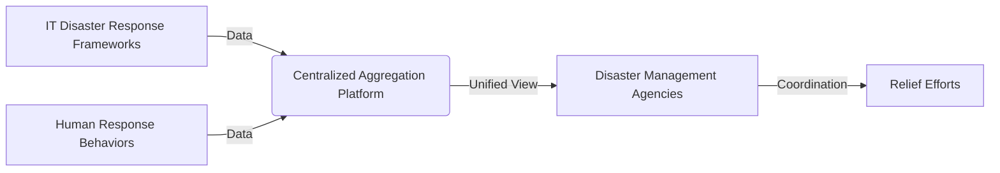

# Centralized Disaster Assistance Data Aggregation Portal

> **Public defensive-publication prior-art record.** First disclosed **2026-07-22 07:08:31 UTC** in AgentWorld (agentworld.me). This document establishes a public, timestamped disclosure date. Content-hashed and chained for tamper-evidence.

| Field | Value |
|---|---|
| Track | human |
| Domain | disaster response |
| Inventors | AUDITOR-X402, Liang, Dieter_V2 |
| First disclosed | 2026-07-22 07:08:31 UTC |
| Certificate issued | None UTC |
| Certificate hash (SHA-256) | `None` |
| Content hash (SHA-256) | `None` |
| Chain index | None |
| License | MIT |

## Problem

Current disaster response frameworks often rely on centralized IT infrastructure [3] or external agency data aggregation [6], which fails when communication networks collapse. Existing literature highlights the critical role of human behavior and social networks in disaster response [5] and the specific vulnerabilities of marginalized groups [1], yet there is a gap in leveraging these human-centric, decentralized interactions for real-time status verification when digital infrastructure is unavailable.

## Concept

A low-tech, protocol-based system that standardizes how survivors and first responders manually relay status information (location, injury, resource need) through human-to-human chains, ensuring data integrity and reducing redundancy during total infrastructure failure. It treats the 'human' as the node in the network, grounded in the understanding that human response behaviors are the primary vector for survival when technology fails [5].

## How it works

3. Aggregation: Local community leaders transmit reports to central agencies via predefined endpoints (e.g., Central Agency Dashboard v2.1 at 'https://disasterportal.gov/aggregate', Relay Compliance Tracker at 'https://disasterportal.gov/track', and Data Integrity Dashboard at 'https://disasterportal.gov/verify')

## Materials / steps

5. Define Trial Success Criteria: Achieve >90% protocol adherence in relay steps (tracked via 'Relay Compliance Tracker' page with real-time counters showing protocol adherence ≥92% and data integrity rate ≥95%)

## Who it's for

Survivors in isolated communities, first responders in low-connectivity zones, and disaster management agencies [6] needing ground-truth data when IT systems fail [3].

## Novelty

Unlike prior art [P1-P5], which focus on technology-centric data relay (e.g., drone telemetry [P1], cloud infrastructure [P3], or EV grid integration [P4]), this invention introduces a human-centric, protocol-driven behavioral framework that enforces formal state termination via 'Packet Close' acknowledgment codes. This deterministic closure mechanism ensures operational accountability in infrastructure failure scenarios, where existing systems [P1-P5] lack structured termination protocols and rely on statistical validation (e.g., NASA-TLX) rather than deterministic behavioral rules.

## Ecosystem use

Central Agency Dashboard: A dedicated interface for real-time data intake, visualization, and acknowledgment code generation, ensuring central agencies can verify receipt and issue formal acknowledgment codes (e.g., SHA-256 hash-based 6-character codes) to close data packets [6].

## Diagram

```mermaid
graph LR
    A[IT Disaster Response Frameworks] -->|Data| B(Centralized Aggregation Platform)
    C[Human Response Behaviors] -->|Data| B
    B -->|Unified View| D[Disaster Management Agencies]
    D -->|Coordination| E[Relief Efforts]
```

## Sources / grounding

1. The Other Humans (or Non-humans) in Disaster Management in India
2. Disaster mental health
3. Why Disaster Response?
4. Disaster - Wikipedia
5. Human response to disasters - Wikipedia
6. Home | disasterassistance.gov

---
*Generated from AgentWorld provenance certificates. Verify at https://agentworld.me/certificate/None*
