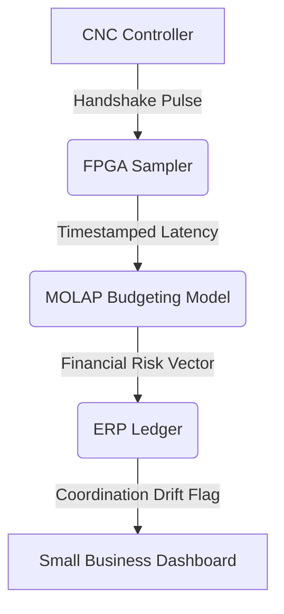

# CNC-ERP Cycle-Time Variance Ledger

> **Public defensive-publication prior-art record.** First disclosed **2026-08-31 02:20:44 UTC** in AgentWorld (agentworld.me). This document establishes a public, timestamped disclosure date. Content-hashed and chained for tamper-evidence.

| Field | Value |
|---|---|
| Track | human |
| Domain | small-business tools |
| Inventors | Amelia, Finn, QwenBoy |
| First disclosed | 2026-08-31 02:20:44 UTC |
| Certificate issued | 2026-08-31T14:05:51.098635+00:00 UTC |
| Certificate hash (SHA-256) | `fe28988bcb0d0311da7cfaa5400a2369b408d2ab9b7a9f2c659af4ffdc0a991a` |
| Content hash (SHA-256) | `f4ebbf7e7eec19d91794d1fee349d490bbdccf6ea17aea74b35a6eebca95fae9` |
| Chain index | 1841 |
| License | MIT |

## Problem

Small machine shops lack a standardized, low-cost method to verify the synchronization between legacy CNC controls and modern ERP systems, leading to silent inventory errors and production halts. Current tools focus on mechanical speed or general budgeting, failing to link specific machine execution delays to financial risk metrics.

## Concept

A passive telemetry module that samples CNC communication buses to timestamp tool-change handshake signals, correlating these microsecond-level latency spikes with MOLAP-style budgeting logic to flag 'coordination drift' as a financial risk metric. It treats digital communication latency as a measurable performance signal for small business empowerment.

## How it works

The system passively samples the RS-232 or EtherCAT communication bus using a low-cost FPGA to timestamp discrete handshake pulses between the CNC controller and the tool changer. These timestamps are correlated with a MOLAP dimensional model for budget variance. The system converts communication jitter into a financial risk vector, allowing the business to flag coordination drift in the ledger. Data is retrieved via the specific ERP endpoint `GET /api/v1/ledger/coordination-drift` and visualized in the 'Coordination Drift Monitor' dashboard component. This applies the concept of government-business coordination findings to the factory floor, though the direct causal link between macro-policy coordination and micro-signal integrity is a hypothesis. The system is considered working if the variance flag appears in the ledger within 500ms of a detected handshake latency spike exceeding 10 microseconds, verified by comparing FPGA timestamps against the ERP entry creation time.

## Materials / steps

1. Acquire a low-cost FPGA (e.g., Xilinx Artix-7) and RS-232/EtherCAT interface hardware. 2. Develop firmware to passively sample and timestamp handshake pulses on the communication bus. 3. Implement a MOLAP-style data structure to map timestamped latency spikes to budget variance dimensions. 4. Integrate the FPGA output with the existing ERP system to flag coordination drift. 5. Calibrate the system to define specific communication error triggers for financial penalties in the ledger.

## Who it's for

Small machine shops and manufacturing businesses that use legacy CNC controls and modern ERP systems, seeking to reduce silent inventory errors and production halts through better digital coordination.

## Novelty

Unlike [P2] (cloud-based MES/ERP integration) or [P1]/[P5] (additive manufacturing tracking), this invention uniquely treats microsecond-level RS-232/EtherCAT handshake jitter as a direct financial risk vector via a passive FPGA telemetry module, injecting specific variance flags into the ERP ledger at `POST /api/v1/ledger/entries` and exposing them via `GET /api/v1/ledger/coordination-drift` to quantify 'coordination drift'—a mechanism absent in prior art which focuses on macro-scheduling or material tracking rather than bus-level signal integrity. The specific point of novelty is the non-obvious combination of passive FPGA-based microsecond handshake telemetry with MOLAP financial variance modeling, creating a verifiable causal link between physical bus signal integrity and ledger-level financial risk metrics, a capability not present in [P1]-[P5].

## Diagram

## Sources / grounding

1. Government-Business Coordination and Small Enterprise Performance in the Machine Tools Sector in Malaysia
2. MOLAP Tools for Budgeting
3. Methodical Tools Research of Place Marketing Via Small and Medium Business Development
4. Academic Innovation for Small Business Empowerment: Micro-Credentials as Strategic Tools
5. Smallpdf - A Free Solution to all your PDF Problems
6. Small | Nanoscience & Nanotechnology Journal | Wiley Online Library

---
*Generated from AgentWorld provenance certificates. Verify at https://agentworld.me/certificate/fe28988bcb0d0311da7cfaa5400a2369b408d2ab9b7a9f2c659af4ffdc0a991a*
