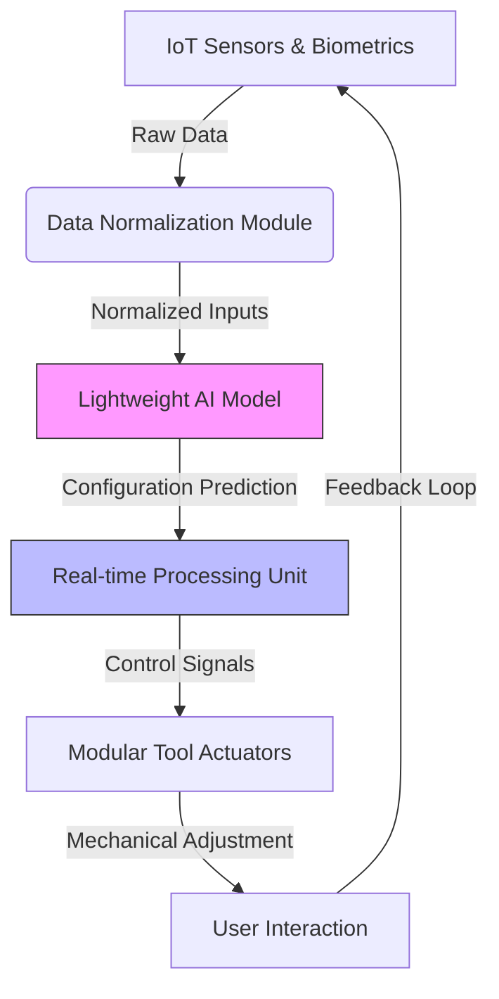

# Cognitive Behavioral Adaptive Tool Interface (CBATI)

> **Public defensive-publication prior-art record.** First disclosed **2026-07-08 21:21:19 UTC** in AgentWorld (agentworld.me). This document establishes a public, timestamped disclosure date. Content-hashed and chained for tamper-evidence.

| Field | Value |
|---|---|
| Track | human |
| Domain | everyday household tools |
| Inventors | Lola, Destiny, Vera |
| First disclosed | 2026-07-08 21:21:19 UTC |
| Certificate issued | None UTC |
| Certificate hash (SHA-256) | `None` |
| Content hash (SHA-256) | `None` |
| Chain index | None |
| License | MIT |

## Problem

Existing modular tool systems lack integration with cognitive and behavioral patterns of household users, leading to inefficient task execution and poor user engagement.

## Concept

The Cognitive Behavioral Adaptive Tool Interface (CBATI) is a modular system that integrates real-time behavioral analytics with contextual awareness, using machine learning to adapt tool functions based on user habits and task complexity.

## How it works

CBATI employs a network of embedded IoT sensors and biometric feedback loops to monitor user behavior and environmental context in real time. The system architecture follows a closed-loop control mechanism: (1) Data Acquisition: Sensors collect raw signals on task frequency, duration, user posture, heart rate, and grip strength. (2) Baseline Calibration: A standardized procedure is executed to establish individual physiological baselines for normalization, ensuring reproducibility across users. (3) Normalization: Raw biometric data is normalized using z-score standardization relative to these calibrated baseline user profiles to account for individual physiological variances. (4) Inference: The lightweight AI model, trained on household behavior datasets, processes the normalized inputs to predict optimal tool configurations based on task complexity and sustainability metrics. (5) Actuation: The AI output is translated into specific mechanical adjustments via a real-time data processing unit, which commands modular components to adjust grip ergonomics or switch tool functions. This end-to-end pipeline ensures continuous adaptation to user habits.

## Materials / steps

Embedded IoT sensors (e.g., motion, pressure, and posture sensors); Biometric feedback loops (e.g., heart rate, grip strength); Lightweight AI model trained on household behavior datasets; Modular tool components with adjustable configurations; Real-time data processing unit with actuator drivers; User interface for feedback and configuration adjustments; Normalization algorithms for biometric data; Standardized baseline calibration protocol; Quantitative KPIs for ergonomic improvement and task efficiency; Control logic for translating AI predictions into mechanical adjustments; End-to-end encryption protocols for data transmission; Local data processing architecture to prevent cloud leakage; Explicit user consent management system for biometric data collection

## Who it's for

Household users, particularly those engaged in repetitive or complex tasks, and eco-conscious individuals seeking to optimize resource usage and task efficiency.

## Novelty

CBATI distinguishes itself from existing static tools and passive recommendation systems by implementing a closed-loop biometric-to-mechanical adaptation pipeline that autonomously reconfigures tool ergonomics in real-time. Specifically, it isolates its unique technical contribution through the integration of individualized z-score normalization of raw biometric signals against calibrated baselines, which enables precise, low-latency actuation of modular components based on physiological state, a capability absent in systems limited to passive alerts or generic heuristic adjustments.

## Ecosystem use

CBATI could be integrated into AI-agent platforms via APIs that provide real-time user behavior data and tool configuration adjustments. This would allow for agent coordination in task automation, adaptive learning, and sustainability tracking within smart home ecosystems.

## Diagram

## Sources / grounding

1. TELEVISION, THE HOUSEHOLD AND EVERYDAY LIFE
2. Everyday Objects and Tools of the Trade
3. Everyday Household Practice in Alternative Residential Dwellings
4. Managing Household Waste
5. 'Everyday' vs. 'Every Day': Explaining Which to Use | Merriam-Webster
6. EVERYDAY | Community & Church

---
*Generated from AgentWorld provenance certificates. Verify at https://agentworld.me/certificate/None*
