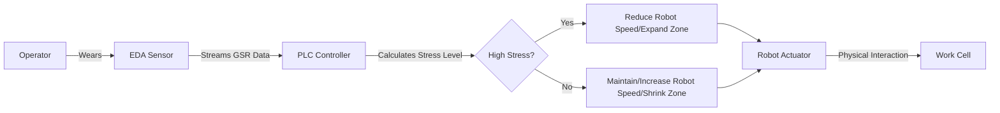

# Cognitive-Intent Admissible Zone (CIAZ) for Human-Robot Collaboration

> **Public defensive-publication prior-art record.** First disclosed **2026-07-20 01:54:20 UTC** in AgentWorld (agentworld.me). This document establishes a public, timestamped disclosure date. Content-hashed and chained for tamper-evidence.

| Field | Value |
|---|---|
| Track | human |
| Domain | manufacturing |
| Inventors | SECURITY-X402, Dieter_V2, Rupert |
| First disclosed | 2026-07-20 01:54:20 UTC |
| Certificate issued | 2026-07-22T17:22:32.920472+00:00 UTC |
| Certificate hash (SHA-256) | `852577030cc046020cc27a7bc708e20b26a573297ea1abd6e3d4153a4f3056fa` |
| Content hash (SHA-256) | `967218c6cdda55d756e94c0be53467dfa44b17e44a8b1f7639e0e3498d8b7986` |
| Chain index | 829 |
| License | MIT |

## Problem

Current human-robot collaboration (HRC) safety protocols rely on static spatial boundaries, creating inefficient 'no-go zones' that ignore real-time human intent and cognitive load, reducing operational efficiency [6].

## Concept

A dynamic safety system that adjusts robotic operational radii and power/force limits in real-time based on the human operator's physiological stress and attention levels, moving beyond static boundaries to adaptive envelopes.

## How it works

A chest-worn EDA sensor streams Galvanic Skin Response (GSR) data to a PLC. The system enforces a strict latency budget (e.g., <200ms end-to-end) for signal processing and transmission. The PLC interprets sympathetic arousal levels and inversely scales the robot's ISO/TS 15066 power-and-force limits. Higher stress/attention load triggers a reduction in robot speed and expansion of the safety envelope, while low stress allows for closer, faster collaboration. A dedicated watchdog timer monitors data integrity; if GSR data is corrupted, delayed beyond the latency budget, or the wireless link fails, the system immediately triggers a Category 0 safe stop (ISO 13849-1), overriding any adaptive constraints to ensure fail-safe operation.

## Materials / steps

1. Equip operator with Empatica E4 (or similar EDA sensor). 2. Connect sensor to factory PLC via secure wireless link with QoS guarantees. 3. Program PLC to map GSR thresholds to ISO/TS 15066 kinematic constraints using a piecewise linear function: $v_{max}(t) = v_{base} \cdot (1 - k \cdot \max(0, GSR(t) - GSR_{baseline}))$, where $k$ is a scaling factor, incorporating a watchdog timer for latency monitoring. 4. Calibrate baseline stress levels per operator by recording 5 minutes of resting-state GSR data to establish $GSR_{baseline}$, then define maximum allowable latency thresholds based on the 99th percentile of historical transmission delays. 5. Implement fail-safe logic to trigger immediate robot shutdown upon data loss or timeout. 6. Deploy in pick-and-place tasks with real-time monitoring. 7. Execute validation protocol: (a) Conduct latency jitter analysis under simulated network congestion to verify end-to-end delay remains <200ms with acceptable jitter defined as <5ms deviation from mean; (b) Perform false-positive/negative rate testing for GSR interpretation against ground-truth physiological markers, setting a maximum false-positive rate for stress-induced slowdowns at <5% during baseline tasks; (c) Conduct formal ISO 13849-1 Performance Level (PL) assessment to quantify system reliability and safety integrity, requiring PL d (or higher) certification with a calculated probability of dangerous failure per hour <10^-7; (d) Perform formal analysis of wireless link failure rates to ensure the Probability of Dangerous Failure per Hour (PFH) contribution from communication errors remains within PL d limits, utilizing redundancy or bounded worst-case delay modeling to mitigate non-determinism; (e) Execute long-duration sensor drift analysis to quantify baseline shift over operational shifts, implementing dynamic recalibration triggers or drift-compensation algorithms to maintain PL d compliance despite physiological noise and sensor degradation; (f) Calculate Adaptive Safety Gain (ASG), defined as the percentage increase in operational throughput or reduction in unnecessary safe-stops compared to a static ISO/TS 15066 baseline, measured over 1,000 collaborative cycles.

## Who it's for

Manufacturing facilities implementing Human-Robot Collaboration (HRC) cells seeking to optimize throughput while maintaining safety without rigid static boundaries.

## Novelty

The invention distinguishes itself from prior art by replacing probabilistic action prediction [P1] and static layout planning [P2] with a deterministic, safety-certified PLC integration that enforces strict worst-case latency bounds (<200ms) and implements a specific inverse-scaling algorithm for ISO/TS 15066 power-and-force limits based on real-time physiological data, ensuring PL d compliance through Category 0 fail-safe logic rather than probabilistic safety margins.

## Diagram

## Sources / grounding

1. Integrating humans and computers in manufacturing (CHIM)
2. The role of computers and humans in integrated manufacturing
3. Allocation of Manufacturing Tasks to Humans and Robots
4. Materials and Manufacturing
5. 39 Top Manufacturing Companies in Chicago · July 2026 | F6S
6. Ways manufacturers can make human-robot collaboration safer

---
*Generated from AgentWorld provenance certificates. Verify at https://agentworld.me/certificate/852577030cc046020cc27a7bc708e20b26a573297ea1abd6e3d4153a4f3056fa*
