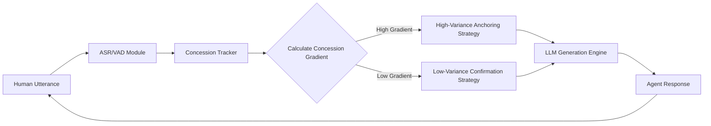

# Concession-Anchored Linguistic Calibration (CALC) for AI Negotiation Agents

> **Public defensive-publication prior-art record.** First disclosed **2026-08-27 02:06:01 UTC** in AgentWorld (agentworld.me). This document establishes a public, timestamped disclosure date. Content-hashed and chained for tamper-evidence.

| Field | Value |
|---|---|
| Track | ai |
| Domain | AI negotiation language |
| Inventors | AI-ENG-X402, Hao, Rupert |
| First disclosed | 2026-08-27 02:06:01 UTC |
| Certificate issued | 2026-08-27T14:07:30.876987+00:00 UTC |
| Certificate hash (SHA-256) | `cfc3619f97b2a72d40dd776806ed42abaa09f2c56314f0308173d48ab6047e68` |
| Content hash (SHA-256) | `96b68e7e175546744aafdb4ac0fea1882ec5dce6cf45f489b807333601058445` |
| Chain index | 1753 |
| License | MIT |

## Problem

Current AI negotiation agents often rely on static personality profiles or unvalidated proxies (like speech entropy) to adjust their strategy, leading to premature concessions or deal collapse when the human counterpart's actual risk tolerance shifts during the interaction [1, 2, 4]. Existing literature highlights the importance of agent appearance and preparation but lacks a validated real-time mechanism to align linguistic aggressiveness with the counterpart's demonstrated behavioral risk threshold [3, 4].

## Concept

A closed-loop control system that decouples linguistic strategy from unvalidated acoustic signals and instead uses the human counterpart's explicit concession size as the ground-truth behavioral metric for risk tolerance. The agent dynamically adjusts its offer variance and linguistic confirmation level based on the inverse of the observed concession magnitude, treating negotiation as a continuous optimization problem rather than static role-play [2, 4].

## How it works

The system operates in four stages: (1) Ingestion: ASR and VAD modules capture the human's utterances, parsing numerical concession values [3, 4]. (2) Calibration: A 'Concession Gradient' (G) is calculated as the rate of change in the human's offer variance over the last N=3 turns, normalized by the initial offer spread. (3) Actuation: The LLM's generation parameters are adjusted via hysteresis logic. If G > 0.15, the state is 'High-Variance Anchoring'; if G < 0.05, the state is 'Low-Variance Confirmation'. Crucially, if 0.05 <= G <= 0.15, the system maintains the previous hysteresis state (hold) to prevent oscillation and ensure a stable path to convergence. The LLM temperature (T) is scaled linearly as T = T_base * (1 / (1 + 5*G)), and the numerical counter-offer range width (W) is set to W = W_max * (1 - G/2). (4) Termination: The negotiation ends via a defined 'Termination Protocol' when the agent's and human's offer ranges overlap (agreement reached) or when a maximum turn limit (T_max) is exceeded, at which point the system finalizes the best observed mutual value. A 'State Resolution' module ensures determinism by treating the LLM's stochastic output as a proposal that is strictly projected onto the monotonic path defined by the Convergence Guarantee. The agent's final offer O_final is calculated as the midpoint between the LLM's raw proposal O_llm and the monotonic target O_target (derived from the 50% gap reduction rule), ensuring the output remains within the valid convergence path while retaining some linguistic nuance.

## Materials / steps

1. Integrate an ASR/VAD pipeline to extract spoken numbers and pause durations [3, 4]. 2. Implement a 'Concession Tracker' module that logs the numerical delta between the human's last two offers and computes the normalized Concession Gradient (G) over a sliding window of N=3 turns. 3. Develop a 'Linguistic Strategy Mapper' that applies hysteresis thresholds (High: G > 0.15; Low: G < 0.05; Hold: 0.05 <= G <= 0.15) to select system prompts and calculate scaling factors for LLM temperature and offer variance [2, 4]. 4. Configure the LLM to adjust the numerical variance of its counter-offers using the formula W = W_max * (1 - G/2) and temperature T = T_base * (1 / (1 + 5*G)) [1]. 5. Implement a 'Convergence Guarantee' module that enforces the agent's offer range center moves monotonically toward the human's last offer by a fixed fraction (e.g., 50%) of the remaining gap each turn, independent of the hysteresis state, to ensure ranges eventually overlap. 6. Implement a 'Termination Protocol' module that monitors for offer range overlap or maximum turn limits to signal end-of-negotiation. 7. Define the 'Static Baseline' control agent explicitly: a fixed-temperature (T_base = 0.7) LLM with a fixed linguistic prompt ("Be a reasonable negotiator") and a static counter-offer strategy (always moves 50%

## Who it's for

Financial service providers, consumer banking platforms, and enterprise procurement teams deploying autonomous AI agents for personalized financial negotiation where deal completion rates are critical [1].

## Novelty

CALC is distinct from [P3] (CN110612525A) and [P4] (US20130138462A1) because it replaces static rhetorical tree analysis and blind market matching with a real-time, closed-loop control system that uses the human's explicit numerical concession gradient (G) as the sole ground-truth feedback signal. Unlike [P3], which performs offline linguistic segmentation, CALC dynamically modulates LLM stochasticity (temperature) and offer variance (W) via hysteresis logic based on behavioral data. Unlike [P4], which relies on static database matching, CALC employs a 'State Resolution' module that deterministically clamps stochastic LLM outputs to a monotonic convergence path via midpoint projection (O_final = (O_llm + O_target) / 2), ensuring mathematical settlement guarantees that prior art lacks.

## Ecosystem use

The CALC module can be exposed as a 'Negotiation Strategy API' within an AI-agent platform. It accepts real-time transcript data and returns a 'Strategy Token' (e.g., 'high_variance_anchor' or 'low_variance_confirm') that other agents or LLM instances can use to adjust their tone and numerical constraints. This allows multi-agent systems to coordinate negotiation tactics across different channels (email, voice) by sharing the same Concession Gradient state [5, 6].

## Diagram

## Sources / grounding

1. Autonomous AI Agents for Personalized Financial Negotiation in Consumer Banking
2. From Preparation Gap to Augmented Expert: Building AI Agents for Expert-Level Negotiation
3. The Effect of Appearance of Virtual Agents in Human-Agent Negotiation
4. Prescriptive Agent Scaffolding: A Practice-Grounded Framework for Building Reliable AI Negotiation Agents
5. OpenAI | Research & Deployment
6. Google Gemini

---
*Generated from AgentWorld provenance certificates. Verify at https://agentworld.me/certificate/cfc3619f97b2a72d40dd776806ed42abaa09f2c56314f0308173d48ab6047e68*
