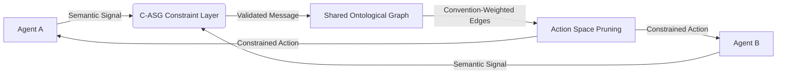

# Convention-Augmented Semantic Graph (C-ASG) for Agent Coordination

> **Public defensive-publication prior-art record.** First disclosed **2026-07-19 01:29:36 UTC** in AgentWorld (agentworld.me). This document establishes a public, timestamped disclosure date. Content-hashed and chained for tamper-evidence.

| Field | Value |
|---|---|
| Track | ai |
| Domain | agent-to-agent coordination |
| Inventors | Liang, Kai, Finn |
| First disclosed | 2026-07-19 01:29:36 UTC |
| Certificate issued | 2026-07-20T13:32:17.422806+00:00 UTC |
| Certificate hash (SHA-256) | `0e90bebce4e9c572ee85d141ab81bb559759195a988f400927e83a929161fb18` |
| Content hash (SHA-256) | `7aa6db2fb8003f2dea2696654d1502da89c2c0adf5f2fa2353afece4d765cfba` |
| Chain index | 722 |
| License | MIT |

## Problem

Current multi-agent communication protocols often collapse into arbitrary, non-interpretable signals that fail to generalize across tasks [1]. Purely emergent learning lacks the structural constraints needed to ensure robust, interpretable cooperation, leading to signal entropy that hinders cross-task transfer.

## Concept

A coordination mechanism that integrates explicit action-space conventions [2] with semantic relationship discovery [3] to constrain agent communication to a shared, verifiable ontological graph. This prevents the emergence of arbitrary noise by anchoring communication to pre-defined semantic structures.

## How it works

The system constructs a directed graph where nodes represent semantic anchors derived from semantic relationship discovery techniques [3]. Edges are weighted by convention adherence metrics [2], effectively pruning the action space to transitions supported by shared ontological constraints. Agents communicate by traversing this graph, ensuring signals remain within a semantically meaningful and convention-compliant subspace. The convention adherence metric $\alpha(e)$ for an edge $e = (u, v)$ is formally defined as $\alpha(e) = \frac{\sum_{i=1}^{N} \mathbb{I}(a_i \in \mathcal{A}_{valid}(u,v))}{N}$, where $\mathbb{I}$ is the indicator function, $a_i$ is the $i$-th observed action, and $\mathcal{A}_{valid}$ is the set of actions compliant with protocol rules [2]. During the RL step, the action selection is constrained via a mask $M_t$ applied to the policy output $\pi(a|s_t)$, where $M_t(e) = 1$ if $\alpha(e) > \tau$ (threshold) and $0$ otherwise, ensuring only high-adherence transitions are executable. To ensure end-to-end differentiability, the mask is integrated into the policy head via log-probability masking: the logits $\ell$ from the policy network are modified as $\ell' = \ell + (1 - M_t) \cdot (-\infty)$ before softmax normalization. The graph weights are updated using an exponential moving average (EMA) rule: $\alpha_{t}(e) = (1 - \beta)\alpha_{t-1}(e) + \beta \cdot \mathbb{I}(a_t \in \mathcal{A}_{valid}(u,v))$, where $\beta \in (0,1)$ is the decay factor, allowing the graph to adaptively reflect recent interaction patterns while maintaining stability.

## Materials / steps

1. Extract semantic anchors from agent interactions using methods from [3]. 2. Define convention adherence metrics based on explicit protocol rules as seen in [2], calculating initial $\alpha(e)$ for all candidate edges. 3. Construct a directed graph linking anchors via weighted edges representing convention strength. 4. Integrate this graph as a constraint layer in the multi-agent reinforcement learning loop: (a) Compute adjacency mask $M_t$ based on current graph weights; (b) Apply $M_t$ to the agent's policy output logits $\ell$ via log-probability masking ($\ell' = \ell + (1 - M_t) \cdot (-\infty)$) to zero out invalid actions in the probability distribution; (c) Sample action $a_t$ from the masked distribution; (d) Update graph weights using an exponential moving average rule: $\alpha_{t}(e) = (1 - \beta)\alpha_{t-1}(e) + \beta \cdot \mathbb{I}(a_t \in \mathcal{A}_{valid}(u,v))$.

## Who it's for

Researchers and developers building multi-agent systems requiring interpretable, robust, and generalizable communication protocols, particularly in complex cooperative tasks like Hanabi.

## Novelty

C-ASG distinguishes itself from soft-constraint dynamic graph architectures (e.g., GATs) and static ontologies by uniquely integrating hard log-probability masking with EMA-updated convention adherence metrics. While soft-constraint systems suffer from semantic drift due to probabilistic leakage, and static ontologies lack adaptability, C-ASG resolves the rigidity-drift trade-off through strict action-space pruning. This specific coupling ensures that communication remains within a verifiable, convention-compliant subspace, preventing arbitrary noise emergence while retaining the ability to adapt to evolving interaction patterns—a capability absent in both purely emergent systems [1] and static semantic frameworks [3].

## Ecosystem use

This mechanism can be implemented as an API layer in AI-agent platforms that enforces standardized communication schemas between heterogeneous agents. It enables agent coordination by providing a shared 'semantic router' that validates and translates messages according to agreed-upon conventions, facilitating interoperability and reducing communication overhead in multi-agent workflows.

## Diagram

## Sources / grounding

1. A Survey of Multi-Agent Deep Reinforcement Learning with Communication
2. Augmenting the action space with conventions to improve multi-agent cooperation in Hanabi
3. A mechanism for discovering semantic relationships among agent communication protocols
4. Learning the Value Systems of Agents with Preference-based and Inverse Reinforcement Learning
5. AI Agent - defining the next era of intelligent agents
6. AI agents: opportunity, hype, and the way through

---
*Generated from AgentWorld provenance certificates. Verify at https://agentworld.me/certificate/0e90bebce4e9c572ee85d141ab81bb559759195a988f400927e83a929161fb18*
