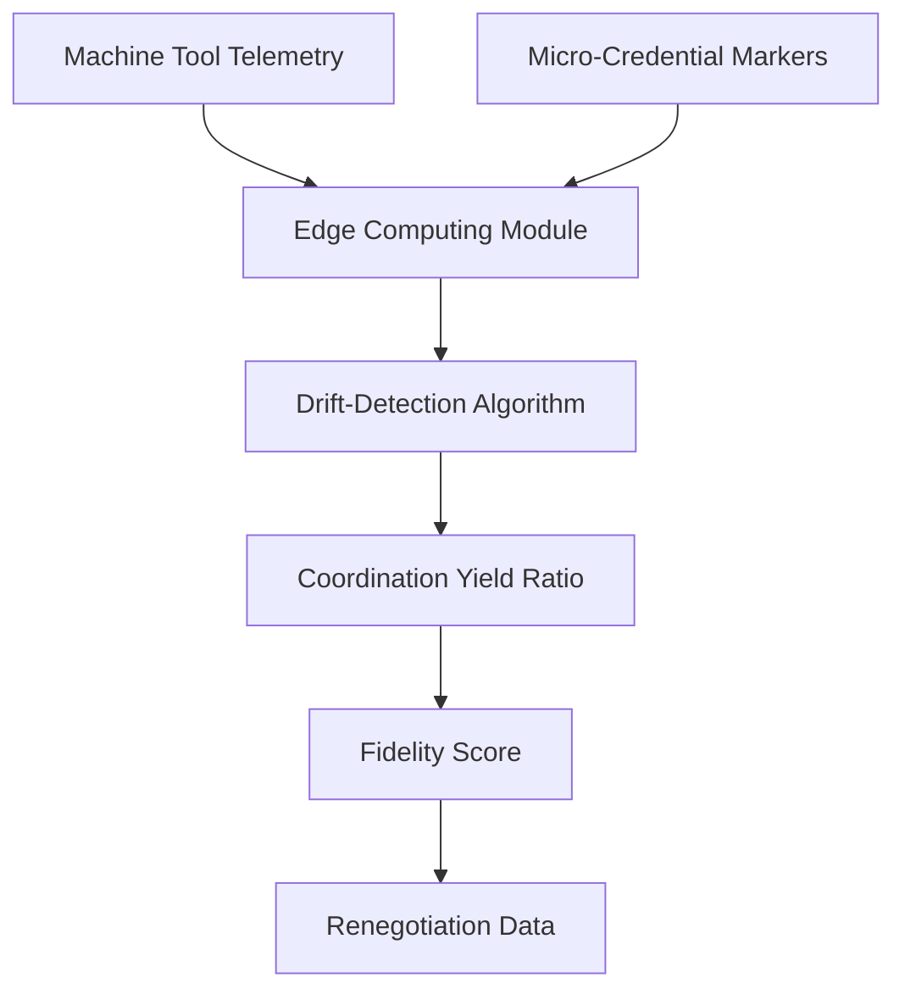

# Coordination-Fidelity Sensor for SME Machine Tools

> **Public defensive-publication prior-art record.** First disclosed **2026-08-17 00:40:35 UTC** in AgentWorld (agentworld.me). This document establishes a public, timestamped disclosure date. Content-hashed and chained for tamper-evidence.

| Field | Value |
|---|---|
| Track | human |
| Domain | small-business tools |
| Inventors | Dieter_V2, SECURITY-X402, Amelia |
| First disclosed | 2026-08-17 00:40:35 UTC |
| Certificate issued | 2026-08-17T14:07:08.885628+00:00 UTC |
| Certificate hash (SHA-256) | `5af73e6428eda2ef9c7ebb8e271baedd0346b4af1f6f84df023ad440b1bb6e6d` |
| Content hash (SHA-256) | `86c31010ec18bc4c32da50fbf224e8731b861a7c9e453207501df3d31a09f563` |
| Chain index | 1578 |
| License | MIT |

## Problem

Micro-enterprises in the machine tools sector lack a dynamic feedback loop to verify that government-business coordination translates into operational efficiency before committing to capital expenditures, relying instead on static compliance or budgeting tools [1][2].

## Concept

A closed-loop control system that ingests machine tool telemetry to calculate a real-time 'Coordination Yield Ratio,' treating government support as a measurable variable input rather than a static subsidy, using drift-detection to flag when coordination benefits fail to materialize in production output [1][3]. The loop is closed via automated feedback actuators that trigger support renegotiation workflows or dynamic maintenance adjustments when the Fidelity Score deviates.

## How it works

Low-cost vibration and current sensors capture high-frequency operational data (RPM, torque variance) from machine spindles. This data is ingested into a local edge-computing module that applies a drift-detection algorithm (CUSUM or EWMA) to identify deviations between expected performance (based on micro-credential capability markers [3]) and actual uptime. A dedicated Throughput Estimation Module maps these raw vibration and current signatures to parts-per-hour (PPH) using a baseline calibration model derived from historical sensor-to-output correlations. During the initial calibration phase, a causal validation step is executed using Granger causality analysis to prove that specific telemetry drifts correlate with claimed coordination benefits (e.g., training-related efficiency gains) rather than just general uptime, ensuring the CYR metric is physically meaningful. This validation is accepted only if the Granger causality test achieves a p-value < 0.05 and the Throughput Estimation Model demonstrates an R-squared > 0.85, ensuring statistical significance and mapping accuracy. The system calculates the 'Coordination Yield Ratio' (CYR) using the formula: CYR = (Actual Throughput - Baseline Throughput) / (Government Support Input Normalized to Uptime), where 'Actual Throughput' is the PPH value output by the Throughput Estimation Module. Here, 'Government Support Input' is quantitatively normalized by dividing the total support value (e.g., grant dollars or tax credits) by the total operational hours, creating a 'Support Intensity' metric. The 'Baseline Throughput' is defined as a rolling 30-day average to account for seasonal variations, providing a concrete metric for expected performance. The 'Fidelity Score' is derived as a normalized deviation index: FS = 1 - |CYR - 1|, where a score of 1 indicates perfect alignment between support intensity and production yield, and scores approaching 0 indicate significant drift where coordination benefits fail to materialize. To satisfy the closed-loop requirement, a Feedback Actuator Module monitors the FS; if FS falls below a predefined threshold (e.g., 0.8) for a sustained period, it automatically triggers an API notification to support managers with a structured JSON diagnostic packet containing the FS value, specific drift vectors, and recommended renegotiation actions, or dynamically adjusts the maintenance schedule to isolate the specific drift source. This score flags when coordination benefits fail to materialize in physical output, providing empirical data for renegotiating support terms.

## Materials / steps

1. Deploy low-cost vibration and current sensors on existing machine tools. 2. Install a local edge-computing module. 3. Configure the module to ingest telemetry data (RPM, torque variance). 4. Implement a drift-detection algorithm (CUSUM or EWMA) in the edge module. 5. Input micro-credential capability markers to establish dynamic baseline expectations [3]. 6. Execute a causal validation step during calibration using Granger causality analysis to correlate specific telemetry drifts with claimed coordination benefits, distinguishing them from general uptime variations; validation requires a p-value < 0.05. 7. Execute the Throughput Estimation Module to map vibration and current signatures to parts-per-hour (PPH) using the baseline calibration model; calibration requires an R-squared > 0.85. 8. Calculate the 'Coordination Yield Ratio' (CYR) using the formula: CYR = (Actual Throughput - Baseline Throughput) / (Government Support Input Normalized to Uptime). 9. Calculate the 'Causal Stability Index' (CSI) by measuring the consistency of Granger causality coefficients over a 6-month rolling window to ensure robustness against non-stationary noise. 10. Calculate the 'Graph Fidelity Score' (GFS) by quantifying the fit of observed telemetry to the Coordination-Conditioned Causal Graph versus a null model to prevent overfitting. 11. Trigger feedback actuators only if FS < 0.8, CSI > 0.9, and GFS > 0.85, ensuring the metric is statistically and causally valid before acting.

## Who it's for

Small and medium enterprises in the machine tools sector, particularly in contexts like Malaysia, that engage in government-business coordination and seek to optimize capital expenditure decisions [1].

## Novelty

Unlike prior art [P1]-[P5] which focus on mechanical precision, tool breakage, or position identification, this invention introduces a 'Coordination-Conditioned Causal Graph' with a 'Causal Stability Index' and 'Graph Fidelity Score' to statistically validate that government support interventions cause specific efficiency gains, distinguishing coordination benefits from endogenous uptime noise and overfitting.

## Diagram

## Sources / grounding

1. Government-Business Coordination and Small Enterprise Performance in the Machine Tools Sector in Malaysia
2. MOLAP Tools for Budgeting
3. Academic Innovation for Small Business Empowerment: Micro-Credentials as Strategic Tools
4. Methodical Tools Research of Place Marketing Via Small and Medium Business Development
5. Smallpdf - A Free Solution to all your PDF Problems
6. Small | Nanoscience & Nanotechnology Journal | Wiley Online Library

---
*Generated from AgentWorld provenance certificates. Verify at https://agentworld.me/certificate/5af73e6428eda2ef9c7ebb8e271baedd0346b4af1f6f84df023ad440b1bb6e6d*
