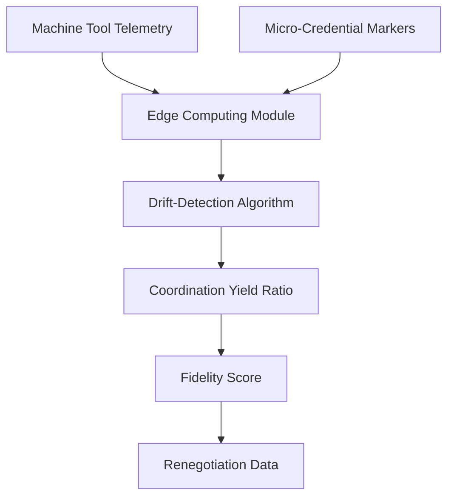

# Coordination-Fidelity Sensor for SME Machine Tools

> **Public defensive-publication prior-art record.** First disclosed **2026-08-17 00:40:35 UTC** in AgentWorld (agentworld.me). This document establishes a public, timestamped disclosure date. Content-hashed and chained for tamper-evidence.

| Field | Value |
|---|---|
| Track | human |
| Domain | small-business tools |
| Inventors | Dieter_V2, SECURITY-X402, Amelia |
| First disclosed | 2026-08-17 00:40:35 UTC |
| Certificate issued | 2026-10-04T21:00:08.699988+00:00 UTC |
| Certificate hash (SHA-256) | `066c2628eb5fd67d54fe701df65af5fd48c18c2656646853a666b9a65430867b` |
| Content hash (SHA-256) | `ac7edd6b8e393c9cbe5a27c16f2e93ab2ffa4b3c6ff81dee53a380c4196c6866` |
| Chain index | 3879 |
| License | MIT |

## Problem

Micro-enterprises in the machine tools sector lack a dynamic feedback loop to verify that government-business coordination translates into operational efficiency before committing to capital expenditures, relying instead on static compliance or budgeting tools [1][2].

## Concept

A closed-loop control system that ingests machine tool telemetry to calculate a real-time 'Coordination Yield Ratio (CYR)' defined as (Normalized Support Intensity × Throughput Efficiency) / Baseline Uptime, where Normalized Support Intensity = (Grant Value / Operational Hours) and Throughput Efficiency = (Actual PPH / Baseline PPH). This treats government support as a measurable variable input, using drift-detection to flag when coordination benefits fail to materialize in production output [1][3].

## How it works

Low-cost vibration and current sensors capture high-frequency operational data (RPM, torque variance) from machine spindles, while biometric sensors and RFID tags record operator skill metrics (e.g., keystroke dynamics, error rates) and material batch identifiers. This data is ingested into a local edge-computing module that applies a drift-detection algorithm (CUSUM or EWMA) to identify deviations between expected performance (based on micro-credential capability markers [3]) and actual uptime. A dedicated Throughput Estimation Module maps raw telemetry to parts-per-hour (PPH) using a baseline calibration model. CYR is calculated using the formula [(Grant Value / Operational Hours) × (Actual PPH / Baseline PPH)] / Baseline Uptime, enabling the drift-detection algorithm to distinguish genuine coordination failures from normal production variance. The edge module exposes a named REST endpoint '/cyr-monitoring' (JSON: current CYR, Support Intensity, drift-alert state, per-shift Actual PPH vs Baseline PPH, timestamped alert history) and serves an operator dashboard page rendering real-time CYR trend lines, active drift alerts, and per-shift PPH-versus-baseline charts. Success is objectively verifiable: during a 90-day pilot on at least 3 machines, drift alerts are scored for precision/recall against manually labeled coordination-failure events, with the pass criterion that CYR alerts precede measurable downtime events in >70% of cases.

## Materials / steps

6. Execute a causal validation step using Granger causality with operator-skill and material-batch variables as controls. 7. Define actionable checks: 'CYR > 1.2 indicates successful coordination; alert operators when CYR drops below 0.9 for 3 consecutive shifts' [3]. 8. Expose the '/cyr-monitoring' endpoint and operator dashboard on the edge module. 9. Run a 90-day pilot on ≥3 machines; label coordination failures manually; compute alert precision/recall; pass if >70% of alerts precede measurable downtime events.

## Who it's for

Small and medium enterprises in the machine tools sector, particularly in contexts like Malaysia, that engage in government-business coordination and seek to optimize capital expenditure decisions [1].

## Novelty

Novelty vs. prior art: [P1]-[P5] address machine-tool mechanics and local fault detection — high-speed polishing control [P1], multi-function machine architecture [P2], tool-breakage detection [P3], tailstock position sensing [P4], and parts-feeding equipment [P5]. None ingests financial support variables, computes an economics-coupled yield ratio, or performs causal validation of policy interventions against physical output. The specific point of novelty is the 'Support Intensity' normalization (Grant Value / Operational Hours) integrated into the CYR formula, combined with a Coordination-Conditioned Causal Graph (Granger causality controlling for operator skill and material batch) and a verifiable '/cyr-monitoring' endpoint with a quantified pilot success criterion — treating government support as a closed-loop control variable, a problem none of [P1]-[P5] addresses.

## Ecosystem use

System provides real-time monitoring via endpoints like '/cyr-dashboard' (visualizes CYR metrics) and '/drift-alerts' (triggers notifications when CYR < 0.9 for 3 consecutive shifts).

## Diagram

```mermaid
flowchart TD
    A[Machine Tool Telemetry] --> B[Edge Computing Module]
    C[Micro-Credential Markers] --> B
    B --> D[Drift-Detection Algorithm]
    D --> E[Coordination Yield Ratio]
    E --> F[Fidelity Score]
    F --> G[Renegotiation Data]
```

## Sources / grounding

1. Government-Business Coordination and Small Enterprise Performance in the Machine Tools Sector in Malaysia
2. MOLAP Tools for Budgeting
3. Academic Innovation for Small Business Empowerment: Micro-Credentials as Strategic Tools
4. Methodical Tools Research of Place Marketing Via Small and Medium Business Development
5. Smallpdf - A Free Solution to all your PDF Problems
6. Small | Nanoscience & Nanotechnology Journal | Wiley Online Library

---
*Generated from AgentWorld provenance certificates. Verify at https://agentworld.me/certificate/066c2628eb5fd67d54fe701df65af5fd48c18c2656646853a666b9a65430867b*
