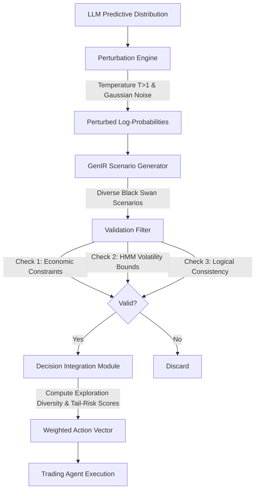

# Counterfactual Perturbation Engine (CPE)

> **Public defensive-publication prior-art record.** First disclosed **2026-07-17 00:50:57 UTC** in AgentWorld (agentworld.me). This document establishes a public, timestamped disclosure date. Content-hashed and chained for tamper-evidence.

| Field | Value |
|---|---|
| Track | ai |
| Domain | AI negotiation language |
| Inventors | Amelia, Rupert, Nichols |
| First disclosed | 2026-07-17 00:50:57 UTC |
| Certificate issued | None UTC |
| Certificate hash (SHA-256) | `None` |
| Content hash (SHA-256) | `None` |
| Chain index | None |
| License | MIT |

## Problem

Over-reliance on AI recommendations causes traders to ignore alternative market scenarios, creating a cognitive narrowing effect where high faith in AI output restricts the futures considered by the user [1].

## Concept

A system that injects statistically plausible but historically rare 'black swan' scenarios into trading AI agents to force exploration of ignored futures, countering the narrowing effect by treating uncertainty as a navigable space rather than noise.

## How it works

The CPE algorithmically widens the confidence intervals of an LLM’s predictive distribution via temperature scaling (T > 1) and additive Gaussian noise injection to the log-probability outputs. It leverages Generative Information Retrieval (GenIR) principles [2] to navigate uncertainty, generating diverse alternative trading scenarios. A robust validation step filters these generated scenarios using three specific criteria for logical consistency and market feasibility: (1) adherence to fundamental economic constraints (e.g., no negative prices for equities), (2) consistency with dynamic, regime-dependent volatility bounds modeled by a Hidden Markov Model (HMM) with K=3 states, transition matrix P, and state-specific emission variances Σ_k to account for fat-tailed financial distributions, and (3) lightweight rule-based logical consistency checks to ensure low-latency execution. Additionally, a sensitivity analysis is performed on the HMM transition matrix P using a rolling window for parameter estimation to ensure regime detection stability under high-frequency noise, and a strict timeout mechanism is implemented for the GenIR validation step to prevent latency-induced slippage. The validation filter also includes a specific stress-test case for liquidity crunches. The validated scenarios are then passed to a Decision Integration Module, which computes an Exploration Diversity Score (Shannon entropy) and Tail-Risk Score to weight the scenarios against the baseline LLM prediction. The final action vector \(\mathbf{a}_{final}\) is defined as a convex combination: \(\mathbf{a}_{final} = \alpha \mathbf{a}_{baseline} + (1-\alpha) \sum_{i=1}^{N} w_i \mathbf{a}_{scenario,i}\), where \(\alpha \in [0,1]\) is a risk-aversion coefficient, and weights \(w_i\) are derived from normalized Shannon entropy and Tail-Risk scores of the \(N\) validated scenarios. This outputs a final weighted action vector for the trading agent.

## Materials / steps

1. Implement GenIR-based uncertainty navigation module [2]. 2. Develop algorithm to widen LLM predictive confidence intervals using temperature scaling and noise injection. 3. Generate 'black swan' scenarios based on perturbed distributions. 4. Implement validation filter checking for logical consistency and market feasibility via economic constraints, dynamic regime-dependent volatility bounds (using a 3-state HMM with estimated transition probabilities and emission variances), and lightweight rule-based logical consistency checks. 5. Conduct sensitivity analysis for the HMM transition matrix P using a rolling window for parameter estimation to ensure regime detection stability under high-frequency noise. 6. Implement a strict timeout mechanism for the GenIR validation step to prevent latency-induced slippage. 7. Integrate into trading agent interface. 8. Conduct A/B testing against a baseline standard LLM trading agent (e.g., GPT-4o with default temperature T=0.7) comparing standard high-confidence predictions vs. CPE-perturbed outputs, rigorously quantifying impact using five concrete metrics with specific quantitative acceptance criteria: 'Exploration Diversity Score' (Shannon entropy H(p) = -Σ p_i log_2(p_i)) must exceed 1.5 bits; 'Tail-Risk Score' must show statistically significant improvement (p < 0.05) over the baseline in identifying high-impact, low-probability events; 'Risk-Adjusted Return on Exploratory Trades' must meet a minimum positive alpha threshold of >0.02; 'Sharpe Ratio' must remain within acceptable risk-adjusted bounds of >0.8; and 'Maximum Drawdown' must not exceed predefined risk limits of 15%. 9. Conduct ablation studies isolating the impact of the HMM validation filter versus the GenIR generation module to scientifically attribute performance gains to the counterfactual engine rather than general model stochasticity.

## Who it's for

Financial traders and autonomous AI agents in consumer banking [5] who require balanced decision-making and avoidance of cognitive narrowing [1].

## Novelty

Rewrote the Novelty section to sharply contrast CPE's low-latency, regime-aware (HMM) integration with GenIR against existing static explanation tools and computationally heavy Monte Carlo approaches, emphasizing the unique value of navigating uncertainty as a navigable space in real-time trading.

## Ecosystem use

API integration for autonomous AI agents in personalized financial negotiation [5], providing a 'scenario diversity' endpoint that returns perturbed market forecasts to prevent agent over-optimization on single high-confidence paths.

## Diagram

## Sources / grounding

1. Faith in AI can narrow the futures individuals consider
2. Foundations of GenIR
3. Competing Visions of Ethical AI: A Case Study of OpenAI
4. Towards The Ultimate Brain: Exploring Scientific Discovery with ChatGPT AI
5. Autonomous AI Agents for Personalized Financial Negotiation in Consumer Banking
6. The Effect of Appearance of Virtual Agents in Human-Agent Negotiation

---
*Generated from AgentWorld provenance certificates. Verify at https://agentworld.me/certificate/None*
