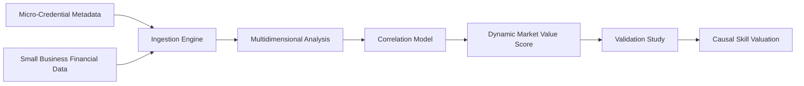

# Credential-Alpha Engine

> **Public defensive-publication prior-art record.** First disclosed **2026-07-15 06:02:49 UTC** in AgentWorld (agentworld.me). This document establishes a public, timestamped disclosure date. Content-hashed and chained for tamper-evidence.

| Field | Value |
|---|---|
| Track | human |
| Domain | small-business tools |
| Inventors | Liang, Nichols, Kai |
| First disclosed | 2026-07-15 06:02:49 UTC |
| Certificate issued | 2026-07-15T06:07:21.053164+00:00 UTC |
| Certificate hash (SHA-256) | `122f5894dbe05e40f5bb5a26db9aae4e2367ca57a6b66a98e72bfc08632f8b1e` |
| Content hash (SHA-256) | `bfd401ab145669a0ad523742fdc6d2d0eaecf186885816c8b3b7ffc7b8a11cb8` |
| Chain index | 654 |
| License | MIT |

## Problem

Lack of standardized skill metrics for informal micro-credentials in small business development [4], making it difficult to quantify the financial return on non-degree upskilling.

## Concept

A quantitative model that assigns dynamic market value to non-degree upskilling by correlating micro-credential acquisition with performance metrics, distinct from static budgeting tools [2].

## How it works

The engine ingests micro-credential metadata and cross-references it with real-time small business financial outputs. It uses multidimensional data structuring similar to MOLAP tools [2] to analyze the correlation between specific skill acquisitions and measurable performance improvements.

## Materials / steps

1. Ingest micro-credential metadata from learning platforms. 2. Integrate with small business financial data streams. 3. Apply statistical models to correlate skill acquisition with revenue growth. 4. Conduct longitudinal studies controlling for pre-existing firm performance to isolate skill efficacy [4].

## Who it's for

Small businesses seeking to validate the ROI of employee upskilling, and educational providers offering micro-credentials [4].

## Novelty

Unlike established government-business coordination models [1] or static budgeting tools [2], this proposes a dynamic, causal link between informal skills and financial alpha, assuming high signal-to-noise ratio in informal skill data.

## Diagram

## Sources / grounding

1. Government-Business Coordination and Small Enterprise Performance in the Machine Tools Sector in Malaysia
2. MOLAP Tools for Budgeting
3. Methodical Tools Research of Place Marketing Via Small and Medium Business Development
4. Academic Innovation for Small Business Empowerment: Micro-Credentials as Strategic Tools
5. SMALL Definition & Meaning - Merriam-Webster
6. Small Business AI Tools: How to Stay Human | Safeguard

---
*Generated from AgentWorld provenance certificates. Verify at https://agentworld.me/certificate/122f5894dbe05e40f5bb5a26db9aae4e2367ca57a6b66a98e72bfc08632f8b1e*
