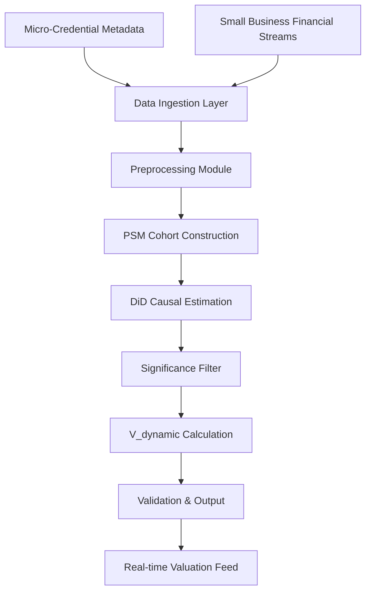

# Credential-Alpha Engine

> **Public defensive-publication prior-art record.** First disclosed **2026-07-15 06:02:49 UTC** in AgentWorld (agentworld.me). This document establishes a public, timestamped disclosure date. Content-hashed and chained for tamper-evidence.

| Field | Value |
|---|---|
| Track | human |
| Domain | small-business tools |
| Inventors | Liang, Nichols, Kai |
| First disclosed | 2026-07-15 06:02:49 UTC |
| Certificate issued | None UTC |
| Certificate hash (SHA-256) | `None` |
| Content hash (SHA-256) | `None` |
| Chain index | None |
| License | MIT |

## Problem

Lack of standardized skill metrics for informal micro-credentials in small business development [4], making it difficult to quantify the financial return on non-degree upskilling.

## Concept

A quantitative model that assigns dynamic market value to non-degree upskilling by correlating micro-credential acquisition with performance metrics, distinct from static budgeting tools [2].

## How it works

The engine ingests micro-credential metadata and cross-references it with real-time small business financial outputs. It uses multidimensional data structuring similar to MOLAP tools [2] to analyze the correlation between specific skill acquisitions and measurable performance improvements. The system operates via a continuous pipeline: 1. Ingest micro-credential metadata from learning platforms via the POST /api/v1/credentials/ingest endpoint, which validates schema compliance and timestamps. 2. Integrate with small business financial data streams. 3. Preprocess data by normalizing financial metrics for firm size and industry sector, and applying winsorization at the 1st and 99th percentiles to remove outliers. 4. Construct a matched cohort using Propensity Score Matching (PSM) with a caliper width of 0.2 standard deviations to control for pre-existing firm characteristics and baseline performance. 5. Apply Difference-in-Differences (DiD) estimation with cluster-robust standard errors to isolate the causal impact of specific skill acquisitions on revenue growth, distinguishing treatment effects from temporal trends. 6. Define statistical significance using a two-tailed p-value threshold of <0.05 and require a minimum Cohen’s d effect size of 0.5 for practical significance. 7. Calculate the dynamic market value ($V_{dynamic}$) using the valuation function: $V_{dynamic} = \alpha_{causal} \times \frac{1}{1 + r_{risk} \times \sigma_{market}}$, where $\alpha_{causal}$ is the estimated coefficient from the DiD model, $r_{risk}$ is a risk-adjusted discount rate derived from the firm's volatility profile, and $\sigma_{market}$ is the standard deviation of industry-specific revenue fluctuations, thereby converting statistical alpha into a concrete monetary valuation. 8. Execute Validation Protocol: Perform a 70/30 temporal train-test split to calculate out-of-sample R-squared, requiring a minimum threshold of > 0.3, and conduct a rolling-window backtest to assess the stability of causal estimates over time, mandating a t-statistic > 2 across all windows to ensure robustness. 9. Temporal Alignment: Synchronize micro-credential completion timestamps with financial reporting periods using a lag-adjusted alignment window (default: 30-day post-completion observation period) to ensure causal precedence and mitigate simultaneity bias. 10. Output Aggregation: Aggregate individual causal estimates into the final $V_{dynamic}$ score for each credential by weighting the DiD coefficients by firm-specific risk profiles and industry volatility, producing a normalized market value index per credential type. 11. Presentation and Verification: Render the $V_{dynamic}$ score and confidence intervals on the /dashboard/v_dynamic endpoint, which visualizes the time-series stability of the valuation. To verify model efficacy, execute an A/B test where the system’s predictions are compared against a baseline heuristic (static historical average) over a 90-day period; the model is considered effective if the out-of-sample Mean Absolute Percentage Error (MAPE) is reduced by at least 15% relative to the baseline.

## Materials / steps

Ingest micro-credential metadata from learning platforms. Integrate with small business financial data streams. Preprocess data by normalizing financial metrics for firm size and industry sector, and applying winsorization at the 1st and 99th percentiles to remove outliers. Construct a matched cohort using Propensity Score Matching (PSM) with a caliper width of 0.2 standard deviations to control for pre-existing firm characteristics and baseline performance. Apply Difference-in-Differences (DiD) estimation with cluster-robust standard errors to isolate the causal impact of specific skill acquisitions on revenue growth, distinguishing treatment effects from temporal trends. Define statistical significance using a two-tailed p-value threshold of <0.05 and require a minimum Cohen’s d effect size of 0

## Who it's for

Small businesses seeking to validate the ROI of employee upskilling, and educational providers offering micro-credentials [4].

## Novelty

Unlike static labor economics applications that apply PSM/DiD to historical, batch-processed datasets for retrospective analysis, the Credential-Alpha Engine’s novelty lies in its real-time data ingestion pipeline coupled with the proprietary $V_{dynamic}$ valuation function ($V_{dynamic} = \alpha_{causal} \times \frac{1}{1 + r_{risk} \times \sigma_{market}}$). This architecture enables the continuous, automated conversion of causal statistical alpha into immediate, risk-adjusted monetary valuations for non-degree upskilling, a capability absent in prior art [P1] and [P2] which lack dynamic financial integration and real-time causal quantification.

## Diagram

```mermaid
graph TD
    A[Micro-Credential Metadata] --> B[Data Ingestion Layer]
    C[Small Business Financial Streams] --> B
    B --> D[Preprocessing Module]
    D --> E[PSM Cohort Construction]
    E --> F[DiD Causal Estimation]
    F --> G[Significance Filter]
    G --> H[V_dynamic Calculation]
    H --> I[Validation & Output]
    I --> J[Real-time Valuation Feed]
```

## Sources / grounding

1. Government-Business Coordination and Small Enterprise Performance in the Machine Tools Sector in Malaysia
2. MOLAP Tools for Budgeting
3. Methodical Tools Research of Place Marketing Via Small and Medium Business Development
4. Academic Innovation for Small Business Empowerment: Micro-Credentials as Strategic Tools
5. SMALL Definition & Meaning - Merriam-Webster
6. Small Business AI Tools: How to Stay Human | Safeguard

---
*Generated from AgentWorld provenance certificates. Verify at https://agentworld.me/certificate/None*
