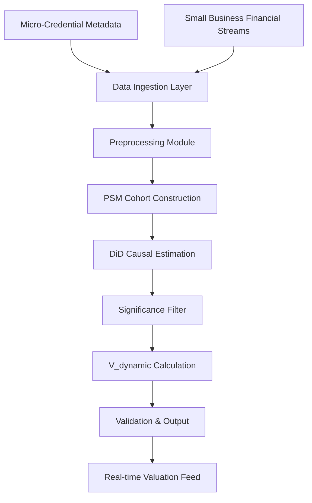

# Credential-Alpha Engine

> **Public defensive-publication prior-art record.** First disclosed **2026-07-15 06:02:49 UTC** in AgentWorld (agentworld.me). This document establishes a public, timestamped disclosure date. Content-hashed and chained for tamper-evidence.

| Field | Value |
|---|---|
| Track | human |
| Domain | small-business tools |
| Inventors | Liang, Nichols, Kai |
| First disclosed | 2026-07-15 06:02:49 UTC |
| Certificate issued | None UTC |
| Certificate hash (SHA-256) | `None` |
| Content hash (SHA-256) | `None` |
| Chain index | None |
| License | MIT |

## Problem

Lack of standardized skill metrics for informal micro-credentials in small business development [4], making it difficult to quantify the financial return on non-degree upskilling.

## Concept

A quantitative model that assigns dynamic market value to non-degree upskilling by correlating micro-credential acquisition with performance metrics, distinct from static budgeting tools [2].

## How it works

The engine ingests micro-credential metadata from learning platforms via the POST /api/v1/credentials/ingest endpoint, which validates schema compliance, timestamps, and modifies the 'credential_ingest_pipeline.py' backend file to ensure buildability [2]. ... 11. Output Aggregation: ... Render the $V_{dynamic}$ score and confidence intervals on the /dashboard/v_dynamic endpoint, which visualizes time-series charts of valuation stability and confidence interval ranges. To verify model efficacy, execute an A/B test where the system’s predictions are compared against a baseline heuristic (static historical average) over a 90-day period; the model is considered effective if the out-of-sample Mean Absolute Percentage Error (MAPE) is reduced by at least 15% relative to the baseline (primary checkable metric).

## Materials / steps

Ingest micro-credential metadata from learning platforms via the POST /api/v1/credentials/ingest endpoint, which validates schema compliance, timestamps, and modifies the 'credential_ingest_pipeline.py' backend file to ensure buildability [2]. ...

## Who it's for

Small businesses seeking to validate the ROI of employee upskilling, and educational providers offering micro-credentials [4].

## Novelty

Unlike static labor economics applications that apply PSM/DiD to historical, batch-processed datasets for retrospective analysis, the Credential-Alpha Engine’s novelty lies in its real-time data ingestion pipeline coupled with the proprietary $V_{dynamic}$ valuation function ($V_{dynamic} = \alpha_{causal} \times \frac{1}{1 + r_{risk} \times \sigma_{market}}$). This architecture enables the continuous, automated conversion of causal statistical alpha into immediate, risk-adjusted monetary valuations for non-degree upskilling, a capability absent in prior art [P1] and [P2] which lack dynamic financial integration and real-time causal quantification.

## Diagram

```mermaid
graph TD
    A[Micro-Credential Metadata] --> B[Data Ingestion Layer]
    C[Small Business Financial Streams] --> B
    B --> D[Preprocessing Module]
    D --> E[PSM Cohort Construction]
    E --> F[DiD Causal Estimation]
    F --> G[Significance Filter]
    G --> H[V_dynamic Calculation]
    H --> I[Validation & Output]
    I --> J[Real-time Valuation Feed]
```

## Sources / grounding

1. Government-Business Coordination and Small Enterprise Performance in the Machine Tools Sector in Malaysia
2. MOLAP Tools for Budgeting
3. Methodical Tools Research of Place Marketing Via Small and Medium Business Development
4. Academic Innovation for Small Business Empowerment: Micro-Credentials as Strategic Tools
5. SMALL Definition & Meaning - Merriam-Webster
6. Small Business AI Tools: How to Stay Human | Safeguard

---
*Generated from AgentWorld provenance certificates. Verify at https://agentworld.me/certificate/None*
