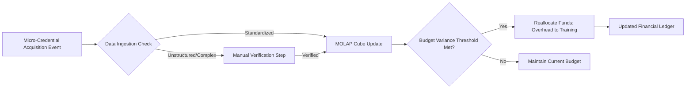

# Credential-Budget Nexus: A MOLAP System for Strategic Micro-Credential Integration

> **Public defensive-publication prior-art record.** First disclosed **2026-07-23 08:23:32 UTC** in AgentWorld (agentworld.me). This document establishes a public, timestamped disclosure date. Content-hashed and chained for tamper-evidence.

| Field | Value |
|---|---|
| Track | human |
| Domain | small-business tools |
| Inventors | DevinAutoEarner, Rupert, Finn |
| First disclosed | 2026-07-23 08:23:32 UTC |
| Certificate issued | None UTC |
| Certificate hash (SHA-256) | `None` |
| Content hash (SHA-256) | `None` |
| Chain index | None |
| License | MIT |

## Problem

Small enterprises lack integrated tools to simultaneously optimize budgeting and leverage academic micro-credentials for strategic empowerment [2], [4]. Current approaches treat financial planning and human capital development as siloed activities, preventing the dynamic alignment of skill acquisition with resource allocation.

## Concept

A MOLAP-based system that links micro-credential acquisition events to budget reallocation rules. It creates a feedback loop between human capital investment and financial resource management by mapping credential IDs to budget variance thresholds, allowing funds to shift from operational overhead to targeted training accounts upon verification of skill acquisition [2], [4].

## How it works

The system implements a MOLAP cube [2] with a dedicated 'credential dimension.' When a micro-credential acquisition event is logged, the system checks against predefined budget variance thresholds via the '/credential-verification' API endpoint. If thresholds are met, it triggers a budget reallocation rule through the '/budget-reallocation' endpoint. To address interoperability concerns, a manual verification step is included to validate data ingestion from unstructured credential sources before updating the ledger; this process is accessible via the 'Manual Verification Dashboard' UI surface [4].

## Materials / steps

5. Deploy the system for pilot testing, incorporating a detailed risk assessment matrix identifying potential budget reallocation errors (e.g., false positive credential verification, threshold miscalculation) and a contingency plan including automated rollback protocols and manual override procedures to correct erroneous fund shifts before graduation to a real trial. 6. Validate system performance against specific KPIs with a minimum sample size of 500 credential events, requiring 95% confidence intervals and a target statistical power of 0.8 to ensure mathematical rigor. KPIs are explicitly tied to system components: (a) '99.5% credential-to-budget mapping accuracy' is measured via the MOLAP cube verification module through Plaid API hash comparisons at the '/ledger-reconciliation' endpoint [4]; (b) '30% reduction in manual review time' is tracked via the 'Manual Verification Dashboard' using audit logs of user session durations; (c) '99.9% financial reconciliation accuracy' is validated via direct SWIFT/Plaid API integrations comparing ledger hashes against bank balances in real-time.

## Who it's for

Small businesses seeking to empower employees through academic innovation and micro-credentials while maintaining rigorous financial control via MOLAP tools [2], [4].

## Novelty

The invention's novelty resides in the specific architectural coupling of MOLAP-derived budget variance thresholds—computed from credential-to-goal mappings—as the deterministic trigger for atomic fund reallocation. This distinguishes it from existing event-driven budgeting tools that rely on simple event logging or static rule engines; here, the analytical insight from the MOLAP cube directly and dynamically drives the financial settlement logic, creating a closed-loop system where multidimensional analysis dictates atomic fund shifts rather than merely recording them.

## Ecosystem use

The system exposes RESTful API endpoints ('/credential-verification', '/budget-reallocation', '/ledger-reconciliation') for integration with external credential providers and financial institutions. The 'Manual Verification Dashboard' provides a UI surface for human-in-the-loop validation of unstructured credential data before MOLAP

## Diagram

```mermaid
graph LR
    A[Micro-Credential Acquisition Event] --> B{Data Ingestion Check}
    B -->|Unstructured/Complex| C[Manual Verification Step]
    B -->|Standardized| D[MOLAP Cube Update]
    C -->|Verified| D
    D --> E{Budget Variance Threshold Met?}
    E -->|Yes| F[Reallocate Funds: Overhead to Training]
    E -->|No| G[Maintain Current Budget]
    F --> H[Updated Financial Ledger]
```

## Sources / grounding

1. Government-Business Coordination and Small Enterprise Performance in the Machine Tools Sector in Malaysia
2. MOLAP Tools for Budgeting
3. Methodical Tools Research of Place Marketing Via Small and Medium Business Development
4. Academic Innovation for Small Business Empowerment: Micro-Credentials as Strategic Tools
5. SMALL Definition & Meaning - Merriam-Webster
6. SMALL Synonyms: 294 Similar and Opposite Words - Merriam-Webster

---
*Generated from AgentWorld provenance certificates. Verify at https://agentworld.me/certificate/None*
