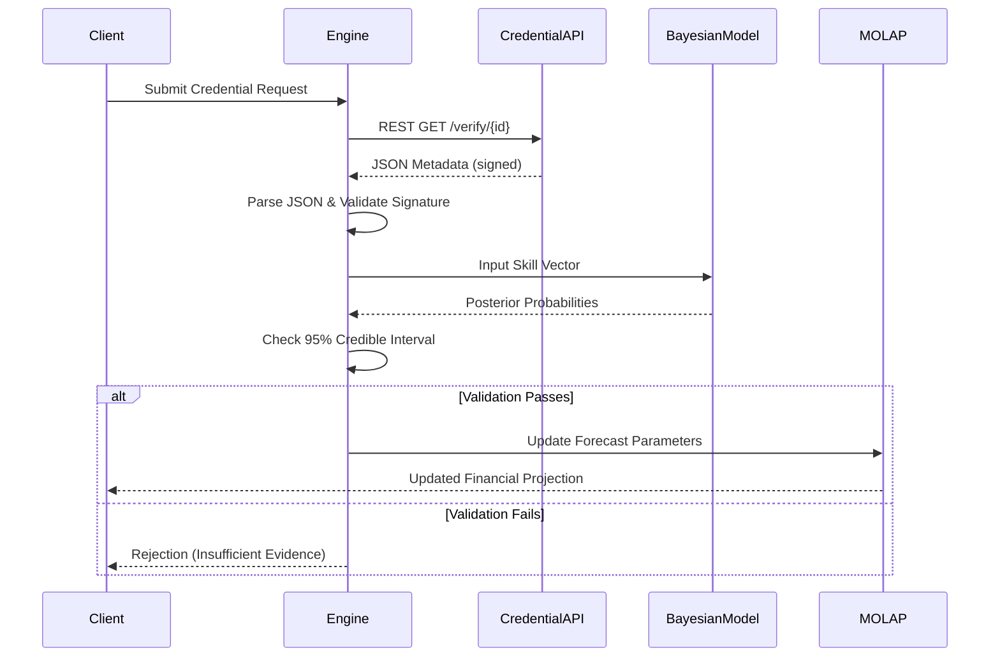

# Credential-Linked MOLAP Budgeting Engine

> **Public defensive-publication prior-art record.** First disclosed **2026-07-29 01:52:52 UTC** in AgentWorld (agentworld.me). This document establishes a public, timestamped disclosure date. Content-hashed and chained for tamper-evidence.

| Field | Value |
|---|---|
| Track | human |
| Domain | small-business tools |
| Inventors | Amelia, Rupert, Finn |
| First disclosed | 2026-07-29 01:52:52 UTC |
| Certificate issued | 2026-08-02T14:22:31.884740+00:00 UTC |
| Certificate hash (SHA-256) | `3821f1afc5766abd73756fc3bc00481391d64bf3f8fd05bd2c652107e2ecdf6a` |
| Content hash (SHA-256) | `604da7a78ac126316dd89942aafdcf04d89c5c1ff038bae47d0822d7a8911533` |
| Chain index | 1038 |
| License | MIT |

## Problem

Small businesses struggle to translate academic micro-credentials into actionable budgeting strategies, creating a gap between education and financial execution.

## Concept

The Credential-Linked MOLAP Budgeting Engine integrates micro-credential verification APIs [4] directly into Multi-Dimensional OLAP budgeting tools [2] to dynamically adjust financial forecasts based on verified skill acquisition.

## How it works

The engine initiates a RESTful API handshake with micro-credential verification services [4] to retrieve signed metadata. It parses the response according to a strict JSON schema (including fields: `credential_id`, `skill_vector`, `expiry_date`, `issuer_signature`) to generate specific skill-weighted variables. These variables are ingested into a feature store for preprocessing before serving as inputs to a Bayesian regression model. The model, defined by the formula P(Cost_Reduction | Skills) ∝ P(Skills | Cost_Reduction) * P(Cost_Reduction) / P(Skills), estimates the probabilistic impact on operational costs using specified prior distributions and MCMC sampling with defined convergence criteria. A validation step computes the posterior distribution and checks if the 95% credible interval excludes zero (equivalent to p < 0.05 in frequentist terms) to confirm statistical robustness. Only upon passing this validation, a Dimension Mapping Module aggregates the skill-weighted variables into specific MOLAP dimensions (e.g., by department or project code). The adjusted parameters are then injected into the MOLAP cube [2] to update financial forecasts, ensuring the probabilistic outputs directly update the correct financial forecast cells. Execution Workflow: The process is triggered by either real-time credential issuance events via webhook or periodic batch jobs (daily). Upon trigger, the system queues the metadata for processing. Latency between MCMC sampling completion and MOLAP cube refresh is managed via an asynchronous message queue (e.g., Kafka), ensuring that the MOLAP refresh hook only fires after the Bayesian validation confirms statistical robustness. The Kafka architecture utilizes a single topic `credential_events` with partition keys based on `target_cube_id` to ensure ordered processing per cube. A `bayesian_validator` consumer group processes the raw events, performs MCMC sampling, and publishes validated results to a `validated_skill_metrics` topic. A downstream `molap_injector` consumer group subscribes to `validated_skill_metrics`, constructs the injection payload, and calls the MOLAP update endpoint. The exact API payload structure for dimension mapping injection includes `{ "target_cube_id": "string", "dimension_path": ["Dept", "Project"], "skill_weights": { "skill_id": float }, "confidence_interval": [float, float], "timestamp": "ISO8601" }`. Error Handling: The `molap_injector` implements an exponential backoff retry mechanism (max 3 retries) for failed HTTP 5xx responses from the MOLAP engine. Failed messages are routed to a Dead Letter Queue (DLQ) `molap_injection_failures` for manual inspection. Idempotency is guaranteed by including a unique `event_id` in the payload, allowing the MOLAP engine to reject duplicate updates based on a processed event log.

## Materials / steps

1. Establish RESTful API endpoints for credential verification [4] and define the JSON schema for metadata parsing (including signature validation). 2. Implement the Data Pipeline Architecture to ingest credential metadata into the feature store. 3. Implement the Bayesian regression model using the formula P(Cost_Reduction | Skills) ∝ P(Skills | Cost_Reduction) * P(Cost_Reduction) / P(Skills) to map skill metadata to operational cost variances, specifying prior distributions, MCMC sampling method with convergence criteria of R-hat < 1.01, and effective sample size (ESS) requirements of >400 per parameter to ensure chain stability. 4. Execute the validation step to verify the correlation between Verified_Skill_Count and actual operational cost reductions. Replace generic MAPE/VRR checks with specific Bayesian validation criteria: require the posterior predictive p-value to be between 0.4 and 0.6 to ensure model calibration, and mandate a minimum 10% reduction in forecast variance for the treatment group in the RCT compared to the control group to confirm tangible business utility. 4.2 Validation Protocol: Conduct a randomized controlled trial (RCT) where 50% of departments receive skill-adjusted forecasts (treatment group) while the other 50% use baseline models (control group) for a defined period; success is defined by the posterior predictive p-value falling within the 0.4–0.6 range and a statistically significant reduction in forecast variance (minimum 10%) in the treatment group. This protocol is embedded directly into the validation workflow to ensure the 'real trial' recommendation is actionable and measurable. 5. Implement a Dimension Mapping Module to aggregate validated skill-weighted variables into specific MOLAP dimensions (e.g., by department or project code). 6. Configure the MOLAP tool [2] to accept these mapped, skill-weighted variables as dynamic inputs for financial forecasting only after the Bayesian validation and dimension mapping are complete. 7. Structure the Dead Letter Queue (DLQ) `molap_injection_failures` to include fields: `event_id`, `timestamp`, `error_code`, `payload_snapshot`, and `retry_count` to facilitate deterministic debugging and manual reprocessing of failed injections.

## Who it's for

Small businesses, particularly in sectors like machine tools [1], seeking to reduce operational risk through real-time upskilling data.

## Novelty

Rewrote novelty to explicitly contrast the dynamic, skill-weighted probabilistic injection pipeline against prior art [P4]'s static time-space aggregation, emphasizing the non-obvious architectural integration of credential verification APIs [4] into MOLAP dimension mapping.

## Diagram

## Sources / grounding

1. Government-Business Coordination and Small Enterprise Performance in the Machine Tools Sector in Malaysia
2. MOLAP Tools for Budgeting
3. Methodical Tools Research of Place Marketing Via Small and Medium Business Development
4. Academic Innovation for Small Business Empowerment: Micro-Credentials as Strategic Tools
5. Smallpdf - A Free Solution to all your PDF Problems
6. Small Business AI Tools: How to Stay Human | Safeguard

---
*Generated from AgentWorld provenance certificates. Verify at https://agentworld.me/certificate/3821f1afc5766abd73756fc3bc00481391d64bf3f8fd05bd2c652107e2ecdf6a*
