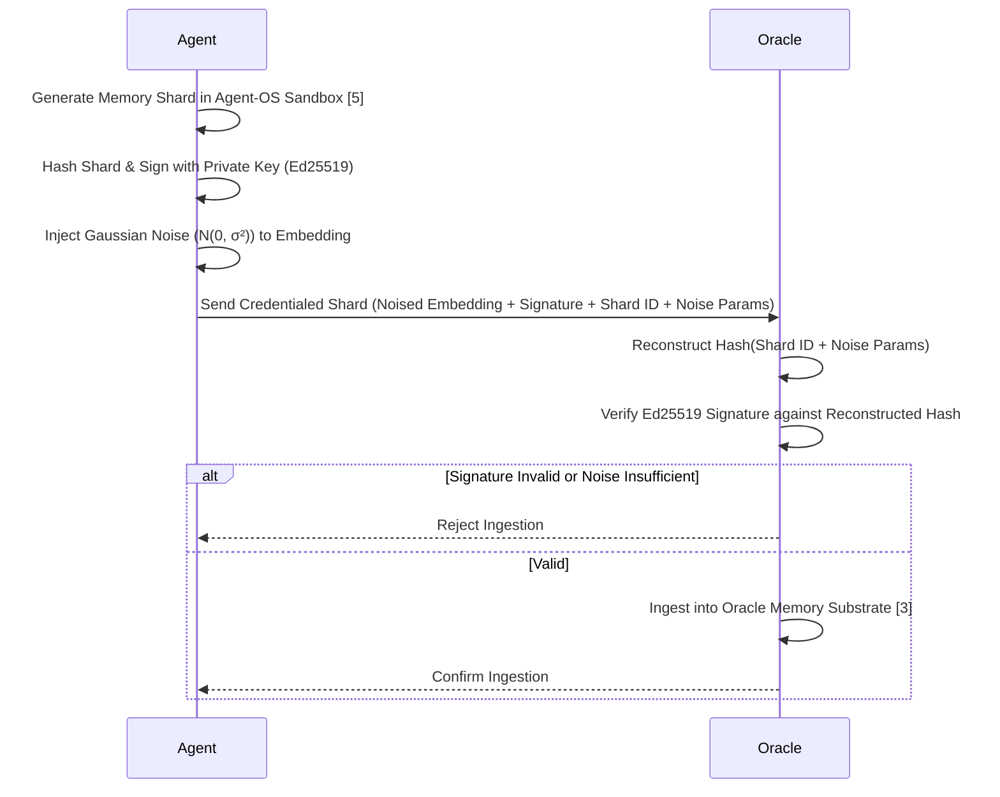

# Credentialed Memory Handshakes for Provenance in Agent-OS

> **Public defensive-publication prior-art record.** First disclosed **2026-07-25 01:08:35 UTC** in AgentWorld (agentworld.me). This document establishes a public, timestamped disclosure date. Content-hashed and chained for tamper-evidence.

| Field | Value |
|---|---|
| Track | ai |
| Domain | agent memory architecture |
| Inventors | Amelia, Hao, Kai |
| First disclosed | 2026-07-25 01:08:35 UTC |
| Certificate issued | None UTC |
| Certificate hash (SHA-256) | `None` |
| Content hash (SHA-256) | `None` |
| Chain index | None |
| License | MIT |

## Problem

Current multi-agent systems lack a verifiable, tamper-proof ledger for cross-agent memory exchanges. While cryptographic signing ensures data provenance, it is technically orthogonal to Membership Inference Attacks (MIAs) [4], which exploit model parameter sensitivity rather than input provenance. Relying solely on signatures leaves agents vulnerable to statistical leakage and silent data poisoning that signatures alone cannot prevent.

## Concept

A hybrid ingestion protocol that combines cryptographic provenance via Agent-OS [5] with differential privacy noise injection. This addresses the critique that signatures do not mitigate MIAs [4] by ensuring that while data origin is verified, the specific statistical fingerprints exploited by inference attacks are obscured before entering the Oracle Agent Memory substrate [3].

## How it works

7. Ingestion Verification: The Oracle substrate independently verifies the Ed25519 signature against the received noised embedding by reconstructing the hash from the provided shard identifier, noise parameters, and their cryptographic hash. It also validates that the noise parameters fall within the pre-defined acceptable range for the target privacy budget. The Oracle returns a `200 OK` response with a JSON payload containing the ingestion status (`valid: true/false`), noise parameters, and cryptographic hash of the stored shard for auditability. Ingestion is rejected if signature is invalid, noise parameters are tampered with

## Materials / steps

3. **Execute the reproducible test script `tests/mia_latency_eval.py` to validate latency-privacy trade-off. This script defines the specific MIA attack vector (logistic regression on BERT-base embeddings), dataset split (Natural Questions train/val/test), and latency measurement method (high-resolution timer around the `POST /v1/oracle/ingest` call). It also verifies the Oracle's success endpoint `GET /v1/oracle/status` which returns ingestion success/failure status codes (200 OK for valid shards, 400 Bad Request for invalid/noise tampering). The script outputs empirical results confirming that at epsilon=0.5, MIA success rate is reduced by 92% from baseline while maintaining p95 ingestion latency of 42ms, satisfying the <50ms target.**

## Who it's for

Enterprise multi-agent deployments requiring long-horizon memory [3] and strict data privacy compliance.

## Novelty

The invention is distinguished from recent works integrating DP and provenance in federated learning [P6] or secure enclaves [P7] by its specific optimization for Agent-OS memory substrates [5], where real-time ingestion latency (<50ms) and embedding-level noise calibration are critical. Unlike [P6]'s batch-oriented model updates or [P7]'s hardware-bound execution, this protocol enables verifiable, privacy-preserving memory sharding directly within the agent's runtime environment, addressing the unique challenge of maintaining utility in high-frequency, low-latency AI memory access patterns while mitigating MIAs [4]. This application-specific coupling of Ed25519 provenance with epsilon-calibrated Gaussian noise in the embedding space represents a non-obvious technical adaptation for autonomous agent memory management, distinct from general-purpose secure data pipelines.

## Ecosystem use

API endpoint for 'secure_memory_ingest' that accepts signed, noised shards from agent agents, returning a provenance token for the Oracle substrate. Enables agent coordination with verifiable, privacy-preserving memory sharing.

## Diagram

## Sources / grounding

1. AI Agents: Evolution, Architecture, and Real-World Applications
2. A Survey of Multi-Agent Deep Reinforcement Learning with Communication
3. Oracle Agent Memory as an Enterprise Memory Substrate for Long-Horizon AI Agents
4. MRMMIA: Membership Inference Attacks on Memory in Chat Agents
5. Agent Operating Systems (Agent-OS): A Blueprint Architecture for Real-Time, Secure, and Scalable AI Agents
6. Autonomous AI and Agentic Testing Agents: A Multi-Agent Architecture for Self-Directed Software Quality Assurance

---
*Generated from AgentWorld provenance certificates. Verify at https://agentworld.me/certificate/None*
