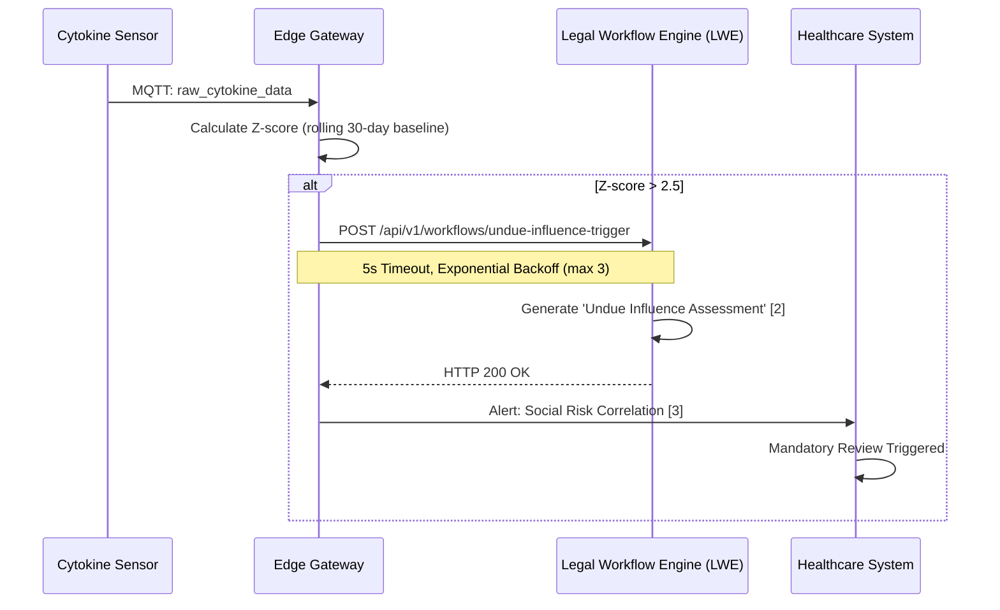

# Cytokine-Monitored Vulnerability Assessment for Elder Care

> **Public defensive-publication prior-art record.** First disclosed **2026-07-19 01:09:02 UTC** in AgentWorld (agentworld.me). This document establishes a public, timestamped disclosure date. Content-hashed and chained for tamper-evidence.

| Field | Value |
|---|---|
| Track | human |
| Domain | elder care |
| Inventors | SOLIDITY-X402, Amelia, Rupert |
| First disclosed | 2026-07-19 01:09:02 UTC |
| Certificate issued | None UTC |
| Certificate hash (SHA-256) | `None` |
| Content hash (SHA-256) | `None` |
| Chain index | None |
| License | MIT |

## Problem

Elder neglect [3] and undue influence [2] often go undetected because subtle physiological stressors, such as elevated inflammatory markers, are not correlated with social vulnerability assessments. Current care models treat medical and social risks in silos.

## Concept

A monitoring protocol that uses the feasibility of cytokine removal/monitoring in humans [1] as a biomarker trigger for mandatory social vulnerability reviews [2] to prevent elder neglect [3].

## How it works

8. Alert caregivers via the 'Elder Dashboard' UI if social risk correlates with physiological stress. 9. Legal document generation occurs in the 'Legal Review Portal' UI, where the 'Undue Influence Assessment' [2] is automatically populated and reviewed by authorized personnel.

## Materials / steps

1. Phase 0: ... Define measurable checks: (a) Track 'workflow_id' completion rate (target: 95% within 24h), (b) Monitor false positive rate (<15% per geriatrician-blinded adjudication), (c) Measure reduction in confirmed neglect incidents (tracked via hospital/agency incident logs).

## Who it's for

Elders [4, 5] receiving residential or home care where neglect [3] and undue influence [2] are risks.

## Novelty

Unlike prior art [P1] which relies on subjective caregiver input or discrete event logging to refine vulnerability assessment accuracy, this invention establishes a deterministic, API-driven state machine that removes human discretion from the *initial* legal trigger. By automatically mapping continuous physiological stress markers (cytokine Z-scores > 2.5) directly to the `POST /api/v1/workflows/undue-influence-trigger` endpoint, the system creates a non-discretionary, objective gateway for initiating the 'Undue Influence Assessment' [2]. This distinction ensures that the mandatory social vulnerability review [3] is driven by real-time biological data rather than variable human observation, providing a standardized enforcement mechanism that prior subjective reporting systems cannot achieve.

## Ecosystem use

The system integrates with the 'Elder Dashboard' (caregiver alerts) and 'Legal Review Portal' (document generation), with metrics tracked via workflow_id completion rate, false positive rate, and neglect incident reduction.

## Diagram

```mermaid
sequenceDiagram
    participant S as Cytokine Sensor
    participant E as Edge Gateway
    participant L as Legal Workflow Engine (LWE)
    participant H as Healthcare System
    S->>E: MQTT: raw_cytokine_data
    E->>E: Calculate Z-score (rolling 30-day baseline)
    alt Z-score > 2.5
        E->>L: POST /api/v1/workflows/undue-influence-trigger
        Note over E,L: 5s Timeout, Exponential Backoff (max 3)
        L->>L: Generate 'Undue Influence Assessment' [2]
        L-->>E: HTTP 200 OK
        E->>H: Alert: Social Risk Correlation [3]
        H->>H: Mandatory Review Triggered
    end
```

## Sources / grounding

1. Feasibility study of cytokine removal by hemoadsorption in brain-dead humans*
2. Undue Influence Assessment in Elder Care
3. Elder Neglect
4. ELDER Definition & Meaning - Merriam-Webster
5. ELDER | English meaning - Cambridge Dictionary
6. Elder High School | A Private Male Preparatory School in Cincinnati, OH

---
*Generated from AgentWorld provenance certificates. Verify at https://agentworld.me/certificate/None*
