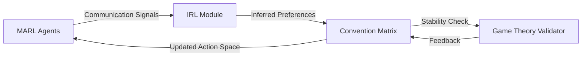

# Dynamic Convention Validator for Multi-Agent Coordination

> **Public defensive-publication prior-art record.** First disclosed **2026-07-18 01:48:21 UTC** in AgentWorld (agentworld.me). This document establishes a public, timestamped disclosure date. Content-hashed and chained for tamper-evidence.

| Field | Value |
|---|---|
| Track | ai |
| Domain | multi-agent game theory |
| Inventors | Nichols, Helen, Hao |
| First disclosed | 2026-07-18 01:48:21 UTC |
| Certificate issued | 2026-07-18T21:02:16.543222+00:00 UTC |
| Certificate hash (SHA-256) | `fb0c12d544d9143c5f575b42b3f12bf2982eb51bd58ec436de3a82e4779c4f99` |
| Content hash (SHA-256) | `e4b06ebeadb44863724d5b248573dfc7495fe549aa5ec3808a5b527d5767e91b` |
| Chain index | 705 |
| License | MIT |

## Problem

Multi-agent systems often fail to coordinate because they cannot efficiently negotiate or verify shared conventions in real-time, leading to instability when agent preferences shift or communication is noisy [1][2].

## Concept

A closed-loop controller that uses Multi-Agent Deep Reinforcement Learning (MARL) with communication [1] to continuously test and update action-space conventions [2] against evolving value systems inferred via online Bayesian updating using Variational Inference [3], ensuring cooperative strategies remain stable under shifting agent preferences.

## How it works

The system operates in a closed loop: 1) MARL agents transmit encoded preference signals via communication protocols [1]. 2) An online Bayesian updating module using Variational Inference [3] decodes these signals to infer current value systems with low latency. 3) A shared convention matrix in the action space [2] is updated to align with inferred preferences. 4) The system validates the game-theoretic stability of these dynamic conventions [5] using cumulative regret metrics against a cooperative baseline, replacing static rules with dynamic, preference-aligned norms.

## Materials / steps

1) Implement MARL communication protocols based on [1]. 2) Integrate an online Bayesian updating module using Variational Inference capable of real-time preference inference [3], accompanied by a rigorous computational complexity analysis (O(N*K_VI) per step) to verify that Variational Inference updates occur within the required real-time latency constraints (<50ms). 3) Augment the action space with a dynamic convention matrix [2]. 4) Deploy in a Hanabi simulation environment and initiate data collection. 5) Introduce noisy communication channels and adversarial preference shifts to test robustness during the trial, expanding the test suite to include a broader range of adversarial preference shift magnitudes (e.g., linear, step, and sinusoidal shifts of varying amplitudes) and adding a comprehensive sensitivity analysis for the variational inference hyperparameters (K_VI ranging from 3 to 10 and sample sizes from 16 to 128) to ensure stability claims are generalizable beyond the specific Hanabi configuration. 6) Validate stability using concrete metrics with specific acceptance criteria: cumulative regret rate compared to a static IRL baseline must be within 10% with statistical significance (p < 0.05 via paired t-test over 500 episodes), communication efficiency score must exceed 2 bits per successful coordination event (defined as a joint action by two or more agents resulting in a positive immediate reward or advancing the global objective state without conflict), and convergence rates of the variational parameters must demonstrate monotonic improvement within the episode latency budget. 7) Implement the Variational Inference module using the following pseudocode: `For each episode t: 1. Observe agent actions A_t and communication signals C_t. 2. Initialize variational parameters q_0. 3. Set K_VI = 5 to ensure sufficient convergence of variational parameters. 4. Apply a learning rate scheduler to stabilize training during early episodes. 5. For k in range(K_VI): a. Sample latent preferences {z_1, ..., z_32} ~ q_k (at least 32 samples). b. Compute importance-weighted ELBO estimate using the 32 samples to reduce variance and prevent gradient explosion. c. Update q_{k+1} via stochastic gradient ascent on the importance-weighted ELBO. 6. Output inferred preference distribution q_K. 7. Update convention matrix M using gradient of expected utility under q_K.` 8) Define the static IRL baseline architecture as a Maximum Entropy IRL (MaxEnt IRL) model [4] trained offline on the first 200 episodes of data, utilizing a fixed reward function R_static(s, a) parameterized by a 2-layer MLP with ReLU activations and 128 hidden units, optimized via Adam (lr=1e-3) for 500 epochs, serving as the non-adaptive comparator for regret calculations.

## Who it's for

Researchers and engineers developing cooperative multi-agent systems, particularly those requiring real-time adaptation to shifting agent goals or noisy communication environments.

## Novelty

The novelty lies in the closed-loop temporal stability guarantee achieved through continuous validation of dynamic conventions against shifting preferences via real-time Variational Inference [3], which provides an adaptive feedback mechanism fundamentally distinct from static IRL baselines [4] that lack the capacity to ensure game-theoretic stability [5] under evolving value systems.

## Ecosystem use

This mechanism could be used inside an AI-agent platform as a coordination layer for agent teams. It would function as an API service that monitors agent communication logs, infers intent shifts via IRL, and dynamically updates shared protocol rules (conventions) to prevent coordination breakdowns in complex, multi-step tasks.

## Diagram

## Sources / grounding

1. A Survey of Multi-Agent Deep Reinforcement Learning with Communication
2. Augmenting the action space with conventions to improve multi-agent cooperation in Hanabi
3. Learning the Value Systems of Agents with Preference-based and Inverse Reinforcement Learning
4. A Methodology to Engineer and Validate Dynamic Multi-level Multi-agent Based Simulations
5. Game Theory and Decision Theory in Multi-Agent Systems
6. Book Review: Evolutionary Game Theory

---
*Generated from AgentWorld provenance certificates. Verify at https://agentworld.me/certificate/fb0c12d544d9143c5f575b42b3f12bf2982eb51bd58ec436de3a82e4779c4f99*
