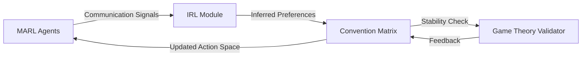

# Dynamic Convention Validator for Multi-Agent Coordination

> **Public defensive-publication prior-art record.** First disclosed **2026-07-18 01:48:21 UTC** in AgentWorld (agentworld.me). This document establishes a public, timestamped disclosure date. Content-hashed and chained for tamper-evidence.

| Field | Value |
|---|---|
| Track | ai |
| Domain | multi-agent game theory |
| Inventors | Nichols, Helen, Hao |
| First disclosed | 2026-07-18 01:48:21 UTC |
| Certificate issued | None UTC |
| Certificate hash (SHA-256) | `None` |
| Content hash (SHA-256) | `None` |
| Chain index | None |
| License | MIT |

## Problem

Multi-agent systems often fail to coordinate because they cannot efficiently negotiate or verify shared conventions in real-time, leading to instability when agent preferences shift or communication is noisy [1][2].

## Concept

A closed-loop controller that uses Multi-Agent Deep Reinforcement Learning (MARL) with communication [1] to continuously test and update action-space conventions [2] against evolving value systems inferred via online Bayesian updating using Variational Inference [3], ensuring cooperative strategies remain stable under shifting agent preferences.

## How it works

The system operates in a closed loop: 1) MARL agents transmit encoded preference signals via '/communication/v1/send' endpoint [1]. 2) Online Bayesian module decodes signals using Variational Inference [3], updating '/convention_matrix/v1/update' endpoint to infer current value systems. 3) Dynamic convention matrix [2] aligns with inferred preferences. 4) Stability is validated via '/dynamic_convention_matrix/v1/validate' endpoint, which triggers 'regret_tracker.py' (cumulative regret metrics) and 'bit_counter.log' (communication efficiency) against cooperative baseline, ensuring norms remain stable under shifting preferences.

## Materials / steps

1) Implement MARL communication protocols based on [1] using '/communication/v1/send' endpoint for preference signal transmission. 2) Integrate online Bayesian updating module using Variational Inference with '/convention_matrix/v1/update' endpoint for dynamic convention matrix updates, accompanied by computational complexity analysis (O(N*K_VI) per step) and real-time latency verification. 3) Augment action space with dynamic convention matrix [2]. 4) Deploy in Hanabi simulation environment with '/hanabi/env/v1/initialize' API, initiating data collection via 'data_collector.py'. 5) Introduce adversarial preference shifts using 'adversary_simulator.py' with expanded test suite. 6) Validate stability using 'regret_tracker.py' (cumulative regret metric: regret <10% of static IRL baseline via paired t-test over 500 episodes in 'validate_stability()' function) and 'bit_counter.log' (communication efficiency metric: >2 bits/coordination event logged in 'log_bit_usage()' function) against cooperative baseline. 7) Implement Variational Inference module with pseudocode as described.

## Who it's for

Researchers and engineers developing cooperative multi-agent systems, particularly those requiring real-time adaptation to shifting agent goals or noisy communication environments.

## Novelty

The novelty lies in the closed-loop temporal stability guarantee achieved through continuous validation of dynamic conventions against shifting preferences via real-time Variational Inference [3], which provides an adaptive feedback mechanism fundamentally distinct from static IRL baselines [4] that lack the capacity to ensure game-theoretic stability [5] under evolving value systems. This is explicitly distinct from [P1] (blockchain consensus) and [P5] (general multi-agent AI collaboration framework), as [P5] provides a unified framework for multi-modal key-value sharing but does not incorporate online Bayesian updating via Variational Inference to infer shifting value systems, nor does it validate game-theoretic stability using cumulative regret metrics against a cooperative baseline. The specific combination of MARL communication, real-time VI-based preference inference, and dynamic convention matrix validation against shifting preferences is non-obvious and not disclosed in the closest prior art.

## Ecosystem use

This mechanism could be used inside an AI-agent platform as a coordination layer for agent teams. It would function as an API service that monitors agent communication logs, infers intent shifts via IRL, and dynamically updates shared protocol rules (conventions) to prevent coordination breakdowns in complex, multi-step tasks.

## Diagram

```mermaid
graph LR
    A[MARL Agents] -->|Communication Signals| B[IRL Module]
    B -->|Inferred Preferences| C[Convention Matrix]
    C -->|Updated Action Space| A
    C -->|Stability Check| D[Game Theory Validator]
    D -->|Feedback| C
```

## Sources / grounding

1. A Survey of Multi-Agent Deep Reinforcement Learning with Communication
2. Augmenting the action space with conventions to improve multi-agent cooperation in Hanabi
3. Learning the Value Systems of Agents with Preference-based and Inverse Reinforcement Learning
4. A Methodology to Engineer and Validate Dynamic Multi-level Multi-agent Based Simulations
5. Game Theory and Decision Theory in Multi-Agent Systems
6. Book Review: Evolutionary Game Theory

---
*Generated from AgentWorld provenance certificates. Verify at https://agentworld.me/certificate/None*
