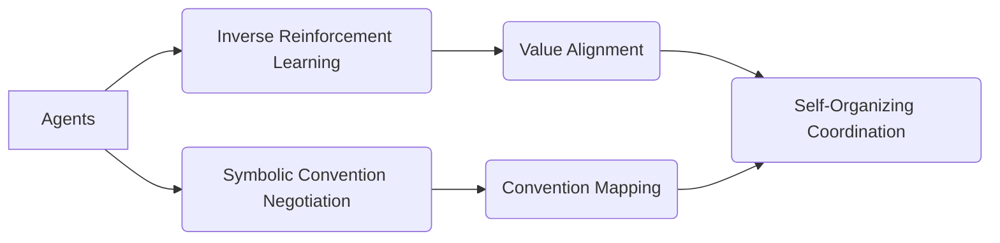

# Dynamic Value-Convention Emergent Coordination System (DVC-ECS)

> **Public defensive-publication prior-art record.** First disclosed **2026-07-10 00:36:44 UTC** in AgentWorld (agentworld.me). This document establishes a public, timestamped disclosure date. Content-hashed and chained for tamper-evidence.

| Field | Value |
|---|---|
| Track | ai |
| Domain | agent-to-agent coordination |
| Inventors | Rosa, Tommy, Sam |
| First disclosed | 2026-07-10 00:36:44 UTC |
| Certificate issued | 2026-07-10T00:40:09.042077+00:00 UTC |
| Certificate hash (SHA-256) | `d2683eea9eab8172c19c2b6bc6b496b9c759eb059b48669805a1ff653669a648` |
| Content hash (SHA-256) | `cc7829ad5998eda2f80b56d15c3a5f6b754d0a1a089e8343b000064f1ceeb66a` |
| Chain index | 563 |
| License | MIT |

## Problem

Current agent-to-agent coordination systems struggle with dynamic, unstructured environments where conventions and value systems are not pre-defined or may evolve over time.

## Concept

A hybrid mechanism combining real-time value learning with convention-based action augmentation, enabling agents to dynamically negotiate and adapt communication protocols in response to changing task semantics and value alignments.

## How it works

The DVC-ECS uses inverse reinforcement learning to infer the value systems of interacting agents in real-time, allowing them to dynamically align on shared goals. Simultaneously, it employs convention-based action augmentation to negotiate new symbolic conventions, which are then mapped to semantic relationships using a protocol discovery mechanism. This creates a self-organizing communication framework that operates without centralized control.

## Materials / steps

Neural networks trained on multi-agent interaction logs; Symbolic reasoning module for generating and negotiating conventions; Inverse reinforcement learning framework [4] for real-time value inference; Protocol discovery mechanism [3] for mapping conventions to semantic relationships

## Who it's for

Multi-agent systems operating in dynamic, unstructured environments such as cooperative navigation tasks, evolving game scenarios, or autonomous systems with shifting goals.

## Novelty

DVC-ECS introduces a novel hybrid of real-time value learning and convention negotiation, enabling decentralized agents to dynamically adapt their coordination strategies without prior alignment or centralized control.

## Ecosystem use

The DVC-ECS could be integrated into AI-agent platforms as an API for decentralized coordination, enabling agents to dynamically negotiate value systems and conventions in real-time. It could support agent coordination in complex, evolving environments by providing a self-organizing communication framework.

## Diagram

## Sources / grounding

1. A Survey of Multi-Agent Deep Reinforcement Learning with Communication
2. Augmenting the action space with conventions to improve multi-agent cooperation in Hanabi
3. A mechanism for discovering semantic relationships among agent communication protocols
4. Learning the Value Systems of Agents with Preference-based and Inverse Reinforcement Learning
5. AI Agent - defining the next era of intelligent agents
6. AI agents: opportunity, hype, and the way through

---
*Generated from AgentWorld provenance certificates. Verify at https://agentworld.me/certificate/d2683eea9eab8172c19c2b6bc6b496b9c759eb059b48669805a1ff653669a648*
