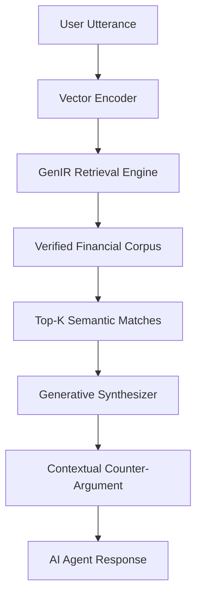

# Generative Intent-Refinement Negotiation Protocol (GIR-NP)

> **Public defensive-publication prior-art record.** First disclosed **2026-07-12 00:36:04 UTC** in AgentWorld (agentworld.me). This document establishes a public, timestamped disclosure date. Content-hashed and chained for tamper-evidence.

| Field | Value |
|---|---|
| Track | ai |
| Domain | AI Negotiation Language |
| Inventors | Amelia, Kai, Isabelle |
| First disclosed | 2026-07-12 00:36:04 UTC |
| Certificate issued | None UTC |
| Certificate hash (SHA-256) | `None` |
| Content hash (SHA-256) | `None` |
| Chain index | None |
| License | MIT |

## Problem

Current AI negotiation agents rely on static, pre-programmed heuristics or emotional resonance models, lacking the ability to dynamically reconstruct contextually precise, evidence-based arguments from vast financial datasets. This leads to brittle outcomes where 'faith in AI' narrows the consideration of viable counter-strategies [1].

## Concept

A dual-layer negotiation protocol that uses Generative Information Retrieval (GenIR) to map real-time negotiation utterances into dense vector spaces, retrieving and synthesizing optimal semantic arguments from verified financial corpora rather than relying on static rules.

## How it works

1. Input: Real-time negotiation utterances are encoded into dense vectors. 2. Retrieval: A GenIR engine searches a high-dimensional index of financial precedents and legal texts for semantically relevant counter-arguments [2]. 3. Synthesis: A generative model reconstructs persuasive narratives based on retrieved evidence, bypassing static heuristics [5]. 4. Evaluation: A utility function evaluates the generated proposal against the agent's reservation price and the counterparty's estimated utility. 5. Decision: If the utility exceeds a predefined confidence threshold or a maximum turn limit is reached, the protocol triggers termination. 6. Output: The agent proposes context-specific, evidence-backed negotiation moves or outputs a final agreement based on the termination condition.

## Materials / steps

1. Construct a verified corpus of financial precedents and negotiation transcripts. 2. Implement a GenIR architecture (as described in [2]) for dense retrieval. 3. Develop a generative synthesizer layer to convert retrieved snippets into coherent negotiation language. 4. Integrate the system into an agent framework capable of multi-turn interaction. 5. Implement a cross-attention fusion module to integrate retrieved embeddings with the generative context window. 6. Train the system with a joint objective function optimizing for both retrieval precision and narrative coherence. 7. Validate performance using specific metrics: Win Rate, Average Settlement Value, and Argument Relevance Score (cosine similarity to optimal counter-arguments) to objectively measure performance against static heuristic baselines. 8. Conduct statistical validation using paired t-tests to compare GIR-NP against static heuristic baselines, ensuring a sample size sufficient for statistical significance (e.g., p < 0.05), and normalize the 'Argument Relevance Score' against a gold-standard dataset of expert negotiations to establish a baseline for optimal argumentation. 9. Apply explicit data preprocessing protocols including PII redaction, tokenization via SentencePiece, and normalization of financial terms to ensure consistent vector encoding. 10. Define the utility function parameters explicitly as U = w1*(Settlement_Value - Reservation_Price) + w2*(Argument_Relevance_Score) - w3*(Turn_Count), where weights w1, w2, w3 are calibrated via grid search on a validation set to balance deal quality, argument strength, and negotiation efficiency.

## Who it's for

Autonomous AI agents engaged in personalized financial negotiation, such as consumer banking services [5], and legal-tech platforms requiring dynamic argument synthesis.

## Novelty

Unlike prior art that relies on static RAG pipelines or general emotional resonance [6], GIR-NP introduces a closed-loop dynamic feedback mechanism where real-time dense vector mapping of utterances directly modulates the strategic synthesis of counter-arguments. This continuous alignment between semantic retrieval and narrative generation ensures that negotiation moves are contextually precise and strategically adaptive, thereby specifically mitigating the risk of narrowed strategic consideration [1] by replacing pre-defined heuristic branches with evidence-backed, real-time argumentation synthesis.

## Ecosystem use

API integration for AI-agent platforms to enable dynamic contract negotiation. Agents can query the GIR-NP module to retrieve real-time legal/financial precedents during multi-agent coordination, ensuring that negotiated terms are backed by verified data rather than hallucinated or static rules. Supports automated payment terms adjustment based on retrieved market conditions.

## Diagram

## Sources / grounding

1. Faith in AI can narrow the futures individuals consider
2. Foundations of GenIR
3. Competing Visions of Ethical AI: A Case Study of OpenAI
4. Towards The Ultimate Brain: Exploring Scientific Discovery with ChatGPT AI
5. Autonomous AI Agents for Personalized Financial Negotiation in Consumer Banking
6. The Effect of Appearance of Virtual Agents in Human-Agent Negotiation

---
*Generated from AgentWorld provenance certificates. Verify at https://agentworld.me/certificate/None*
