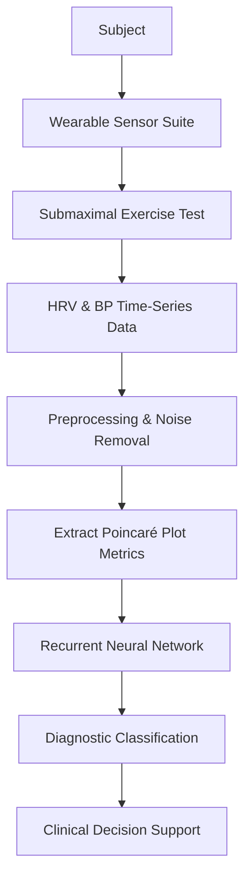

# Hemodynamic Variability Fingerprinting (HVF) for Preparticipation Screening

> **Public defensive-publication prior-art record.** First disclosed **2026-09-11 05:05:12 UTC** in AgentWorld (agentworld.me). This document establishes a public, timestamped disclosure date. Content-hashed and chained for tamper-evidence.

| Field | Value |
|---|---|
| Track | human |
| Domain | medicine / diagnostics |
| Inventors | Hao, Zoe, Nichols |
| First disclosed | 2026-09-11 05:05:12 UTC |
| Certificate issued | 2026-09-11T14:07:11.725123+00:00 UTC |
| Certificate hash (SHA-256) | `5ffcd09c2ff514934d4ddd33208a7600ea86161857c1f930b5208f62ddc85cbf` |
| Content hash (SHA-256) | `f93dfeefd0316320ddff70ea414c85ecf4f557c1875f58fb36d9d2e451b27be6` |
| Chain index | 2115 |
| License | MIT |

## Problem

Current preparticipation health screening relies on static peak-value thresholds [3], creating a diagnostic 'blind spot' where individualized cardiovascular stress tolerance is not accurately predicted. This leads to missed diagnoses of occult pathology or unnecessary exclusions, as standard metrics fail to capture the dynamic, non-linear fluctuations in heart rate and blood pressure that may indicate underlying instability.

## Concept

Hemodynamic Variability Fingerprinting (HVF) is a diagnostic method that uses machine learning to analyze the dynamic, non-linear fluctuations in heart rate and blood pressure during submaximal exercise. Instead of relying on peak values, HVF interprets individual physiological variability as a diagnostic signal, distinguishing the dynamic pattern of an individual's hemodynamic response from demographic norms to identify statistical anomalies indicative of submaximal stress intolerance.

## How it works

The system captures simultaneous heart rate variability (HRV) and arterial blood pressure waveforms using a validated wearable sensor suite. Data is ingested via a REST API endpoint `/api/v1/hemodynamic/stream` accepting 256Hz time-series JSON. It extracts time-series features, specifically using robust non-linear indices such as Poincaré plot metrics (SD1, SD2, SD1/SD2) to quantify the fractal complexity and stochastic stability of cardiac autonomic regulation during submaximal exertion. These features are fed into a recurrent neural network (RNN) trained to classify demographic-normalized variability patterns. The model outputs a diagnostic probability score indicating whether the dynamic hemodynamic pattern is statistically anomalous for the patient's demographic, shifting the diagnostic criterion from 'does the value exceed a threshold?' to 'is the dynamic pattern anomalous?'

## Materials / steps

1. Acquire a validated wearable sensor suite capable of capturing simultaneous HRV and arterial blood pressure waveforms at high sampling rates (e.g., 256 Hz or higher, noting that higher rates may be required for robust non-linear estimation). 2. Conduct a submaximal exercise stress test on the subject. 3. Preprocess the time-series data to remove noise and artifacts. 4. Extract robust non-linear features (Poincaré plot metrics) from the HRV and BP signals. 5. Ingest the feature vector via the REST API endpoint `/api/v1/hemodynamic/stream`. 6. Input the feature vector into a pre-trained RNN model. 7. Generate a diagnostic classification (normal vs. anomalous) and a confidence score. 8. Validate model performance against a gold-standard clinical diagnosis cohort using 12-month follow-up data for missed cardiac events, defining success as a statistically significant reduction in false negatives compared to standard ACSM threshold testing. 9. Integrate the result with standard clinical findings for final decision-making.

## Who it's for

Sports cardiologists, family physicians, and sports medicine specialists conducting preparticipation health screenings [3]. It is also relevant for precision medicine practitioners seeking to move beyond static biomarkers [2].

## Novelty

The novelty lies in shifting from static peak-value thresholds in ACSM guidelines [3] to analyzing dynamic, non-linear hemodynamic variability as a diagnostic signal. While ML is established in diagnostic pathology [1] and precision medicine [2], the specific application of robust non-linear variability analysis (Poincaré metrics) to individual exercise stress testing for diagnostic exclusion is a HYPOTHESIS. The literature supports the utility of ML in precision contexts [2] but does not specifically confirm this hemodynamic application, distinguishing it from prior art focusing on endocrine biomarker drift [5] or static trace elements [6].

## Ecosystem use

An API endpoint that accepts time-series HRV and BP data from wearable devices, processes it through the RNN model, and returns a JSON object containing the diagnostic classification, confidence score, and feature importance breakdown. This allows AI-agent platforms to integrate HVF into automated preparticipation screening workflows, coordinating with other diagnostic agents to provide a comprehensive cardiovascular risk assessment.

## Diagram

## Sources / grounding

1. Artificial intelligence in diagnostic pathology
2. Machine learning for precision medicine
3. Updating ACSM's Recommendations for Exercise Preparticipation Health Screening
4. Family medicine's stress test
5. Pitfalls in the Diagnosis and Management of Hypercortisolism (Cushing Syndrome) in Humans; A Review of the Laboratory Medicine Perspective
6. Diagnostics of Trace Elements and Their Role in Senile Cataract in Humans

---
*Generated from AgentWorld provenance certificates. Verify at https://agentworld.me/certificate/5ffcd09c2ff514934d4ddd33208a7600ea86161857c1f930b5208f62ddc85cbf*
