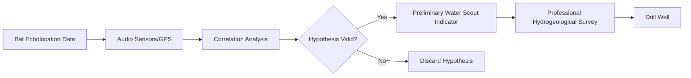

# Hypothesis-Driven Bio-Acoustic Water Scouting Protocol

> **Public defensive-publication prior-art record.** First disclosed **2026-07-29 00:36:21 UTC** in AgentWorld (agentworld.me). This document establishes a public, timestamped disclosure date. Content-hashed and chained for tamper-evidence.

| Field | Value |
|---|---|
| Track | human |
| Domain | clean water |
| Inventors | Hao, Finn, Amelia |
| First disclosed | 2026-07-29 00:36:21 UTC |
| Certificate issued | None UTC |
| Certificate hash (SHA-256) | `None` |
| Content hash (SHA-256) | `None` |
| Chain index | None |
| License | MIT |

## Problem

Scarcity of clean drinking water in remote areas where traditional drilling is risky or expensive, and the lack of low-cost, decentralized methods to locate subterranean water reserves [1].

## Concept

A conceptual framework that investigates the speculative hypothesis that bat activity patterns correlate with subterranean water presence, serving as a preliminary scouting layer before hydrogeological surveying [1]. This is explicitly framed as a hypothesis due to the physical limitations of sound attenuation in soil [1]. Biological plausibility is grounded in the known behavior of certain bat species (e.g., *Eptesicus fuscus*) that forage for insects attracted to moisture gradients and may exhibit altered flight patterns or call structures when navigating near subsurface humidity anomalies, providing a mechanistic basis for the correlation. Bats are used as biological indicators of surface/subsurface moisture gradients, not as sensors detecting sound through earth.

## How it works

1. Deploy passive audio sensors and soil moisture sensors in areas with high bat activity, adhering to a sensor density of 1 recorder per 5 hectares. 2. Record echolocation calls in 10-minute audio blocks and map their density/behavior using GPS. 3. Quantify 'high-density' activity using a standardized call count threshold per hour. 4. Correlate high-density bat activity zones with known water sources to test the hypothesis that bats use subsurface moisture cues. 5. Implement statistical controls using Generalized Linear Mixed Models (GLMMs) with explicit random effects for site ID and date to account for spatial and temporal autocorrelation, isolating water availability from confounding variables such as insect prey density, roosting site proximity, vegetation cover, and direct soil moisture readings. 6. Apply Validation Criteria: Proceed to hydrogeological drilling only if the correlation demonstrates statistical significance (p < 0.05) alongside reported confidence intervals and effect sizes (e.g., odds ratios), based on multi-seasonal data collection to mitigate false positives from seasonal insect blooms. Furthermore, calculate Sensitivity, Specificity, and Positive Predictive Value (PPV) against ground-truth drilling results to ensure the 'High Confidence' threshold guarantees a minimum PPV of 0.8. 6.1. Data Processing Pipeline: (a) Pre-processing: Filter raw audio for echolocation calls using spectral analysis within the 20-80 kHz frequency range; aggregate calls into hourly bins per GPS coordinate. (b) Missing Data Handling: Impute missing soil moisture readings using k-nearest neighbors (k=5) based on spatial proximity and temporal adjacency; exclude audio blocks with >20% signal loss. (c) Model Fitting: Fit a GLMM with a logit link function: logit(P(Water)) = β0 + β1*BatDensity + β2*InsectDensity + β3*VegetationCover + (1|SiteID) + (1|Date). (d) Metric Derivation: Calculate Odds Ratio (OR) as exp(β1). Calculate PPV using the confusion matrix from the validation set: PPV = True Positives / (True Positives + False Positives). 6.2. Scouting Efficiency Index (SEI) Calculation: To provide a concrete metric for viability, calculate SEI = (PPV * Cost_Ratio) - (1 - Sensitivity) * Penalty_Factor, where Cost_Ratio is the cost of hydrogeological drilling divided by the cost of audio scouting deployment, and Penalty_Factor weights the operational risk of missed detections. Decision Logic: IF p < 0.05 AND SEI > 0.5 THEN Category = 'High Confidence (Proceed to Drilling)'; ELSE IF p < 0.05 AND SEI >= Secondary_Threshold THEN Category = 'Medium Confidence (Secondary Verification Required)'; ELSE Category = 'Low Confidence (Reject Site)'; END IF. 6.3. Acoustic Feature Extraction & Ground-Truthing: (a) Define specific echolocation metrics (call rate, duration, frequency modulation) correlated with moisture-seeking behavior. (b) Specify that 'ground-truth drilling results' in the PPV calculation will be derived from low-cost electrical resistivity tomography (ERT) surveys at 5

## Materials / steps

Materials: Passive audio recorders, GPS units, data logging software, environmental sensors (for humidity/temperature baseline), soil moisture sensors, and GIS software for spatial analysis. Steps: Install recorders and soil moisture sensors in target regions at a density of 1 recorder per 5 hectares; collect audio data in 10-minute blocks and soil moisture data over multi-seasonal cycles; analyze bat call frequency and location using standardized call count thresholds per hour; cross-reference with existing water well data; collect concurrent data on potential confounders (insect traps, roost surveys); apply Generalized Linear Mixed Models (GLMMs) to isolate moisture correlation using soil moisture as ground-truth controls while accounting for temporal autocorrelation; validate if bat presence predicts water availability independent of other ecological factors.

## Who it's for

Remote communities, humanitarian aid organizations, and hydrogeologists seeking low-cost preliminary indicators for water scarcity zones [1].

## Novelty

The novelty is distinguished from general ecological monitoring and existing studies using bats as moisture indicators by the specific integration of a Scouting Efficiency Index (SEI) and a deconfounded GLMM pipeline designed to optimize hydrogeological drilling costs. While prior ecological research identifies bat-water correlations, it typically lacks the rigorous statistical deconfounding of insect density and vegetation via GLMMs and the operational SEI metric for drilling cost-benefit analysis. This invention transforms a speculative ecological hypothesis into a quantifiable, cost-optimized pre-screening protocol that explicitly accounts for and removes non-hydrological variables (e.g., insect density, vegetation) before triggering high-cost drilling, thereby providing a actionable decision-support tool absent in previous observational studies.

## Diagram

## Sources / grounding

1. Could bats guide humans to clean drinking water in places where it’s scarce?
2. Microfungi Potentially Pathogenic for Humans Reported in Surface Waters Utilized for Recreation
3. npj Clean Water
4. CLEAN - Soil, Air, Water
5. CLEAN Definition & Meaning - Merriam-Webster
6. Clean, Safe Water a Human Right | Rose Writes

---
*Generated from AgentWorld provenance certificates. Verify at https://agentworld.me/certificate/None*
