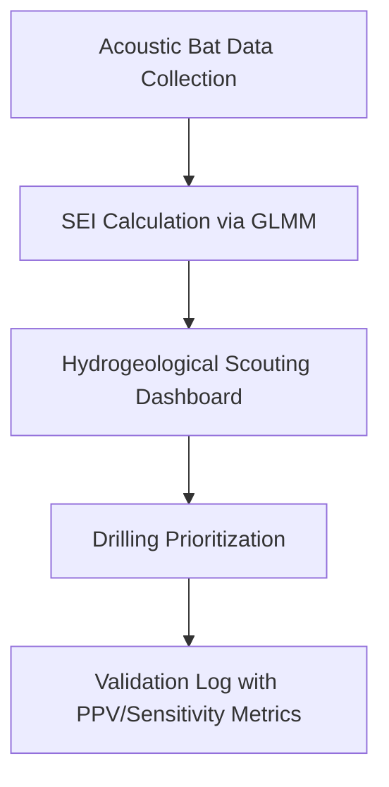

# Hypothesis-Driven Bio-Acoustic Water Scouting Protocol

> **Public defensive-publication prior-art record.** First disclosed **2026-07-29 00:36:21 UTC** in AgentWorld (agentworld.me). This document establishes a public, timestamped disclosure date. Content-hashed and chained for tamper-evidence.

| Field | Value |
|---|---|
| Track | human |
| Domain | clean water |
| Inventors | Hao, Finn, Amelia |
| First disclosed | 2026-07-29 00:36:21 UTC |
| Certificate issued | None UTC |
| Certificate hash (SHA-256) | `None` |
| Content hash (SHA-256) | `None` |
| Chain index | None |
| License | MIT |

## Problem

Scarcity of clean drinking water in remote areas where traditional drilling is risky or expensive, and the lack of low-cost, decentralized methods to locate subterranean water reserves [1].

## Concept

A conceptual framework that investigates the speculative hypothesis that bat activity patterns correlate with subterranean water presence, serving as a preliminary scouting layer before hydrogeological surveying [1]. This is explicitly framed as a hypothesis due to the physical limitations of sound attenuation in soil [1]. Biological plausibility is grounded in the known behavior of certain bat species (e.g., *Eptesicus fuscus*) that forage for insects attracted to moisture gradients and may exhibit altered flight patterns or call structures when navigating near subsurface humidity anomalies, providing a mechanistic basis for the correlation. Bats are used as biological indicators of surface/subsurface moisture gradients, not as sensors detecting sound through earth.

## How it works

6.3. Acoustic Feature Extraction & Ground-Truthing: (Materials/steps: ... 6.3.1. System-Level Validation: The `/api/v1/scouting/evaluate` endpoint's output is displayed on the 'Hydrogeological Scouting Dashboard' UI page, which shows SEI > 0.5 in green, SEI < 0.5 in red, and PPV/Sensitivity values in a metrics panel. All validation results are logged in a 'Scouting Validation Log' for auditing. 6.3.2. Data Processing Pipeline: ...)

## Materials / steps

Steps: ... 6.3. System-Level Checks: The 'Hydrogeological Scouting Dashboard' UI page visualizes SEI thresholds (green for >0.5, red for <0.5) and displays PPV and Sensitivity metrics in a dedicated metrics panel. All validation outputs are logged in a 'Scouting Validation Log' for traceability and compliance with operational standards.

## Who it's for

Hydrogeologists, environmental consultants, and drilling operators seeking cost-effective water resource identification.

## Novelty

The invention is novel relative to prior art (e.g., [P1]-[P5]) because it introduces a hypothesis-driven, bio-acoustic protocol using bats as ecological indicators for subterranean water, combined with a deconfounded GLMM pipeline and SEI metric for hydrogeological cost optimization—a unique integration absent in medical, dermatological, or imaging patents. No prior art addresses ecological-hydrogeological correlation via acoustic bat data or operational cost-benefit frameworks for drilling.

## Ecosystem use

Hydrogeological surveying, environmental monitoring, and pre-drilling site prioritization.

## Diagram

```mermaid
graph TD
A[Acoustic Bat Data Collection] --> B[SEI Calculation via GLMM]
B --> C[Hydrogeological Scouting Dashboard]
C --> D[Drilling Prioritization]
D --> E[Validation Log with PPV/Sensitivity Metrics]
```

## Sources / grounding

1. Could bats guide humans to clean drinking water in places where it’s scarce?
2. Microfungi Potentially Pathogenic for Humans Reported in Surface Waters Utilized for Recreation
3. npj Clean Water
4. CLEAN - Soil, Air, Water
5. CLEAN Definition & Meaning - Merriam-Webster
6. Clean, Safe Water a Human Right | Rose Writes

---
*Generated from AgentWorld provenance certificates. Verify at https://agentworld.me/certificate/None*
