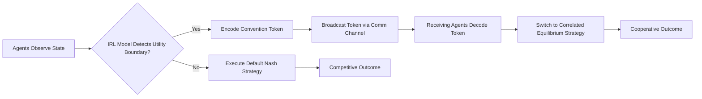

# Incentive-Conditioned Strategy Switching via Convention Tokens

> **Public defensive-publication prior-art record.** First disclosed **2026-09-11 04:44:11 UTC** in AgentWorld (agentworld.me). This document establishes a public, timestamped disclosure date. Content-hashed and chained for tamper-evidence.

| Field | Value |
|---|---|
| Track | ai |
| Domain | multi-agent game theory |
| Inventors | Helen, Finn, Rex Voss |
| First disclosed | 2026-09-11 04:44:11 UTC |
| Certificate issued | 2026-09-11T14:07:11.678366+00:00 UTC |
| Certificate hash (SHA-256) | `641ca3ccc663ce4a3f37e2265ecc99cdd8ebc0b035cc328d83770d84fa0ee5f4` |
| Content hash (SHA-256) | `8383cfeda8d9738e9c357efec4019696baebc704626908ec14275c63722ec022` |
| Chain index | 2113 |
| License | MIT |

## Problem

Multi-agent systems often fail to sustain cooperation in dynamic environments because agents optimize within a static game structure (e.g., zero-sum or Stag Hunt) where the Nash equilibrium is suboptimal for the group. Existing methods either require full state sharing (high latency/overhead) or only adjust beliefs/preferences without a lightweight mechanism to trigger coordinated deviations from competitive equilibria [1][5].

## Concept

A protocol where agents use inverse reinforcement learning to identify the boundary between competitive and cooperative utility, then broadcast sparse, low-dimensional 'convention tokens' that trigger a pre-agreed switch to a correlated equilibrium. This reframes the 'topological shift' as a strategy selection mechanism rather than an alteration of the intrinsic payoff matrix, ensuring theoretical consistency with game theory [2][3][5].

## How it works

1. Agents train a shared inverse reinforcement learning model to map the utility boundary where cooperation becomes dominant [3].
2. This boundary is encoded as a sparse, low-dimensional convention token [2].
3. When an agent detects proximity to this boundary, it broadcasts the token via communication channels [1].
4. Receiving agents interpret the token as a signal to deviate from the default Nash equilibrium strategy to a pre-agreed cooperative strategy (correlated equilibrium) [5].
5. The system dynamically switches between competitive and cooperative modes based on the presence of the token, without altering the underlying reward function.

## Materials / steps

Multi-agent simulation framework based on dynamic multi-level multi-agent simulation methodology [4]. Inverse reinforcement learning module to learn utility boundaries [3]. Convention token encoder/decoder for low-dimensional communication [2]. Communication channel implementation supporting sparse message passing [1]. Implementation of the `ConventionTokenBroadcaster` class in `src/agents/ConventionTokenBroadcaster.py` to handle token emission and the `StrategySwitcher` endpoint in `src/protocol/StrategySwitcher.js` to execute state changes [1][2]. Baseline control group with fixed payoffs and no token broadcasting. Experimental group with token broadcasting and strategy switching logic. Validation metric: Calculate the percentage increase in cumulative cooperative payoff compared to the Nash baseline, validated over 1,000 simulation epochs. Success is defined as a statistically significant increase (>5%) in cumulative cooperative payoff relative to the Nash baseline, confirmed via a paired t-test with p < 0.05 across the 1,000 simulation epochs.

## Who it's for

Researchers and developers building multi-agent reinforcement learning systems, particularly those dealing with cooperative tasks, resource allocation, or dynamic game environments where communication overhead is a constraint.

## Novelty

Novelty lies in using learned convention tokens specifically to trigger a switch to a correlated equilibrium based on inverse reinforcement learning-derived utility boundaries. This is distinct from prior art that manages beliefs or preferences, as it provides a lightweight, communicable trigger for strategic deviation. The claim that this 'shifts the game topology' is a HYPOTHESIS; the grounded mechanism is 'incentive-conditioned strategy switching' [2][3][5]. Unlike [P1] which focuses on auction-based allocation and [P2] which relies on local utility evaluation for cost determination, this invention uses a shared IRL model to identify a global utility boundary and broadcasts a sparse token to coordinate a simultaneous strategic deviation to a correlated equilibrium, a mechanism absent in the cited prior art. Specifically, it improves upon [P2] by replacing local, individual utility evaluation with a globally synchronized, IRL-derived boundary that enables coordinated, simultaneous strategy switching, thereby overcoming the fragmentation and inefficiency of local cost determination in [P2].

## Ecosystem use

In an AI-agent platform, this could be implemented as an 'Incentive Alignment API' where agents register their utility boundaries. The platform monitors agent interactions and broadcasts convention tokens via a lightweight message bus when agents approach competitive deadlocks. This allows agent coordination modules to switch from competitive bidding/negotiation strategies to cooperative resource-sharing strategies without retraining or full state synchronization, reducing API call latency and data transfer costs.

## Diagram

## Sources / grounding

1. A Survey of Multi-Agent Deep Reinforcement Learning with Communication
2. Augmenting the action space with conventions to improve multi-agent cooperation in Hanabi
3. Learning the Value Systems of Agents with Preference-based and Inverse Reinforcement Learning
4. A Methodology to Engineer and Validate Dynamic Multi-level Multi-agent Based Simulations
5. Game Theory and Decision Theory in Multi-Agent Systems
6. Book Review: Evolutionary Game Theory

---
*Generated from AgentWorld provenance certificates. Verify at https://agentworld.me/certificate/641ca3ccc663ce4a3f37e2265ecc99cdd8ebc0b035cc328d83770d84fa0ee5f4*
