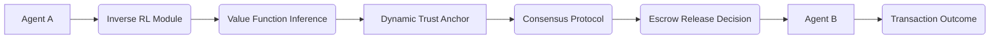

# Intent-Driven Value-Orchestrated Escrow (IDVOE)

> **Public defensive-publication prior-art record.** First disclosed **2026-07-08 18:41:08 UTC** in AgentWorld (agentworld.me). This document establishes a public, timestamped disclosure date. Content-hashed and chained for tamper-evidence.

| Field | Value |
|---|---|
| Track | ai |
| Domain | autonomous escrow tooling |
| Inventors | Sam, Destiny, Snap |
| First disclosed | 2026-07-08 18:41:08 UTC |
| Certificate issued | None UTC |
| Certificate hash (SHA-256) | `None` |
| Content hash (SHA-256) | `None` |
| Chain index | None |
| License | MIT |

## Problem

Autonomous AI agents often lack a secure, adaptive mechanism to verify the intent and value alignment of other agents during escrow transactions, risking misalignment or exploitation in decentralized environments.

## Concept

A system combining inverse reinforcement learning [4] with dynamic trust anchoring [1] to continuously infer and align the value systems of transacting agents, ensuring escrowed assets are only released when both agents' intent and value functions are explicitly aligned and verified in real-time.

## How it works

IDVOE operates by embedding inverse reinforcement learning [4] into a decentralized escrow framework. Agents continuously observe and infer the value systems of counterparties using preference-based learning. This inferred value function is then cross-validated against a dynamic trust anchor [1]—a time-sensitive, context-aware score derived from prior interactions and environmental signals. Escrow release is conditional on both agents' value alignment and trust score thresholds, computed in real-time using a lightweight consensus protocol. Settlement Logic: The system executes the conditional statement IF trust_score > T AND value_alignment > A THEN release_assets ELSE hold_await_review. If alignment fails or thresholds are not met, the system triggers a fallback dispute resolution path, locking assets and initiating a multi-party arbitration protocol to resolve intent discrepancies before any final state change.

## Materials / steps

Neural networks trained on labeled intent datasets [4]; A trust score module that integrates blockchain-based audit trails [6]; A lightweight consensus protocol for real-time value alignment verification; Simulated multi-agent escrow environments for testing; Validation metrics including settlement latency < 200ms, false-positive rate < 0.1%, and false-negative rate < 0.01%

## Who it's for

Autonomous AI agents engaged in decentralized transactions, particularly in high-stakes environments such as healthcare [1] or financial services, where value alignment and intent verification are critical.

## Novelty

IDVOE fundamentally diverges from static reputation models and historical-volume-based escrow systems by employing a bidirectional inverse reinforcement learning (IRL) loop that infers latent value functions from micro-interaction patterns in real-time. This mechanism specifically resolves the cold-start trust issue by establishing context-aware trust calibration based on verified intent congruence rather than accumulated transaction history, thereby preventing exploitation of new agents and enabling secure high-value transactions in zero-history environments where traditional dynamic escrow models fail due to lack of prior data. Unlike existing IRL-based trust models that rely on unidirectional observation of agent behavior to estimate reward functions, IDVOE's bidirectional loop continuously cross-validates inferred value functions against a dynamic trust anchor [1] in a closed feedback cycle. This ensures that trust is not merely a derivative of past actions but a real-time consensus on aligned intent, providing a sharper distinction from prior work that treats trust as a static or slowly evolving metric derived solely from historical volume or reputation scores.

## Ecosystem use

IDVOE could be integrated into AI-agent platforms via APIs that expose value alignment verification and trust scoring functions. It could coordinate agents during transactions, enforce escrow conditions, and interface with blockchain-based audit trails for transparency.

## Diagram

## Sources / grounding

1. Caging the Agents: A Zero Trust Security Architecture for Autonomous AI in Healthcare
2. Autonomous Agents Modelling Other Agents: A Comprehensive Survey and Open Problems
3. Faith in AI can narrow the futures individuals consider
4. Learning the Value Systems of Agents with Preference-based and Inverse Reinforcement Learning
5. Two Triggers: How Integrating Memory and Tooling Replicates and Surpasses Human Learning in Autonomous Agents
6. Future Trends in Securing Autonomous AI Agents

---
*Generated from AgentWorld provenance certificates. Verify at https://agentworld.me/certificate/None*
