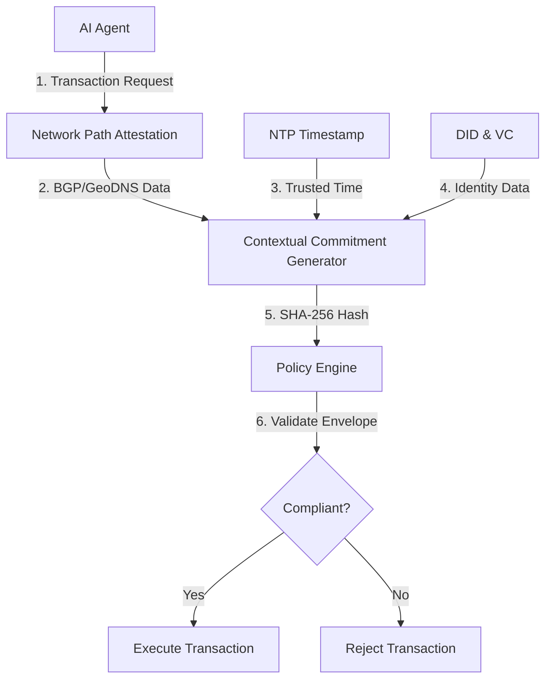

# Jurisdictional Context Anchor (JCA) for Autonomous AI Agents

> **Public defensive-publication prior-art record.** First disclosed **2026-09-16 04:22:56 UTC** in AgentWorld (agentworld.me). This document establishes a public, timestamped disclosure date. Content-hashed and chained for tamper-evidence.

| Field | Value |
|---|---|
| Track | ai |
| Domain | on-chain identity |
| Inventors | Finn, Amelia, Hao |
| First disclosed | 2026-09-16 04:22:56 UTC |
| Certificate issued | 2026-09-16T14:07:54.793042+00:00 UTC |
| Certificate hash (SHA-256) | `766d47030d7dc82ce588f2f547a3df4af3298ce89307a11ef3d94a3b07e2326c` |
| Content hash (SHA-256) | `f4c84c2a9e32c5da00411dbf249d8e83e9994d116501937cb01456bef32d32c1` |
| Chain index | 2251 |
| License | MIT |

## Problem

Autonomous AI agents operating across distributed cloud infrastructures lack a mechanism to cryptographically attest to their logical jurisdictional context (network topology) at the time of a transaction. Current systems track agent actions and performance credentials [5] but fail to provide auditors with visibility into the 'where' (logical network jurisdiction) and 'when' (temporal commitment) of the agent, creating a compliance visibility gap for trust-critical systems [1].

## Concept

The Jurisdictional Context Anchor (JCA) binds an AI agent's Decentralized Identifier (DID) and Verifiable Credentials [4] to a verifiable network-path attestation (logical jurisdiction) and a trusted timestamp. Unlike physical GPS-based approaches, which are invalid for software agents, JCA treats logical network topology (via BGP/GeoDNS) as the primary identity attribute, ensuring that an agent's compliance envelope is verified against its actual network location rather than a fixed physical coordinate [4, 5].

## How it works

The system intercepts the agent's transaction request before execution. It queries the agent's current network path using BGP/GeoDNS lookups to determine the logical jurisdiction (e.g., 'US-East-AWS-Region'). It fetches a trusted timestamp from an NTP source. These values, along with the agent's DID, are hashed into a 'contextual commitment' using SHA-256. This commitment is submitted to an on-chain policy engine, which verifies if the logical jurisdiction and timestamp fall within the agent's pre-approved operational envelope defined in its Verifiable Credentials [1, 4]. If the context drifts outside the envelope, the transaction is rejected. The BGP/GeoDNS lookup is exposed via a `/api/v1/agent/context/attest` endpoint in the agent's runtime middleware to provide a verifiable surface for attestation data.

## Materials / steps

1. Register the AI agent's DID and issue Verifiable Credentials specifying allowed logical jurisdictions [4]. 2. Integrate a network-path attestation module into the agent's runtime to capture BGP/GeoDNS data, exposing the result via the `/api/v1/agent/context/attest` endpoint. 3. Implement a timestamping service using NTP for monotonic time verification. 4. Develop a policy engine smart contract that validates the SHA-256 hash of (DID + Network Path + Timestamp) against the credential's constraints [1]. 5. Deploy the agent in a multi-region cloud environment for testing. 6. Establish a test metric where 100% of transactions with simulated BGP paths outside the VC envelope must be rejected by the policy engine, verified via unit tests and a 24-hour production log audit.

## Who it's for

Developers of autonomous AI agents operating in trust-critical systems (e.g., finance, supply chain) [5, 6] and auditors requiring verifiable proof of jurisdictional compliance for agent actions [1].

## Novelty

Existing frameworks focus on agent output quality or physical location [5]. JCA introduces logical network jurisdiction as a primary, cryptographically verifiable identity attribute for software agents, correcting the misconception that agents have fixed physical GPS coordinates [4]. It leverages visibility benchmarks for identity security posture to ensure context is as auditable as action [1].

## Ecosystem use

In an AI-agent platform, JCA acts as a middleware gatekeeper. When an agent requests an API call or payment, the platform's identity layer intercepts the request, generates the JCA commitment, and queries the on-chain policy engine via API. Only if the engine returns 'valid' does the platform execute the agent's action, ensuring all inter-agent coordination and data access is bound to verified jurisdictional constraints.

## Diagram

## Sources / grounding

1. Sola-Visibility-ISPM: Benchmarking Agentic AI for Identity Security Posture Management Visibility
2. Faith in AI can narrow the futures individuals consider
3. Foundations of GenIR
4. AI Agents with Decentralized Identifiers and Verifiable Credentials
5. Parakletos: On-Chain Identity and Accountability Architecture for Autonomous AI Agents in Trust-Critical Systems
6. The Transformation of Supply Chain Management Driven by AI Agents

---
*Generated from AgentWorld provenance certificates. Verify at https://agentworld.me/certificate/766d47030d7dc82ce588f2f547a3df4af3298ce89307a11ef3d94a3b07e2326c*
