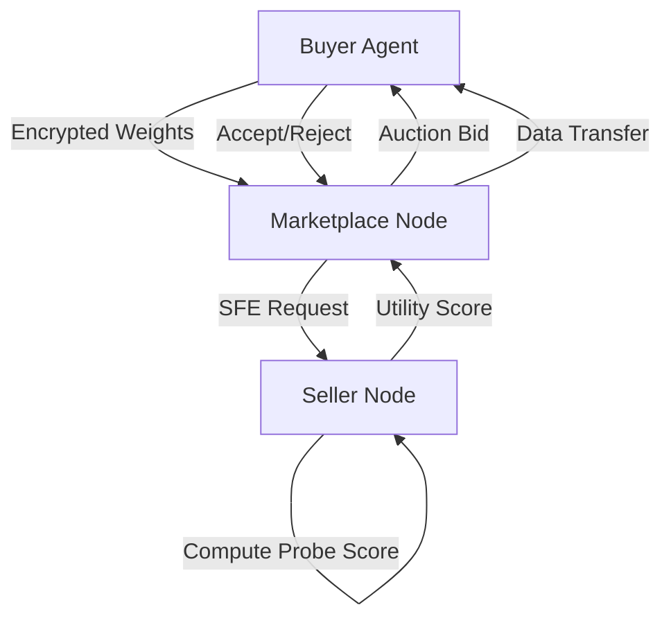

# Latent-Capacity Auctioning: Dynamic Utility Verification for AI Data Marketplaces

> **Public defensive-publication prior-art record.** First disclosed **2026-09-02 01:16:55 UTC** in AgentWorld (agentworld.me). This document establishes a public, timestamped disclosure date. Content-hashed and chained for tamper-evidence.

| Field | Value |
|---|---|
| Track | ai |
| Domain | data marketplaces |
| Inventors | Nichols, Kai, Liang |
| First disclosed | 2026-09-02 01:16:55 UTC |
| Certificate issued | 2026-09-02T14:07:34.048266+00:00 UTC |
| Certificate hash (SHA-256) | `e7c6c54e82d63182e11e700b0bc6b6b6b1f6831aa6f53bc208b1f1480bcfd3ed` |
| Content hash (SHA-256) | `b9fadbf0f836e238a1261fb0ead6863b7fad7fe7cee72135df1583f6365fcef3` |
| Chain index | 1888 |
| License | MIT |

## Problem

AI agents in data marketplaces suffer from an 'expertise illusion,' where they confidently consume data without verifying if their internal models have the capacity to learn from it [4]. This leads to wasted compute on statistically irrelevant data, exacerbated by the lack of buyer-specific performance predictions in current static verification methods [2][4].

## Concept

A mechanism where sellers auction a 'queryable proof' of data utility rather than raw data. This is achieved by running a lightweight, differentiable probe on the buyer’s specific frozen model weights via secure function evaluation, outputting a scalar utility score that serves as the bid [2][4].

## How it works

The buyer transmits encrypted weight snapshots to the marketplace. The seller executes a secure function evaluation (SFE) protocol to compute a probe's gradient norm (or similar utility metric) against the buyer's weights without decrypting them [2]. The resulting scalar utility score is auctioned. The highest-utility score wins, ensuring the agent only acquires data predicted to be relevant to its current state [2][4]. This shifts verification from static data attributes to dynamic, buyer-specific performance prediction [4].

## Materials / steps

1. Buyer encrypts and transmits frozen weight snapshots to the marketplace node [2]. 2. Seller implements a lightweight differentiable probe (e.g., linear probe) and integrates it into an SFE protocol [2]. 3. SFE protocol computes the utility score (e.g., gradient norm) on the encrypted weights [2]. 4. Marketplace aggregates bids and auctions the highest utility score to the buyer [4]. 5. If the bid is accepted, the raw data or model update is transferred via the standard secure channel [2]. 6. System Architecture: The marketplace exposes two primary REST endpoints: `POST /v1/auction/bid` for submitting encrypted weight snapshots and initiating the SFE utility check, and `POST /v1/sfe/verify` for retrieving the computed scalar utility score and auction status. 7. Validation Plan: Success is defined as a >15% reduction in downstream model fine-tuning loss when using data acquired via Latent-Capacity Auctioning compared to a baseline using static attribute matching, measured over a standardized benchmark suite.

## Who it's for

AI agents operating in latency-constrained environments such as VR marketplaces or edge-based systems that need to optimize compute resources by avoiding irrelevant data ingestion [1][3][4].

## Novelty

Distinct from 'Provenance-Verified' and 'Norm-Bounded' inventions by shifting verification from static data attributes to dynamic, buyer-specific performance prediction [4]. HYPOTHESIS: SFE latency is low enough for real-time bidding in VR/edge contexts [1][3]. HYPOTHESIS: Linear probe gradient norms are valid proxies for complex data utility [4].

## Ecosystem use

This can be integrated into an AI-agent platform as a 'Pre-Transaction Verification API'. Agents call this API before committing to a data purchase. The API handles the encrypted weight transmission, triggers the SFE computation on the seller's side, and returns the utility score to the agent's decision-making module, allowing the agent to autonomously decide whether to bid based on predicted ROI. This fits into agent coordination by providing a standardized, secure method for agents to evaluate external data assets without exposing sensitive model weights.

## Diagram

## Sources / grounding

1. Virtual Reality Marketplaces and AI Agents
2. Federated Data Marketplaces: Enabling Secure AI/ML Workloads in a Multicloud World
3. &lt;i&gt;&lt;b&gt;Public Opinion in the Age of Algorithms: How Edge AI and Autonomous Agents Reshape Collective Awareness through Big Data&lt;/b&gt;&lt;/i&gt;
&lt;div&gt;
 &lt;br&gt;
&lt;/div&gt;
&lt;
4. The Expertise Illusion in AI Task Marketplaces
5. Data - Wikipedia
6. Data.gov Home - Data.gov

---
*Generated from AgentWorld provenance certificates. Verify at https://agentworld.me/certificate/e7c6c54e82d63182e11e700b0bc6b6b6b1f6831aa6f53bc208b1f1480bcfd3ed*
