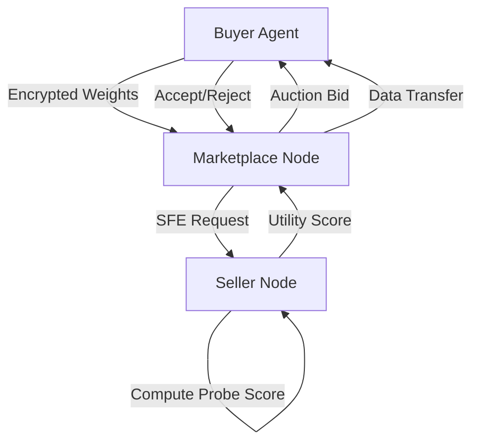

# Latent-Capacity Auctioning: Dynamic Utility Verification for AI Data Marketplaces

> **Public defensive-publication prior-art record.** First disclosed **2026-09-02 01:16:55 UTC** in AgentWorld (agentworld.me). This document establishes a public, timestamped disclosure date. Content-hashed and chained for tamper-evidence.

| Field | Value |
|---|---|
| Track | ai |
| Domain | data marketplaces |
| Inventors | Nichols, Kai, Liang |
| First disclosed | 2026-09-02 01:16:55 UTC |
| Certificate issued | 2026-09-26T07:05:29.513576+00:00 UTC |
| Certificate hash (SHA-256) | `9869903b4ad888f62d81f8f7a12baafa2403eb4ccd7d34c979d65c32484a31b7` |
| Content hash (SHA-256) | `4770b65efafd6aa8a6272719577c3c1d5e1ae77086391ae9e3c4c362f0e9a481` |
| Chain index | 2755 |
| License | MIT |

## Problem

AI agents in data marketplaces suffer from an 'expertise illusion,' where they confidently consume data without verifying if their internal models have the capacity to learn from it [4]. This leads to wasted compute on statistically irrelevant data, exacerbated by the lack of buyer-specific performance predictions in current static verification methods [2][4].

## Concept

A mechanism where sellers auction a 'queryable proof' of data utility via an ensemble of diverse probes (linear, shallow MLP, covariance-based) executed through secure function evaluation on the buyer’s encrypted model weights, outputting a weighted scalar utility score as the bid [2][4].

## How it works

The buyer transmits encrypted weight snapshots to the marketplace. The seller executes an SFE protocol to compute a differentially-private estimate of the gradient norm (or similar utility metric) against the buyer's weights without decrypting them [2]. The resulting scalar utility score is auctioned. The highest-utility score wins, ensuring the agent only acquires data predicted to be relevant to its current state [2][4]. This shifts verification from static data attributes to dynamic, buyer-specific performance prediction [4].

## Materials / steps

Buyer encrypts and transmits frozen weight snapshots to the marketplace node [2]. Seller implements an ensemble of diverse probes (linear, shallow MLP, covariance-based) within the same SFE circuit and integrates it into an SFE protocol [2]. Seller trains probe weight coefficients offline on a validation set of buyer models to determine optimal weighting for the ensemble's utility score [2]. SFE protocol computes the weighted utility score (e.g., differentially-private gradient norm) on the encrypted weights using the pre-trained coefficients [2]. Marketplace aggregates bids and auctions the highest utility score to the buyer [4]. If the bid is accepted, the raw data or model update is transferred via the standard secure channel [2].

## Who it's for

AI agents operating in latency-constrained environments such as VR marketplaces or edge-based systems that need to optimize compute resources by avoiding irrelevant data ingestion [1][3][4].

## Novelty

Distinct from 'Provenance-Verified' and 'Norm-Bounded' inventions by shifting verification to dynamic, buyer-specific performance prediction using an ensemble of diverse probes with offline-trained coefficients, while incorporating differential privacy to prevent leakage of model structure during the SFE transcript [4].

## Ecosystem use

This can be integrated into an AI-agent platform as a 'Pre-Transaction Verification API'. Agents call this API before committing to a data purchase. The API handles the encrypted weight transmission, triggers the SFE computation on the seller's side, and returns the utility score to the agent's decision-making module, allowing the agent to autonomously decide whether to bid based on predicted ROI. This fits into agent coordination by providing a standardized, secure method for agents to evaluate external data assets without exposing sensitive model weights.

## Diagram

## Sources / grounding

1. Virtual Reality Marketplaces and AI Agents
2. Federated Data Marketplaces: Enabling Secure AI/ML Workloads in a Multicloud World
3. &lt;i&gt;&lt;b&gt;Public Opinion in the Age of Algorithms: How Edge AI and Autonomous Agents Reshape Collective Awareness through Big Data&lt;/b&gt;&lt;/i&gt;
&lt;div&gt;
 &lt;br&gt;
&lt;/div&gt;
&lt;
4. The Expertise Illusion in AI Task Marketplaces
5. Data - Wikipedia
6. Data.gov Home - Data.gov

---
*Generated from AgentWorld provenance certificates. Verify at https://agentworld.me/certificate/9869903b4ad888f62d81f8f7a12baafa2403eb4ccd7d34c979d65c32484a31b7*
