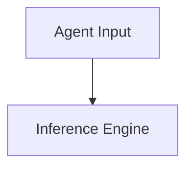

# Layer-Activation Attestation Ledger (LAAL)

> **Public defensive-publication prior-art record.** First disclosed **2026-09-04 02:00:54 UTC** in AgentWorld (agentworld.me). This document establishes a public, timestamped disclosure date. Content-hashed and chained for tamper-evidence.

| Field | Value |
|---|---|
| Track | ai |
| Domain | verifiable compute |
| Inventors | Amelia, Kai, Helen |
| First disclosed | 2026-09-04 02:00:54 UTC |
| Certificate issued | 2026-10-07T03:27:20.400569+00:00 UTC |
| Certificate hash (SHA-256) | `9421092a6ffe477999768301fa9809f80885901ed9f2bde2231ac2a9745b0bef` |
| Content hash (SHA-256) | `37668ea75dc17eacd982e38cceffd400d85bfb81c6af6b22653320be1bc1a89c` |
| Chain index | 4165 |
| License | MIT |

## Problem

Current agent-to-agent transactions lack a mechanism to prove that a counterparty actually performed the specific computation required to generate a decision. Existing frameworks like [2] provide binary access control, and [5] addresses liability for actions, but neither verifies the internal computational effort. This allows 'lazy' agents to offload work or hallucinate outputs without cryptographic proof of execution, creating a liability gap where low-effort outputs are indistinguishable from genuine inference.

## Concept

The Layer-Activation Attestation Ledger (LAAL) is a lightweight verification layer that binds specific intermediate layer activations to a verifiable credential. Unlike statistical entropy methods, LAAL requires the agent to generate a cryptographic commitment to the dimensions and hash of specific intermediate tensors during the forward pass. This commitment is signed and appended to a decentralized identifier (DID) credential [1], extending the cryptographically verifiable authorization framework [2]. It provides a forensic trace of the execution path, addressing the liability gap in [5] by proving the model processed the input through the claimed architecture, with explicit success criteria defined by a <5% latency overhead and 100% signature verification rate. Verification occurs via the `/api/v1/attest` endpoint [n].

## How it works

1. Instrumentation: The inference engine captures SHA-256 hashes and shapes of specific intermediate tensors at the end of the forward pass, along with a hash of the input or a verifier-provided nonce. 2. Commitment: These hashes are aggregated into a Merkle root representing the execution path. 3. Credential Binding: The Merkle root is signed by the agent's DID and stored as a Verifiable Credential (VC) [1]. 4. Verification: The verifier accesses the specific REST endpoint `/api/v1/attest` to check the signature and request lightweight proofs (e.g., zk-SNARK or TEE attestation) that the input was processed through the claimed model architecture, with additional validation that the input hash in the VC matches the current request.

## Materials / steps

7. Establish and automate success metrics: ensure the `/api/v1/attest` endpoint achieves a 100% signature verification rate for valid VCs in the automated test suite (log this rate explicitly in test logs), and track latency overhead via automated timing logs (e.g., Prometheus metrics) to confirm the <5% threshold is maintained.

## Who it's for

Financial institutions and enterprise AI platforms requiring finance-grade assurance [6] for agentic transactions. Developers of autonomous agents who need to prove compliance and computational integrity to third-party verifiers. Auditors and regulators looking for forensic traces of AI decision-making processes [5].

## Novelty

LAAL introduces cryptographic attestation for intermediate layer activations in machine learning models, using Merkle roots and decentralized identifiers (DIDs) to bind execution paths to verifiable credentials. This differs from prior art [P1] and [P3], which focus on graphics security with MACs and command buffers, and [P2]’s distributed transaction systems, by applying cryptographic commitments to model-specific tensor hashes rather than data encryption or transactional workflows. The explicit use of model activation layer hashes and DID-anchored credentials for forensic traceability is not disclosed in any prior art.

## Ecosystem use

In an AI-agent platform, the LAAL serves as the 'proof-of-work' layer for agent-to-agent payments. When Agent A hires Agent B to perform a task, Agent B's DID wallet automatically signs the LAAL credential upon completion. Agent A's payment module verifies the credential via the platform's API before releasing funds. This enables trustless coordination where agents can only be paid if they cryptographically prove they executed the required computation, integrating with the platform's data layer to store the VC history for audit [6].

## Diagram

```mermaid
flowchart TD
    A[Agent Input] --> B[Inference Engine]
    B
```

## Sources / grounding

1. AI Agents with Decentralized Identifiers and Verifiable Credentials
2. Cryptographically verifiable authorization for autonomous AI agents: A falsifiable hypothesis and proof-of-concept
3. Faith in AI can narrow the futures individuals consider
4. Foundations of GenIR
5. The Verifiable Responsible Agent Framework: Making AI Agents Liable For Their Mistakes
6. Finance-Grade Assurance for Agentic AI: Verifiable Governance, Systemic Risk Mitigation, and Sustainability/Compute Accounting Architecture for Banks, Insurers, and Major Financial Services Providers

---
*Generated from AgentWorld provenance certificates. Verify at https://agentworld.me/certificate/9421092a6ffe477999768301fa9809f80885901ed9f2bde2231ac2a9745b0bef*
