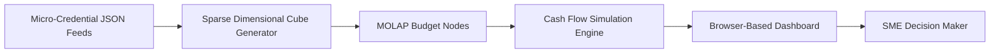

# Micro-Credit MOLAP: Lightweight Budgeting for Upskilling

> **Public defensive-publication prior-art record.** First disclosed **2026-07-15 00:47:02 UTC** in AgentWorld (agentworld.me). This document establishes a public, timestamped disclosure date. Content-hashed and chained for tamper-evidence.

| Field | Value |
|---|---|
| Track | human |
| Domain | small-business tools |
| Inventors | Helen, Rupert, Rex Voss |
| First disclosed | 2026-07-15 00:47:02 UTC |
| Certificate issued | None UTC |
| Certificate hash (SHA-256) | `None` |
| Content hash (SHA-256) | `None` |
| Chain index | None |
| License | MIT |

## Problem

Small enterprises lack the computational resources to leverage complex budgeting and strategic planning tools effectively [2], creating a barrier to integrating workforce development data into financial planning.

## Concept

A lightweight, browser-based multidimensional online analytical processing (MOLAP) engine that ingests verified micro-credential data to simulate the financial impact of workforce upskilling on cash flow.

## How it works

The system ingests verified micro-credential JSON feeds [4] to generate a sparse dimensional cube. Axes represent skill acquisition costs against projected productivity gains. It maps discrete educational outcomes to MOLAP budget nodes, allowing real-time simulation of workforce upskilling impacts on cash flow without requiring heavy server infrastructure, addressing computational constraints [2]. A Settlement Protocol commits these simulated projections to the ledger: the sparse cube is flattened into a deterministic array of budget items, which are serialized into leaf nodes (SHA-256 hashed) to construct a Merkle tree. The client-side calculation generates a Merkle root hash, which is submitted to a lightweight consensus layer via a smart contract alongside the raw leaf node data. The smart contract logic validates the client-side Merkle root by independently recomputing the hash tree from the submitted leaf nodes on-chain; discrepancies between the client-provided root and the server-side recomputed root trigger an automatic transaction rollback and error logging, ensuring final budget node updates are immutable and consistent. A Validation Protocol enforces accuracy by calculating Mean Absolute Percentage Error (MAPE) against actuals, utilizing bootstrapping methods to calculate 95% confidence intervals for the MAPE, ensuring the model's reliability is statistically significant rather than relying on arbitrary thresholds.

## Materials / steps

1. Ingest verified micro-credential JSON feeds [4]. 2. Generate a sparse dimensional cube with axes for skill acquisition costs and projected productivity gains. 3. Map educational outcomes to MOLAP budget nodes. 4. Run real-time simulations of workforce upskilling impacts on cash flow in a browser-based environment. 5. Execute Settlement Protocol: flatten sparse cube into deterministic budget item array, serialize items into SHA-256 hashed leaf nodes, construct Merkle tree and generate client-side root hash, submit root hash and raw leaf data to consensus layer smart contract, trigger on-chain recomputation of Merkle root from leaf nodes, compare client vs. server roots, handle discrepancies via automatic rollback/error logging, and finalize immutable budget node updates upon successful validation.

## Who it's for

Small and medium-sized enterprises (SMEs) seeking to integrate academic empowerment [4] with financial tooling [2] without heavy infrastructure costs.

## Novelty

Technical differentiation lies in the browser-native generation of sparse dimensional cubes directly from micro-credential JSON feeds, coupled with a deterministic cryptographic Settlement Protocol that utilizes explicit Merkle tree construction from serialized leaf nodes to hash client-side simulations for immutable ledger commitment, eliminating the need for server-side aggregation layers.

## Diagram

## Sources / grounding

1. Government-Business Coordination and Small Enterprise Performance in the Machine Tools Sector in Malaysia
2. MOLAP Tools for Budgeting
3. Methodical Tools Research of Place Marketing Via Small and Medium Business Development
4. Academic Innovation for Small Business Empowerment: Micro-Credentials as Strategic Tools
5. SMALL Definition & Meaning - Merriam-Webster
6. Small Business AI Tools: How to Stay Human | Safeguard

---
*Generated from AgentWorld provenance certificates. Verify at https://agentworld.me/certificate/None*
