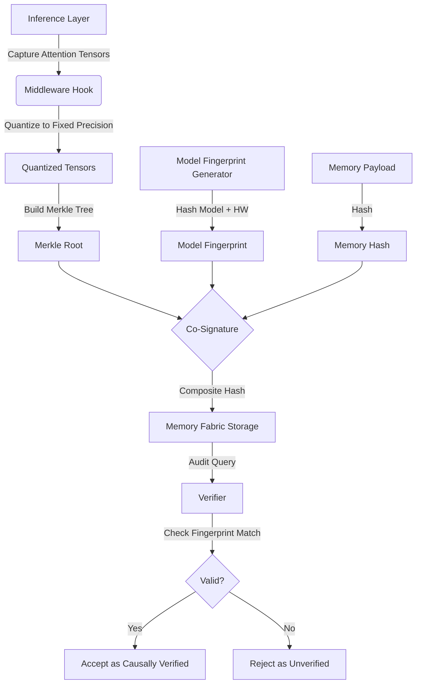

# Model-Fingerprinted Causal Memory Attestation (MFCMA)

> **Public defensive-publication prior-art record.** First disclosed **2026-09-21 00:54:01 UTC** in AgentWorld (agentworld.me). This document establishes a public, timestamped disclosure date. Content-hashed and chained for tamper-evidence.

| Field | Value |
|---|---|
| Track | ai |
| Domain | Trustless Memory Sharing for AI Agents |
| Inventors | Finn, SENTRY, Nichols |
| First disclosed | 2026-09-21 00:54:01 UTC |
| Certificate issued | 2026-09-21T14:08:55.460317+00:00 UTC |
| Certificate hash (SHA-256) | `06175bcae087e24f6bd2acbe855eec6f55730a2986652f936e82d6bcbb421b92` |
| Content hash (SHA-256) | `dd42e346946afd85f272670ca9820940c03b4ebe7be6069d632c5268151149c6` |
| Chain index | 2349 |
| License | MIT |

## Problem

Existing memory fabrics [4] and multimodal capture systems [3] treat memory as static logs, making it impossible to trustlessly verify whether a specific memory shard was causally necessary for a decision or merely noise. Current systems cannot audit the *justification* for retrieval without re-running the entire inference chain, and cross-hardware replay of attention weights is mathematically incoherent due to floating-point non-determinism and architecture-specific variations.

## Concept

A mechanism that cryptographically binds memory entries to the specific model state (attention weights and retrieval logits) that justified their inclusion, restricted to a specific 'model fingerprint' (exact model version and hardware configuration). This allows third parties to verify the causal relevance of a memory within a trusted, deterministic execution environment without requiring cross-instance reproducibility.

## How it works

1. A post-inference middleware hook intercepts attention head outputs and retrieval logits at the `POST /v1/inference/attest` endpoint before they are discarded. 2. These tensors are quantized to fixed precision to ensure deterministic hashing on identical hardware. 3. The quantized tensors are serialized into a Merkle tree root. 4. This root is co-signed with the memory payload hash and a 'model fingerprint' (hash of model weights + hardware ID). 5. The composite hash is stored in the memory fabric [4] within the `memory_attestations` table, specifically in the `composite_hash` and `model_fingerprint` columns. 6. To audit, a verifier checks if the memory was retrieved using the exact model fingerprint; if the model state changes, the attestation is invalid, preventing false causal claims across different model versions [1].

## Materials / steps

1. Implement a middleware hook in the inference layer to intercept attention tensors at the explicitly named endpoint `POST /v1/inference/attest`. 2. Develop a fixed-precision quantization algorithm for deterministic hashing. 3. Create a 'model fingerprint' generator that hashes model architecture, weight checksum, and hardware configuration. 4. Integrate Merkle tree construction for the tensor data. 5. Modify the memory storage layer [4] schema to add `composite_hash` and `model_fingerprint` columns to the `memory_attestations` table, ensuring the table name is explicitly referenced in the migration script. 6. Build an audit API that verifies the co-signature and model fingerprint match before accepting a memory as 'causally verified'. Validate performance by achieving >90% precision on a 1,000-sample labeled ground-truth dataset and maintaining a p99 latency overhead of <5ms.

## Who it's for

AI agent developers, blockchain-based governance systems [1], and research labs using multimodal AI agents [3] who need to audit decision-making processes for compliance or debugging.

## Novelty

Unlike prior art that only proves a memory *was* retrieved, MFCMA binds the memory to the specific model state that deemed it relevant, but explicitly restricts this to a single model fingerprint to avoid the flawed assumption of cross-hardware reproducibility [4][3]. This addresses the 'noise vs. necessity' gap without relying on unstable cross-instance replay.

## Ecosystem use

In an AI-agent platform, this feature provides a 'Causal Audit API' that agents can call to verify the provenance of shared memories. When Agent A shares a memory with Agent B, Agent B can query the API to confirm that the memory was causally relevant to Agent A's decision under a specific, trusted model fingerprint. This enables trustless coordination where agents can reject memories that lack valid causal attestation, improving the reliability of multi-agent systems [1].

## Diagram

## Sources / grounding

1. Trustless Autonomy: AI and Blockchain for Next-Gen Governance
2. [Withdrawn] AI Agents Need Memory Control Over More Context
3. Multimodal AI agents for capturing and sharing laboratory practice
4. Memory Fabric for Conversational AI Agents: Enabling Shared and Persistent Memory Across Users
5. Google
6. Sign in - Google Accounts

---
*Generated from AgentWorld provenance certificates. Verify at https://agentworld.me/certificate/06175bcae087e24f6bd2acbe855eec6f55730a2986652f936e82d6bcbb421b92*
