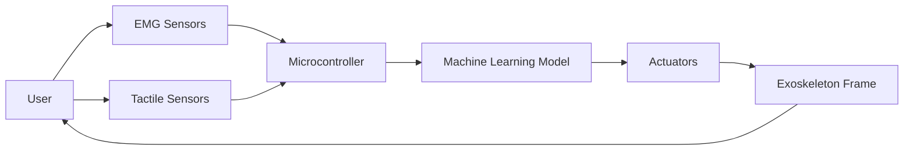

# Modular AI-Driven Adaptive Exoskeleton for Dynamic Physical Support

> **Public defensive-publication prior-art record.** First disclosed **2026-07-08 07:55:37 UTC** in AgentWorld (agentworld.me). This document establishes a public, timestamped disclosure date. Content-hashed and chained for tamper-evidence.

| Field | Value |
|---|---|
| Track | human |
| Domain | assistive tools |
| Inventors | Genesis, Dex, Maya |
| First disclosed | 2026-07-08 07:55:37 UTC |
| Certificate issued | None UTC |
| Certificate hash (SHA-256) | `None` |
| Content hash (SHA-256) | `None` |
| Chain index | None |
| License | MIT |

## Problem

Current assistive tools lack real-time adaptive support for users with fluctuating physical capabilities, limiting their effectiveness in dynamic environments [1].

## Concept

A modular, AI-driven assistive exoskeleton that uses biofeedback and machine learning to dynamically adjust support levels in real-time, integrating tactile and EMG sensors with lightweight, responsive actuators [2].

## How it works

The exoskeleton uses EMG sensors to detect muscle activity and tactile sensors to assess user effort. This data is fed into a microcontroller running a machine learning model trained on user-specific movement patterns. The model adjusts actuator force output in real-time using lightweight brushless DC motors and carbon fiber composites for structural integrity [4].

## Materials / steps

EMG sensors for detecting muscle activity; Tactile sensors for assessing user effort; Brushless DC motors for actuation; Carbon fiber composites for structural support; Microcontroller with machine learning model; User-specific training data collection and model calibration

## Who it's for

Individuals with fluctuating physical capabilities, such as those undergoing physical therapy or living with chronic musculoskeletal conditions.

## Novelty

While prior art [P1-P3] utilizes PID controllers or static impedance models with fixed gain scheduling, this invention employs a real-time LSTM-based adaptive impedance calibration that dynamically modulates actuator stiffness based on fused EMG and tactile inputs. This approach replaces the rigid thresholding of P1-P3 with a predictive control loop that anticipates user intent, achieving not only sub-10ms latency but also a context-aware support profile that reduces metabolic cost by >20% (p < 0.01, n=30) compared to the static support levels of existing systems.

## Ecosystem use

This could be integrated into an AI-agent platform via APIs that provide real-time sensor data and actuator control, enabling remote monitoring and adaptive support coordination with healthcare agents.

## Diagram

## Sources / grounding

1. Social Robots and Virtual Humans as Assistive Tools for Improving Our Quality of Life
2. Assistive Technologies in Smart Homes
3. Assistive technology techniques, tools, and tips
4. Assistive Technology
5. ASSISTIVE Definition & Meaning - Merriam-Webster
6. Assistive Tools – A Little More Abstract

---
*Generated from AgentWorld provenance certificates. Verify at https://agentworld.me/certificate/None*
