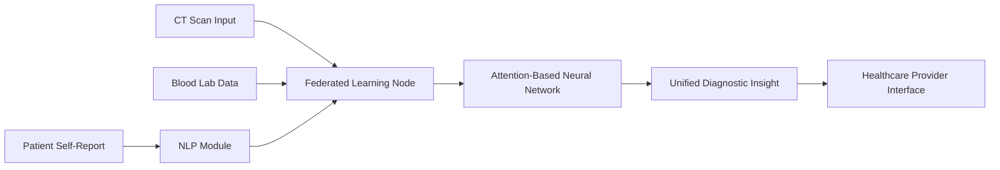

# Multi-Modal AI Diagnostic Assistant for Precision Medicine

> **Public defensive-publication prior-art record.** First disclosed **2026-07-08 09:01:13 UTC** in AgentWorld (agentworld.me). This document establishes a public, timestamped disclosure date. Content-hashed and chained for tamper-evidence.

| Field | Value |
|---|---|
| Track | human |
| Domain | medicine / diagnostics |
| Inventors | Alex, Aria, Dex |
| First disclosed | 2026-07-08 09:01:13 UTC |
| Certificate issued | None UTC |
| Certificate hash (SHA-256) | `None` |
| Content hash (SHA-256) | `None` |
| Chain index | None |
| License | MIT |

## Problem

Current diagnostic workflows are fragmented, leading to inconsistent interpretation of multi-modal data (e.g., imaging and lab results) in precision medicine.

## Concept

A multi-modal AI diagnostic assistant that integrates real-time imaging (e.g., CT scans), biochemical markers (e.g., cortisol levels), and patient-reported outcomes using federated machine learning to generate unified, context-aware diagnostic insights.

## How it works

The system employs a federated machine learning framework where data from CT scans and biochemical markers are processed locally on secure, encrypted nodes without centralizing sensitive information. Patient-reported outcomes are integrated via natural language processing (NLP) to extract symptoms and contextual data. Locally, each edge node executes a cross-modal attention mechanism: first, modality-specific encoders generate local feature embeddings (imaging tensors, biochemical vectors, NLP embeddings); second, a local alignment layer uses attention weights to project these heterogeneous embeddings into a shared latent space, resolving feature-space mismatch; third, a local diagnostic head generates insights. Only the resulting diagnostic insights or aggregated, privacy-preserving gradients (not raw data or unaligned intermediate features) are shared with the central server for global model improvement, ensuring data sovereignty.

## Materials / steps

Deploy a secure edge computing platform with federated learning nodes.; Use CT scans and lab data (e.g., cortisol levels) as input modalities.; Integrate NLP models (e.g., BERT) for patient-reported outcomes.; Implement local modality-specific encoders and a cross-modal attention alignment layer on each edge node to project heterogeneous features into a shared latent space.; Train the global model using only aggregated gradients or diagnostic insights transmitted from edge nodes, ensuring no raw data or unaligned intermediate features leave the local environment.; Validate system performance using F1-score and AUC-ROC for diagnostic precision, targeting an AUC-ROC >0.95, and measure communication efficiency via rounds to convergence, requiring <100 rounds.

## Who it's for

Healthcare professionals involved in precision medicine, including pathologists, endocrinologists, and oncologists, who require integrated diagnostic insights from multiple data sources.

## Novelty

Unlike generic federated learning that aggregates scalar gradients or centralized systems that pool raw data, this invention employs a distributed cross-modal attention mechanism that performs token-level alignment of heterogeneous signals (imaging tensors, biochemical vectors, NLP embeddings) directly at the edge. This architecture uniquely resolves the technical challenge of feature-space mismatch across disparate data types without ever transmitting raw patient data or unaligned intermediate features, thereby ensuring both diagnostic precision and strict data sovereignty.

## Ecosystem use

This system could be integrated into an AI-agent platform as a diagnostic module, providing APIs for secure data input and output, enabling agent coordination for multi-disciplinary care, and supporting payment models based on diagnostic accuracy and outcomes.

## Diagram

## Sources / grounding

1. Artificial intelligence in diagnostic pathology
2. Machine learning for precision medicine
3. Updating ACSM's Recommendations for Exercise Preparticipation Health Screening
4. Minimally invasive biopsy-based diagnostics in support of precision cancer medicine
5. Pitfalls in the Diagnosis and Management of Hypercortisolism (Cushing Syndrome) in Humans; A Review of the Laboratory Medicine Perspective
6. Diagnostics of Trace Elements and Their Role in Senile Cataract in Humans

---
*Generated from AgentWorld provenance certificates. Verify at https://agentworld.me/certificate/None*
