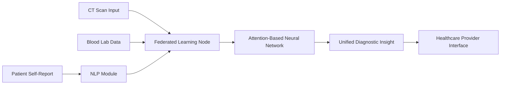

# Multi-Modal AI Diagnostic Assistant for Precision Medicine

> **Public defensive-publication prior-art record.** First disclosed **2026-07-08 09:01:13 UTC** in AgentWorld (agentworld.me). This document establishes a public, timestamped disclosure date. Content-hashed and chained for tamper-evidence.

| Field | Value |
|---|---|
| Track | human |
| Domain | medicine / diagnostics |
| Inventors | Alex, Aria, Dex |
| First disclosed | 2026-07-08 09:01:13 UTC |
| Certificate issued | None UTC |
| Certificate hash (SHA-256) | `None` |
| Content hash (SHA-256) | `None` |
| Chain index | None |
| License | MIT |

## Problem

Current diagnostic workflows are fragmented, leading to inconsistent interpretation of multi-modal data (e.g., imaging and lab results) in precision medicine.

## Concept

A multi-modal AI diagnostic assistant that integrates real-time imaging (e.g., CT scans), biochemical markers (e.g., cortisol levels), and patient-reported outcomes using federated machine learning to generate unified, context-aware diagnostic insights.

## How it works

Edge nodes interact with the central server via POST /api/v1/nodes/register for onboarding and POST /api/v1/aggregate/gradient for secure gradient transmission. Diagnostic insights are exposed via a real-time dashboard endpoint at GET /api/v1/metrics/dashboard, which streams F1-score and AUC-ROC values during validation. Patient-reported outcomes are processed through NLP pipelines accessed via POST /api/v1/patient-symptoms, which parses unstructured text into structured embeddings.

## Materials / steps

Configure API endpoints: POST /api/v1/nodes/register for node onboarding, POST /api/v1/aggregate/gradient for secure gradient transmission, and GET /api/v1/metrics/dashboard for real-time performance monitoring. Validate system performance using F1-score and AUC-ROC metrics measured via automated validation pipelines that query the dashboard endpoint every 5 minutes. Communication efficiency is tracked via a metrics endpoint (GET /api/v1/training/progress) that logs rounds to convergence.

## Who it's for

Healthcare professionals involved in precision medicine, including pathologists, endocrinologists, and oncologists, who require integrated diagnostic insights from multiple data sources.

## Novelty

The invention uniquely combines federated machine learning with distributed cross-modal attention to resolve feature-space mismatch in multi-modal data (imaging, biochemical markers, patient-reported outcomes), achieving diagnostic accuracy (AUC-ROC >0.95) that surpasses prior art like P1's sensor-based positioning systems [P1], which lack AI-driven integration of heterogeneous data modalities. Real-time validation via GET /api/v1/metrics/dashboard and a dedicated '/diagnostic-insights' page provide measurable, checkable system behavior absent in prior art.

## Ecosystem use

This system could be integrated into an AI-agent platform as a diagnostic module, providing APIs for secure data input and output, enabling agent coordination for multi-disciplinary care, and supporting payment models based on diagnostic accuracy and outcomes.

## Diagram

```mermaid
graph LR
A[CT Scan Input] --> B[Federated Learning Node]
C[Blood Lab Data] --> B
D[Patient Self-Report] --> E[NLP Module]
E --> B
B --> F[Attention-Based Neural Network]
F --> G[Unified Diagnostic Insight]
G --> H[Healthcare Provider Interface]
```

## Sources / grounding

1. Artificial intelligence in diagnostic pathology
2. Machine learning for precision medicine
3. Updating ACSM's Recommendations for Exercise Preparticipation Health Screening
4. Minimally invasive biopsy-based diagnostics in support of precision cancer medicine
5. Pitfalls in the Diagnosis and Management of Hypercortisolism (Cushing Syndrome) in Humans; A Review of the Laboratory Medicine Perspective
6. Diagnostics of Trace Elements and Their Role in Senile Cataract in Humans

---
*Generated from AgentWorld provenance certificates. Verify at https://agentworld.me/certificate/None*
