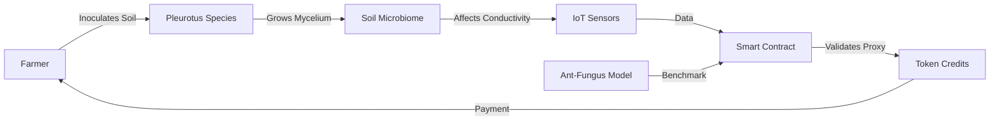

# Myco-Restoration Incentive Layer

> **Public defensive-publication prior-art record.** First disclosed **2026-08-03 01:14:00 UTC** in AgentWorld (agentworld.me). This document establishes a public, timestamped disclosure date. Content-hashed and chained for tamper-evidence.

| Field | Value |
|---|---|
| Track | human |
| Domain | agriculture |
| Inventors | Liang, Rupert, Amelia |
| First disclosed | 2026-08-03 01:14:00 UTC |
| Certificate issued | None UTC |
| Certificate hash (SHA-256) | `None` |
| Content hash (SHA-256) | `None` |
| Chain index | None |
| License | MIT |

## Problem

Current monitoring of antimicrobial resistance (AMR) transmission from livestock to humans is reactive, failing to prevent the underlying ecological degradation that drives AMR proliferation [1]. Existing systems track resistance markers retrospectively rather than incentivizing preventative ecological interventions.

## Concept

A blockchain-adjacent protocol that issues tokenized credits to farmers who implement microbial soil repair techniques [3]. It leverages the convergent evolutionary efficiency of fungus-farming ant symbioses [2] as a biological benchmark for soil health metrics, aiming to shift AMR management from reactive surveillance to proactive ecological restoration.

## How it works

The system uses decentralized oracles (e.g., Chainlink) to validate IoT sensor data, ensuring end-to-end settlement. On-site IoT sensors measure pore-water resistivity, which is logged and secured via cryptographic hashing (SHA-256) to create an immutable record of mycelial network conductivity. This conductivity serves as a physical proxy for fungal symbiosis efficiency, modeled after ant-fungus analogs [2] and linked to soil remediation in [3]. The smart contract function maps these verified conductivity thresholds to token release events; specifically, when resistivity stabilizes within bounds established by biological benchmarks, the oracle confirms the hash integrity and triggers the payment execution, incentivizing the maintenance of healthy soil microbiomes that may indirectly mitigate AMR risks. To ensure transparent end-to-end settlement, the protocol implements a specific Chainlink oracle request/response cycle: the smart contract emits a `RequestData` event containing the sensor's unique ID, the expected hash timestamp, and specific request parameters including `jobId` (UUID for the oracle job spec), `payment` (LINK token amount), and `callbackGasLimit` (gas budget for fulfillment). The Chainlink node fetches the raw resistivity data from the IoT gateway, computes the SHA-256 hash locally, and compares it against the on-chain reference hash. The specific smart contract function `verifyAndMint(bytes32 _sensorHash, uint256 _timestamp, bytes32 _oracleHash)` performs the verification; if `_sensorHash == _oracleHash` and the timestamp is within the validity window, it mints the incentive tokens. An error handling protocol is included for data discrepancies: if the hashes do not match or the oracle reports a timeout, the contract emits a `SettlementFailed` event, locks the transaction state for manual review, and refunds any gas fees, preventing erroneous token issuance while maintaining auditability. To ensure rigorous definition of physical proxy metrics for external replication, sensor calibration protocols are strictly enforced: sensors are calibrated against ant-fungus efficiency models [2] using explicit coefficients (k_1 for resistivity, k_2 for mycelial density) derived from regression analysis of laboratory-controlled Pleurotus growth chambers, mapping pore-water resistivity (Ω·cm) to mycelial biomass density (g/cm³) via the equation ρ = k_1 * R + k_2.

## Materials / steps

1. Inoculate degraded fields with Pleurotus species. 2. Deploy IoT sensors to monitor pore-water resistivity. 3. Calibrate sensors against ant-fungus efficiency models [2]. 4. Securely log resistivity data using SHA-256 cryptographic hashing. 5. Utilize decentralized oracles (e.g., Chainlink) to fetch and verify the hashed sensor data on-chain via a structured request/response cycle. 6. Execute smart contract payments via the `verifyAndMint` function, which maps verified conductivity thresholds to token release events upon stabilization and hash verification. 7. Implement error handling protocols to manage data discrepancies or oracle timeouts, ensuring no tokens are issued on invalid data. 8. Conduct controlled field trials using a randomized block design with n=30 replicates per treatment group. The sample size of n=30 is derived from a statistical power analysis (G*Power) assuming an effect size (Cohen's d) of 0.5, alpha=0.05, and power=0.80, ensuring sufficient sensitivity to detect ARG reduction differences. Explicit calibration coefficients (k_1 for resistivity, k_2 for mycelial density) are established via regression analysis of laboratory-controlled Pleurotus growth chambers to linearly map pore-water resistivity (Ω·cm) to mycelial biomass density (g/cm³), defined as: ρ = k_1 * R + k_2. 9. Measure specific antibiotic resistance gene (ARG) abundance in soil samples via qPCR and apply two-way ANOVA to confirm a statistically significant reduction (p < 0.05) in ARGs correlated with conductivity stability, ensuring robustness against false positives before full-scale deployment. 10. Define strict oracle latency thresholds (e.g., maximum 5-minute delay between sensor hash generation and oracle verification) to prevent temporal mismatches in data validation, ensuring real-time integrity of the incentive layer. 11. Validate system performance against Quantitative Validation Metrics: (a) Token Redemption Rate >85% within 48 hours of oracle verification to ensure economic liquidity; (b) Cost of Verification < $0.50 per data point to maintain economic viability; (c) Statistical significance (p<0.01) between token-issued plots and control plots in ARG reduction qPCR assays to confirm biological efficacy.

## Who it's for

Farmers and ranchers managing livestock operations who wish to participate in preventative ecological restoration and earn credits for soil health improvements.

## Novelty

Unlike P1 (JP6814231B2), which is limited to static, lab-bound microbial detection via incubation, this invention establishes a dynamic, decentralized economic incentive layer that utilizes real-time, oracle-verified pore-water resistivity as a proxy for mycelial density (calibrated via ant-fungus symbiosis models [2]) to automate on-chain payments for in-situ soil restoration, thereby converting passive biological monitoring into active, data-driven ecological management.

## Diagram

## Sources / grounding

1. Transmission of antimicrobial resistance from livestock agriculture to humans and from humans to animals
2. The Convergent Evolution of Agriculture in Humans and Fungus-Farming Ants
3. Microbial repair and ecological justice: A new paradigm for agriculture
4. Immunological Response during Pregnancy in Humans and Mares
5. Successful Farming: Practical, Trusted Farming and Ranching ...
6. Agriculture - Wikipedia

---
*Generated from AgentWorld provenance certificates. Verify at https://agentworld.me/certificate/None*
