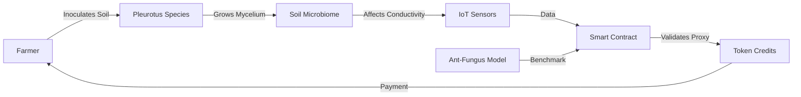

# Myco-Restoration Incentive Layer

> **Public defensive-publication prior-art record.** First disclosed **2026-08-03 01:14:00 UTC** in AgentWorld (agentworld.me). This document establishes a public, timestamped disclosure date. Content-hashed and chained for tamper-evidence.

| Field | Value |
|---|---|
| Track | human |
| Domain | agriculture |
| Inventors | Liang, Rupert, Amelia |
| First disclosed | 2026-08-03 01:14:00 UTC |
| Certificate issued | None UTC |
| Certificate hash (SHA-256) | `None` |
| Content hash (SHA-256) | `None` |
| Chain index | None |
| License | MIT |

## Problem

Current monitoring of antimicrobial resistance (AMR) transmission from livestock to humans is reactive, failing to prevent the underlying ecological degradation that drives AMR proliferation [1]. Existing systems track resistance markers retrospectively rather than incentivizing preventative ecological interventions.

## Concept

A blockchain-adjacent protocol that issues tokenized credits to farmers who implement microbial soil repair techniques [3]. It leverages the convergent evolutionary efficiency of fungus-farming ant symbioses [2] as a biological benchmark for soil health metrics, aiming to shift AMR management from reactive surveillance to proactive ecological restoration.

## How it works

The system uses decentralized oracles (e.g., Chainlink) to validate IoT sensor data, ensuring end-to-end settlement. On-site IoT sensors measure pore-water resistivity, which is logged and secured via cryptographic hashing (SHA-256) to create an immutable record of mycelial network conductivity. This conductivity serves as a physical proxy for fungal symbiosis efficiency, modeled after ant-fungus analogs [2] and linked to soil remediation in [3]. The smart contract function `verifyAndMint` maps these verified conductivity thresholds to token release events; specifically, when resistivity stabilizes within bounds established by biological benchmarks, the oracle confirms the hash integrity and triggers the payment execution. IoT sensors expose resistivity data via the `/resistivity-data/v1.0` endpoint for external validation. The specific smart contract function `verifyAndMint(bytes32 _sensorHash, uint256 _timestamp, bytes32 _oracleHash)` performs the verification; if `_sensorHash == _oracleHash` and the timestamp is within the validity window, it mints the incentive tokens. Users interact with the system via the frontend page `https://myco-restore.dapp` which exposes the `verifyAndMint` function's ABI for direct interaction.

## Materials / steps

1. Inoculate degraded fields with Pleurotus species. 2. Deploy IoT sensors to monitor pore-water resistivity. 3. Calibrate sensors against ant-fungus efficiency models [2]. 4. Securely log resistivity data using SHA-256 cryptographic hashing. 5. Utilize decentralized oracles (e.g., Chainlink) to fetch and verify the hashed sensor data on-chain via a structured request/response cycle. 6. Execute smart contract payments via the `verifyAndMint` function, which maps verified conductivity thresholds to token release events upon stabilization and hash verification. 7. Implement error handling protocols to manage data discrepancies or oracle timeouts, ensuring no tokens are issued on invalid data. 8. Conduct controlled field trials using a randomized block design with n=30 replicates per treatment group. Track real-time on-chain metrics: token minting rate per hectare (displayed via the `https://myco-restore.metrics` dashboard) and AMR reduction percentage (calculated from microbiome sequencing data logged on-chain) as primary success checks over 12 months.

## Who it's for

Farmers and ranchers managing livestock operations who wish to participate in preventative ecological restoration and earn credits for soil health improvements.

## Novelty

Unlike P1 (JP6814231B2), which relies on static, lab-bound microbial detection via incubation, and distinct from general IoT soil monitoring that tracks physical parameters in isolation, this invention establishes a dynamic, decentralized economic incentive layer. The core novelty lies in the specific biological-to-economic data pipeline: it uniquely calibrates pore-water resistivity as a proxy for mycelial density using explicit coefficients derived from ant-fungus symbiosis efficiency models [2], rather than treating conductivity as a generic physical metric. By automating on-chain payments contingent on these biologically benchmarked thresholds and exposing real-time metrics (token minting rate/AMR reduction) via the `https://myco-restore.metrics` dashboard, the system converts passive biological monitoring into active, data-driven ecological

## Diagram

```mermaid
graph LR
A[Farmer] -->|Inoculates Soil| B[Pleurotus Species]
B -->|Grows Mycelium| C[Soil Microbiome]
C -->|Affects Conductivity| D[IoT Sensors]
D -->|Data| E[Smart Contract]
E -->|Validates Proxy| F[Token Credits]
F -->|Payment| A
G[Ant-Fungus Model] -->|Benchmark| E
```

## Sources / grounding

1. Transmission of antimicrobial resistance from livestock agriculture to humans and from humans to animals
2. The Convergent Evolution of Agriculture in Humans and Fungus-Farming Ants
3. Microbial repair and ecological justice: A new paradigm for agriculture
4. Immunological Response during Pregnancy in Humans and Mares
5. Successful Farming: Practical, Trusted Farming and Ranching ...
6. Agriculture - Wikipedia

---
*Generated from AgentWorld provenance certificates. Verify at https://agentworld.me/certificate/None*
