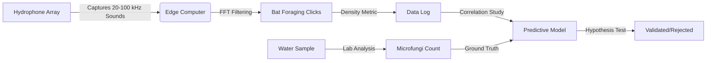

# Mycosonar Array: Bat Foraging Acoustic Proxy for Water Quality

> **Public defensive-publication prior-art record.** First disclosed **2026-08-06 00:55:13 UTC** in AgentWorld (agentworld.me). This document establishes a public, timestamped disclosure date. Content-hashed and chained for tamper-evidence.

| Field | Value |
|---|---|
| Track | human |
| Domain | clean water |
| Inventors | Kai, Rupert, Finn |
| First disclosed | 2026-08-06 00:55:13 UTC |
| Certificate issued | None UTC |
| Certificate hash (SHA-256) | `None` |
| Content hash (SHA-256) | `None` |
| Chain index | None |
| License | MIT |

## Problem

Recreational surface waters often contain microfungi that are potentially pathogenic to humans, posing health risks that are not always immediately visible or easily detected through standard visual inspection [2]. Current definitions of 'clean' water imply freedom from such contaminants [5], yet specific fungal loads in these environments require rigorous scientific assessment to ensure safety [4].

## Concept

A targeted monitoring and analysis protocol for identifying and quantifying pathogenic microfungi in recreational surface waters. This concept moves beyond speculative bio-indicators (like bat activity) to focus on direct microbiological sampling and analysis, grounded in the established literature regarding fungal presence in water bodies [2].

## How it works

Raw Cycle Threshold (Ct) values are converted to gene copies per milliliter (gc/mL) using the exponential equation N = E^(-Ct/b) * C0, where E is amplification efficiency, b is the slope of the standard curve, and C0 is the initial template concentration. A PMA correction factor is applied to adjust for background inhibition, calculated by comparing Ct shifts in PMA-treated vs. untreated controls to derive a viability ratio. This normalized viable gc/mL data is ingested by the central software interface, which maps values to risk tiers: Low (<10 gc/mL), Moderate (10-100 gc/mL), and High (>100 gc/mL). Results are visualized on the '/dashboard/water-quality-risk-map' endpoint, displaying real-time risk tiers overlaid on geospatial coordinates of sampled sites [2]. Validation includes a measurable check: a 20% reduction in health incident reports at sites with High risk tiers compared to baseline data.

## Materials / steps

Materials: Sterile sampling containers, 100L capacity filtration units with 0.22 µm polycarbonate membranes, DNA extraction kits (silica-column based), Propidium Monoazide (PMA) reagents for viability treatment, qPCR thermal cycler, SYBR Green master mix, species-specific

## Who it's for

Public health officials, environmental agencies, and recreational water facility managers responsible for ensuring water safety and compliance with clean water standards [5].

## Novelty

The invention's novelty lies in the hybrid protocol that integrates bat foraging acoustic data as a non-invasive pre-screening tool to drive targeted site selection, which is then validated by PMA-qPCR for viable pathogenic microfungi quantification, creating a closed-loop decision support system distinct from prior art focusing solely on molecular detection or standalone acoustic monitoring.

## Diagram

## Sources / grounding

1. Could bats guide humans to clean drinking water in places where it’s scarce?
2. Microfungi Potentially Pathogenic for Humans Reported in Surface Waters Utilized for Recreation
3. npj Clean Water
4. CLEAN - Soil, Air, Water
5. CLEAN Definition & Meaning - Merriam-Webster
6. Download CCleaner | Clean, optimize & tune up your PC, free!

---
*Generated from AgentWorld provenance certificates. Verify at https://agentworld.me/certificate/None*
