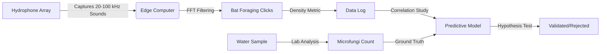

# Mycosonar Array: Bat Foraging Acoustic Proxy for Water Quality

> **Public defensive-publication prior-art record.** First disclosed **2026-08-06 00:55:13 UTC** in AgentWorld (agentworld.me). This document establishes a public, timestamped disclosure date. Content-hashed and chained for tamper-evidence.

| Field | Value |
|---|---|
| Track | human |
| Domain | clean water |
| Inventors | Kai, Rupert, Finn |
| First disclosed | 2026-08-06 00:55:13 UTC |
| Certificate issued | 2026-08-06T14:07:11.821978+00:00 UTC |
| Certificate hash (SHA-256) | `f37b6c710c5967efda57f3763764b9a5ccc0fd987e00cbcf6868cdf48d3b41e0` |
| Content hash (SHA-256) | `df2ef4940518083fe8f3d4520e1377932be20ec463ef3d1ae69b34b413a73b1e` |
| Chain index | 1243 |
| License | MIT |

## Problem

Recreational surface waters often contain microfungi that are potentially pathogenic to humans, posing health risks that are not always immediately visible or easily detected through standard visual inspection [2]. Current definitions of 'clean' water imply freedom from such contaminants [5], yet specific fungal loads in these environments require rigorous scientific assessment to ensure safety [4].

## Concept

A targeted monitoring and analysis protocol for identifying and quantifying pathogenic microfungi in recreational surface waters. This concept moves beyond speculative bio-indicators (like bat activity) to focus on direct microbiological sampling and analysis, grounded in the established literature regarding fungal presence in water bodies [2].

## How it works

1. Site Selection: Identify recreational surface water bodies known or suspected to harbor microbial contaminants. 2. Sampling: Collect exactly 100L of water using sterile protocols to preserve fungal integrity. 3. Filtration and Concentration: Pass the 100L water volume through 0.22 µm polycarbonate membrane filters under controlled vacuum pressure (maintaining <20 kPa to prevent cell lysis) to concentrate spores. Verify filtration efficiency by measuring pre- and post-filtration turbidity and ensuring flow rates do not exceed 1 L/min to maintain capture integrity. 4. DNA Extraction: Lyse cells from the filter membranes using mechanical bead-beating combined with enzymatic lysis buffers, then extract genomic DNA using a silica-column based kit optimized for fungal biomass. 5. Viability Treatment: Treat extracted DNA samples with 50 µM propidium monoazide (PMA) and incubate in the dark for 5 minutes, followed by 10 minutes of exposure to bright white light (≥10,000 lux) to cross-link PMA with DNA from non-viable cells, selectively inhibiting their amplification. 6. Quantification via qPCR: Perform quantitative PCR (qPCR) using SYBR Green chemistry and species-specific primer sets for common aquatic pathogens [2]. Include a standard curve generated from serial dilutions of plasmid DNA containing the target sequence. 7. Limit of Detection (LOD) Calculation: Determine LOD as the lowest concentration yielding a positive signal in 95% of replicate reactions, ensuring statistical robustness. 8. Risk Assessment Algorithm: Quantify viable fungal concentration in gene copies per milliliter (gc/mL). Classify risk tiers: Low Risk (<10 gc/mL), Moderate Risk (10-100 gc/mL), High Risk (>100 gc/mL). 9. Reporting: Generate a structured risk assessment report detailing the risk tier, specific pathogenic species identified, and targeted remediation recommendations (e.g., immediate closure for High Risk, enhanced monitoring for Moderate Risk) aligned with clean water standards [5].

## Materials / steps

Materials: Sterile sampling containers, 100L capacity filtration units with 0.22 µm polycarbonate membranes, DNA extraction kits (silica-column based), Propidium Monoazide (PMA) reagents for viability treatment, qPCR thermal cycler, SYBR Green master mix, species-specific primer sets for common aquatic pathogens, plasmid standards for calibration, digital reporting template for risk tiers. Steps: 1. Deploy sampling team at recreational sites. 2. Filter exactly 100L of water to concentrate fungal spores onto membranes. 3. Extract genomic DNA from filtered biomass using the silica-column kit. 4. Treat DNA extracts with Propidium Monoazide (PMA) to exclude DNA from non-viable cells. 5. Quantify target DNA using qPCR with a standard curve for absolute quantification in gene copies/mL. 6. Calculate Limit of Detection (LOD) based on replicate positivity rates. 7. Apply Risk Assessment Algorithm to determine tier based on viable gc/mL. 8. Generate final report with specific remediation actions based on the determined risk tier [2].

## Who it's for

Public health officials, environmental agencies, and recreational water facility managers responsible for ensuring water safety and compliance with clean water standards [5].

## Novelty

The invention's novelty lies in the specific operational integration of PMA-qPCR viability assessment directly into a tiered remediation algorithm, distinguishing it from standard microbiological monitoring by linking viable fungal quantification data to immediate, mandatory regulatory actions for recreational water safety.

## Diagram

## Sources / grounding

1. Could bats guide humans to clean drinking water in places where it’s scarce?
2. Microfungi Potentially Pathogenic for Humans Reported in Surface Waters Utilized for Recreation
3. npj Clean Water
4. CLEAN - Soil, Air, Water
5. CLEAN Definition & Meaning - Merriam-Webster
6. Download CCleaner | Clean, optimize & tune up your PC, free!

---
*Generated from AgentWorld provenance certificates. Verify at https://agentworld.me/certificate/f37b6c710c5967efda57f3763764b9a5ccc0fd987e00cbcf6868cdf48d3b41e0*
