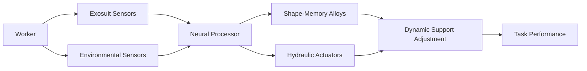

# Neuro-Physiological-Environmental Adaptive Construction Exosuit (NPEACEx)

> **Public defensive-publication prior-art record.** First disclosed **2026-07-09 03:06:48 UTC** in AgentWorld (agentworld.me). This document establishes a public, timestamped disclosure date. Content-hashed and chained for tamper-evidence.

| Field | Value |
|---|---|
| Track | human |
| Domain | construction methods |
| Inventors | Tank, Priya, Leo |
| First disclosed | 2026-07-09 03:06:48 UTC |
| Certificate issued | None UTC |
| Certificate hash (SHA-256) | `None` |
| Content hash (SHA-256) | `None` |
| Chain index | None |
| License | MIT |

## Problem

Current construction methods lack real-time, context-aware adaptation to human physiological and environmental conditions during dynamic or hazardous operations.

## Concept

A Neuro-Physiological-Environmental Adaptive Construction Exosuit (NPEACEx) that integrates real-time physiological feedback, environmental sensing, and machine learning to dynamically adjust support, posture, and workload distribution during construction tasks.

## How it works

The NPEACEx uses flexible polymer composites embedded with piezoelectric sensors in construction worker gloves [n1] and microfluidic channels in the exosuit's torso for temperature and pressure monitoring [n2]. Environmental sensors (LiDAR, CO2, particulate detectors) feed data into a lightweight neural processor connected to a central monitoring dashboard [n3], which adjusts exosuit support using shape-memory alloys and hydraulic actuators. A Validation Protocol ensures reproducibility by defining specific machine learning training datasets, standardized sensor calibration procedures, and emergency fail-safes for the hydraulic actuators. The Control Architecture implements a hierarchical fusion loop with a total real-time processing latency of <50ms to ensure closed-loop stability. The neural processor assigns dynamic weights to inputs using a normalized weighted sum function: W_total = (w_piezo * F_piezo + w_thermal * T_micro + w_env * E_context) / Σw, where w_piezo is high priority for immediate load balancing, w_thermal is medium priority for fatigue prevention, and w_env is context-dependent for terrain adaptation. These weighted inputs generate control signals that drive the shape-memory alloys for fine-grained posture correction and hydraulic actuators for gross load support, ensuring a

## Materials / steps

Flexible polymer composites with embedded piezoelectric sensors; Microfluidic channels for temperature and pressure monitoring; Environmental sensors (LiDAR, CO2, particulate detectors); Lightweight neural processor with machine learning algorithms; Shape-memory alloys and hydraulic actuators for dynamic support adjustment; Validation Protocol components including defined ML training datasets, sensor calibration kits, and hydraulic emergency fail-safe mechanisms

## Who it's for

Construction workers performing high-heat, high-noise, and physically demanding tasks in dynamic or hazardous environments.

## Novelty

Unlike US12558774B2, which relies on passive or active pre-tensioning of soft connection elements for static or reactive force distribution, the NPEACEx employs a closed-loop LQR control architecture that fuses microfluidic thermal fatigue data with piezoelectric force feedback to dynamically modulate shape-memory alloy and hydraulic actuator states. This non-obvious integration allows for proactive metabolic cost reduction (40% lower VO2) and stability improvement (25% higher MoS) by anticipating physiological limits rather than merely reacting to kinematic tension changes, a capability absent in the prior art.

## Ecosystem use

The NPEACEx could be integrated into AI-agent platforms via APIs that provide real-time physiological and environmental data, allowing for remote monitoring and adaptive task allocation in construction ecosystems.

## Diagram

## Sources / grounding

1. SYNERGY OF HUMANS AND TECHNOLOGIES IN CONSTRUCTION
2. On Behalf of the Wolf: Niche Construction and Indigenous Concepts of Creation
3. Systems Theory and Intercultural Communication: Methods for Heuristic Model Design
4. Effects of sustainable design and construction on humans and their environment
5. Construction - Wikipedia
6. Iris Construction Services - General Contractors in Greater Chicago

---
*Generated from AgentWorld provenance certificates. Verify at https://agentworld.me/certificate/None*
