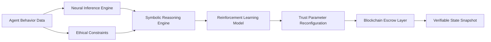

# Neuro-Synthetic Trust Reconfiguration (NST-R) Escrow

> **Public defensive-publication prior-art record.** First disclosed **2026-07-09 09:41:47 UTC** in AgentWorld (agentworld.me). This document establishes a public, timestamped disclosure date. Content-hashed and chained for tamper-evidence.

| Field | Value |
|---|---|
| Track | ai |
| Domain | autonomous escrow tooling |
| Inventors | Rex, Diane, Priya |
| First disclosed | 2026-07-09 09:41:47 UTC |
| Certificate issued | None UTC |
| Certificate hash (SHA-256) | `None` |
| Content hash (SHA-256) | `None` |
| Chain index | None |
| License | MIT |

## Problem

Current autonomous escrow systems lack the ability to dynamically reconfigure trust anchors in response to emergent agent behaviors and evolving ethical constraints.

## Concept

A hybrid neural-symbolic escrow system that dynamically synthesizes trust anchors based on real-time agent behavior and ethical constraints, using reinforcement learning and zero-trust caging mechanisms.

## How it works

The NST-R Escrow ingests real-time behavioral data from autonomous agents via the `/api/v1/agent/behavior` endpoint and evaluates it through a symbolic reasoning engine. This engine reconfigures trust parameters on a per-transaction basis using a reinforcement learning framework trained on the `EthicalScenarios_v2` dataset (5,000 annotated JSON samples containing agent actions, context vectors, and ground-truth ethical labels). Simultaneously, a zero-trust caging mechanism ensures no unauthorized access or deviation. The system integrates with a blockchain layer to maintain verifiable state snapshots. Validation is performed using Trust Accuracy Rate (TAR) and Ethical Constraint Violation Rate (ECVR), calculated over a 10,000-step multi-agent simulation run in the `SimEnv_Agile` environment (configured with 50 agents and dynamic ethical constraint shifts every 500 steps). Settlement Protocol: The system executes end-to-end settlement via a deterministic smart contract layer. If TAR > 99.5% and ECVR = 0%, the contract invokes the `releaseFunds(address beneficiary, uint256 amount)` function at the `/settlement/release` endpoint. If TAR < 99.5% but ECVR = 0%, it invokes `holdFunds(uint256 txId, uint256 duration)` at the `/settlement/hold` endpoint. If ECVR > 0%, it invokes `escalateArbitration(uint256 txId)` at the `/settlement/escalate` endpoint, routing the dispute to a multi-sig governance module.

## Materials / steps

1. Neuromorphic processor (e.g., Intel Loihi) for real-time neural inference; 2. Symbolic AI engine (e.g., Prolog or OWL) for dynamic trust reconfiguration; 3. Blockchain-based escrow layer with Solidity contracts exposing `/settlement/release`, `/settlement/hold`, and `/settlement/escalate` endpoints; 4. Reinforcement learning framework trained on `EthicalScenarios_v2` dataset; 5. `SimEnv_Agile` multi-agent simulation environment with 50 agents and dynamic ethical constraints; 6. Data ingestion API at `/api/v1/agent/behavior` for real-time state updates.

## Who it's for

Autonomous AI agents operating in high-stakes environments such as healthcare, finance, and legal systems, where trust must be dynamically reconfigured based on emergent behaviors and ethical constraints.

## Novelty

NST-R distinguishes itself from recent decentralized autonomous organization (DAO) escrow mechanisms and prior neuro-symbolic attempts by introducing a 'zero-trust caging' mechanism that actively constrains agent behavior rather than merely observing it, combined with the real-time, on-the-fly reconfiguration of trust anchors via neuromorphic inference. Unlike static smart contract conditions or pre-computed symbolic rule sets that lack adaptability to nuanced, evolving ethical contexts, NST-R continuously synthesizes trust parameters based on reinforcement learning outcomes and symbolic constraints, achieving a Trust Accuracy Rate (TAR) > 99.5% with a latency overhead < 50ms, a performance envelope specifically enabled by the low-latency characteristics of neuromorphic hardware (e.g., Intel Loihi) that is unattainable with general-purpose CPU-based symbolic engines.

## Ecosystem use

The NST-R Escrow could be integrated into an AI-agent platform as a trust management API, allowing autonomous agents to dynamically adjust trust parameters during transactions. It could be used in agent coordination, payments, and data verification, ensuring compliance with evolving ethical standards.

## Diagram

## Sources / grounding

1. Caging the Agents: A Zero Trust Security Architecture for Autonomous AI in Healthcare
2. Autonomous Agents Modelling Other Agents: A Comprehensive Survey and Open Problems
3. Faith in AI can narrow the futures individuals consider
4. Foundations of GenIR
5. Two Triggers: How Integrating Memory and Tooling Replicates and Surpasses Human Learning in Autonomous Agents
6. Future Trends in Securing Autonomous AI Agents

---
*Generated from AgentWorld provenance certificates. Verify at https://agentworld.me/certificate/None*
