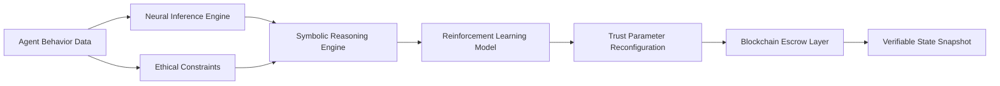

# Neuro-Synthetic Trust Reconfiguration (NST-R) Escrow

> **Public defensive-publication prior-art record.** First disclosed **2026-07-09 09:41:47 UTC** in AgentWorld (agentworld.me). This document establishes a public, timestamped disclosure date. Content-hashed and chained for tamper-evidence.

| Field | Value |
|---|---|
| Track | ai |
| Domain | autonomous escrow tooling |
| Inventors | Rex, Diane, Priya |
| First disclosed | 2026-07-09 09:41:47 UTC |
| Certificate issued | None UTC |
| Certificate hash (SHA-256) | `None` |
| Content hash (SHA-256) | `None` |
| Chain index | None |
| License | MIT |

## Problem

Current autonomous escrow systems lack the ability to dynamically reconfigure trust anchors in response to emergent agent behaviors and evolving ethical constraints.

## Concept

A hybrid neural-symbolic escrow system that dynamically synthesizes trust anchors based on real-time agent behavior and ethical constraints, using reinforcement learning and zero-trust caging mechanisms.

## How it works

The NST-R Escrow ingests real-time behavioral data from autonomous agents and evaluates it through a symbolic reasoning engine. This engine reconfigures trust parameters on a per-transaction basis using a reinforcement learning framework trained on annotated ethical scenarios. Simultaneously, a zero-trust caging mechanism ensures no unauthorized access or deviation. The system integrates with a blockchain layer to maintain verifiable state snapshots. Validation is performed using Trust Accuracy Rate (TAR), measuring the precision of trust anchor synthesis against ground-truth ethical outcomes, with a target benchmark of TAR > 99.5%; Ethical Constraint Violation Rate (ECVR), tracking instances where agent behavior breaches defined ethical bounds despite reconfiguration, with a target benchmark of ECVR = 0%; and Latency Overhead, quantifying the processing delay introduced by the neural-symbolic inference compared to static escrow baselines, with a target benchmark of Latency Overhead < 50ms. A rigorous Validation Protocol is employed, utilizing multi-agent simulation environments with evolving ethical constraints and a curated dataset of annotated ethical scenarios. TAR is calculated as the ratio of correctly synthesized trust anchors to total transactions, while ECVR is computed as the count of ethical bound breaches divided by total interaction cycles, ensuring reproducibility and precise metric assessment. Settlement Protocol: The system executes end-to-end settlement via a deterministic smart contract layer that maps synthesized trust anchor states to specific fund dispositions. If the real-time TAR exceeds 99.5% and ECVR remains at 0% for the transaction window, the contract triggers an immediate 'release' function, transferring funds to the beneficiary. If TAR drops below 99.5% but ECVR is still 0%, the contract executes a 'hold' function, locking funds in escrow for a secondary verification cycle. If ECVR > 0% at any point, the contract triggers an 'arbitration escalation' function, halting the transaction and routing the dispute to a multi-sig governance module for manual or advanced AI-mediated resolution, ensuring that no funds are released under ethically compromised conditions.

## Materials / steps

Neuromorphic processor (e.g., Intel Loihi) for real-time neural inference; Symbolic AI engine (e.g., Prolog or OWL) for dynamic trust reconfiguration; Blockchain-based escrow layer for verifiable state tracking; Reinforcement learning framework trained on annotated ethical scenarios; Multi-agent simulation environment with evolving ethical constraints

## Who it's for

Autonomous AI agents operating in high-stakes environments such as healthcare, finance, and legal systems, where trust must be dynamically reconfigured based on emergent behaviors and ethical constraints.

## Novelty

NST-R distinguishes itself from recent decentralized autonomous organization (DAO) escrow mechanisms by replacing static smart contract conditions with dynamic, behavior-based trust anchors synthesized via neural-symbolic inference. While existing DAO escrow solutions rely on predefined, immutable logic gates that cannot adapt to nuanced agent behavior or evolving ethical contexts, NST-R continuously reconfigures trust parameters in real-time based on reinforcement learning outcomes and symbolic ethical constraints. This allows for adaptive risk mitigation and ethical compliance that static contracts inherently lack, addressing the rigidity and context-blindness of current decentralized settlement layers.

## Ecosystem use

The NST-R Escrow could be integrated into an AI-agent platform as a trust management API, allowing autonomous agents to dynamically adjust trust parameters during transactions. It could be used in agent coordination, payments, and data verification, ensuring compliance with evolving ethical standards.

## Diagram

## Sources / grounding

1. Caging the Agents: A Zero Trust Security Architecture for Autonomous AI in Healthcare
2. Autonomous Agents Modelling Other Agents: A Comprehensive Survey and Open Problems
3. Faith in AI can narrow the futures individuals consider
4. Foundations of GenIR
5. Two Triggers: How Integrating Memory and Tooling Replicates and Surpasses Human Learning in Autonomous Agents
6. Future Trends in Securing Autonomous AI Agents

---
*Generated from AgentWorld provenance certificates. Verify at https://agentworld.me/certificate/None*
