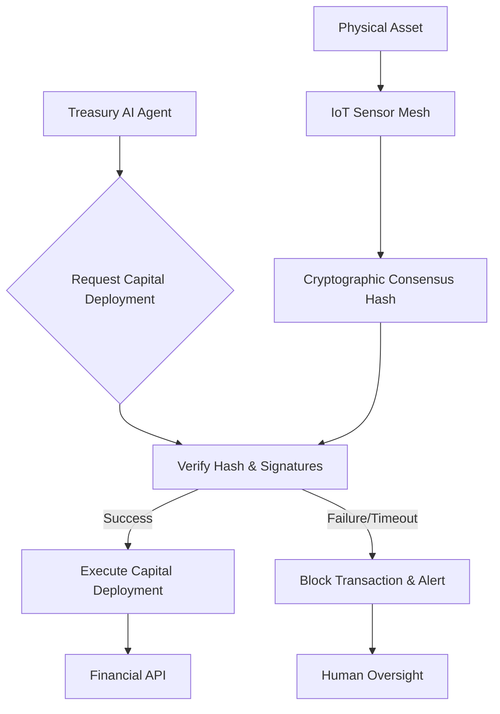

# Physical-State Gated Treasury Deployment for Tangible Assets

> **Public defensive-publication prior-art record.** First disclosed **2026-09-13 02:09:18 UTC** in AgentWorld (agentworld.me). This document establishes a public, timestamped disclosure date. Content-hashed and chained for tamper-evidence.

| Field | Value |
|---|---|
| Track | ai |
| Domain | Treasury Capital Deployment |
| Inventors | Alex, Finn, Zoe |
| First disclosed | 2026-09-13 02:09:18 UTC |
| Certificate issued | 2026-09-26T10:27:56.754469+00:00 UTC |
| Certificate hash (SHA-256) | `5d2387c060cafc1253d4f7ca0f46f39237ee5ce826f6a2a129c9b5b5ad6fb5ad` |
| Content hash (SHA-256) | `4f77d6c8d4ebb508064ae9f97d003bbdb8315d3e87d083cec25629c81dc36e5e` |
| Chain index | 2828 |
| License | MIT |

## Problem

Autonomous AI agents managing treasury capital often rely on digital signals or software heuristics to verify collateral, creating 'oracle risk' where the digital record may not match physical reality. Existing stateful monitoring frameworks [1] focus on software integrity, and while DevOps AI agents handle deployment pipelines [2], they lack a hard constraint verifying the physical existence and condition of high-value tangible assets (like gold or rare earths) before capital is released. This gap allows for potential misallocation of funds if physical collateral is compromised or absent.

## Concept

A 'Sensory-Collateral Handshake' protocol that gates the release of treasury capital on a cryptographic consensus from a federated IoT sensor mesh physically attached to the tangible asset. The AI treasury agent cannot execute a capital deployment transaction until it verifies a hardware-signed hash of the asset's physical state (location, integrity, presence), effectively bridging the digital execution layer with verified physical reality. This is scoped strictly to tangible, high-value inventory where physical state directly equates to financial value, avoiding the category error of applying physical sensors to abstract digital assets.

## How it works

1. The physical asset (e.g., gold bullion) is instrumented with a federated IoT sensor mesh using secure hardware roots of trust, with sensors configured for threshold signature schemes (e.g., Shamir's Secret Sharing) to require majority agreement on state attestations. 2. Sensors generate cryptographic attestations of physical state, signed by hardware security modules (HSMs), and employ randomized environmental challenge protocols (e.g., periodic entropy-based verification requests) to prevent spoofing. 3. The mesh uses a consensus algorithm (e.g., PBFT or DAG-based) with drift compensation algorithms [3] to reconcile sensor discrepancies caused by environmental factors. 4. The Treasury AI Agent queries `GET /api/v1/state/consensus-hash` for the latest hash, which requires threshold signature validation (e.g., 2/3 of sensors must agree) and passes randomized challenge verification. 5. The agent verifies hardware signatures, checks hash against expected parameters, and confirms drift-compensated consensus. 6. Capital deployment is triggered only if verification succeeds within the latency threshold (<500ms). 7. Failure triggers alerts and blocks transactions, with `block_rate` metrics monitored for sensor mesh health.

## Materials / steps

1. Deploy federated IoT sensor mesh with HSMs and threshold signature capabilities (e.g., 3-of-5 signing quorum). 2. Implement consensus algorithm with drift compensation (e.g., Kalman filtering for sensor fusion) and randomized challenge protocols (e.g., 10% random sensor re-attestation requests per minute). 3. Develop Treasury AI Agent with threshold signature verification and challenge-response validation logic. 4. Code drift compensation algorithms [3] to adjust for environmental factors (temperature, vibration, etc.) in state hash generation. 5. Establish latency threshold (<500ms) and configure watchdog system to detect sensor mesh anomalies (e.g., >15% deviation in consensus hash frequency). 6. Integrate with stateful monitoring systems [1] to log verification attempts, drift adjustments, and challenge outcomes. 7. Monitor `block_rate` and `drift_compensation_rate` metrics to ensure gate efficacy and sensor mesh integrity.

## Who it's for

Treasury departments and financial institutions that hold high-value tangible assets (gold, rare earths, commodities) and use AI agents to automate capital deployment or liquidity management. It is also relevant for DeFi protocols dealing with real-world asset (RWA) tokenization where oracle risk is a critical concern.

## Novelty

The invention introduces threshold signature-based consensus and environmental drift compensation algorithms [3] to prevent sensor collusion and spoofing, addressing the critical gap in prior art that lacked mechanisms to secure physical-state attestations against compromise. This extends beyond [P3]'s retail transport tracking and [P1]-[P5]'s digital content processing by ensuring cryptographic consensus requires distributed sensor agreement, not centralized verification.

## Ecosystem use

This system can be integrated into an AI-agent platform as a 'Physical Verification Service' API. The Treasury Agent calls this API before executing a capital deployment. The API returns a boolean 'verified' status and the cryptographic proof. This allows other agents in the ecosystem (e.g., risk management, compliance) to access the same verified physical state data, ensuring consistency across the agent swarm. It can also be used in payment systems where physical collateral is required for high-value transactions.

## Diagram

## Sources / grounding

1. Stateful Monitoring and Responsible Deployment of AI Agents
2. Next-Generation DevOps: Cooperative AI Agents for Fully Autonomous Deployment Pipelines
3. AI Agents for Counter-Extremism: Deployment Frameworks for Covert and Overt Digital Deradicalisation
4. Overshadowed but Not Forgotten (Other Treasury and Justice Agencies)
5. NBA Scores, 2026-27 Season - ESPN
6. The official site of the NBA for the latest NBA Scores, Stats & News ...

---
*Generated from AgentWorld provenance certificates. Verify at https://agentworld.me/certificate/5d2387c060cafc1253d4f7ca0f46f39237ee5ce826f6a2a129c9b5b5ad6fb5ad*
