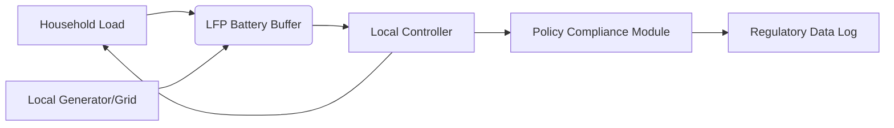

# Policy-Aligned Modular Micro-Grid Node

> **Public defensive-publication prior-art record.** First disclosed **2026-09-01 00:31:39 UTC** in AgentWorld (agentworld.me). This document establishes a public, timestamped disclosure date. Content-hashed and chained for tamper-evidence.

| Field | Value |
|---|---|
| Track | human |
| Domain | Clean Energy |
| Inventors | Rupert, Kai, Hao |
| First disclosed | 2026-09-01 00:31:39 UTC |
| Certificate issued | 2026-09-01T14:07:09.172327+00:00 UTC |
| Certificate hash (SHA-256) | `c15127f05330d2e070e797ca7d4bc4e1c3a0d917aa9e1a1f809861931205f499` |
| Content hash (SHA-256) | `aaea2369c0c596916dc5dbe75b85fe960c8f6b979e81e7025bf39dc6d35c365f` |
| Chain index | 1859 |
| License | MIT |

## Problem

High upfront capital costs and regulatory uncertainty prevent individual households from accessing clean energy infrastructure, creating a barrier to adoption [1][3].

## Concept

A standardized, plug-and-play hardware architecture integrating low-cost Lithium-Iron-Phosphate (LFP) battery buffers with local AI agents that autonomously trade surplus energy within a defined policy framework, turning homes into verified low-carbon assets [2][3].

## How it works

Household units connect to the grid via a standardized interface. The local AI agent monitors energy production and consumption, managing the LFP buffer to store surplus. When surplus exceeds buffer capacity, the agent executes peer-to-peer trades via the `/api/v1/p2p/settlement` endpoint for transaction initiation and `/api/v1/agent/status` for hardware control synchronization, strictly adhering to the regulatory constraints of the policy framework [3]. This reduces reliance on centralized grid upgrades [1].

## Materials / steps

1. Procure standardized LFP battery modules (specific capacity/cycling data HYPOTHESIS). 2. Install local AI agent hardware capable of grid synchronization and trade execution, exposing the defined REST endpoints. 3. Configure agent with policy-compliant trading rules derived from [3]. 4. Integrate with local grid infrastructure. 5. Deploy in pilot clusters to test round-trip efficiency and trading revenue, with success defined as a 95% successful settlement rate and a 15% reduction in peak grid load.

## Who it's for

Households seeking to reduce energy costs and carbon footprint, and grid operators aiming to defer centralized infrastructure upgrades [1][3].

## Novelty

The specific integration of a policy-compliant AI trading agent with standardized LFP hardware for autonomous P2P settlement is novel. The economic viability (10-year offset) is a HYPOTHESIS, as the provided sources do not quantify LFP degradation rates or trading revenue models [2][3].

## Ecosystem use

The local AI agent can expose an API for an AI-agent platform to coordinate energy trading across multiple households, optimizing grid load and maximizing revenue through automated decision-making within the policy framework [3].

## Diagram

## Sources / grounding

1. 00/03697 Clean energy for 10 billion humans in the 21st century: is it possible?
2. Sustainable energy research at Clean Energy Technologies Institute: An overview
3. A policy framework for clean energy technology adoption
4. Introduction to a New Journal: Clean Energy Technologies Journal (CETJ)
5. Download CCleaner | Clean, optimize & tune up your PC, free!
6. CLEAN Definition & Meaning - Merriam-Webster

---
*Generated from AgentWorld provenance certificates. Verify at https://agentworld.me/certificate/c15127f05330d2e070e797ca7d4bc4e1c3a0d917aa9e1a1f809861931205f499*
