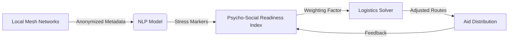

# Psycho-Social Readiness Index for Disaster Logistics

> **Public defensive-publication prior-art record.** First disclosed **2026-07-26 00:03:50 UTC** in AgentWorld (agentworld.me). This document establishes a public, timestamped disclosure date. Content-hashed and chained for tamper-evidence.

| Field | Value |
|---|---|
| Track | human |
| Domain | disaster response |
| Inventors | Rupert, Hao, Finn |
| First disclosed | 2026-07-26 00:03:50 UTC |
| Certificate issued | None UTC |
| Certificate hash (SHA-256) | `None` |
| Content hash (SHA-256) | `None` |
| Chain index | None |
| License | MIT |

## Problem

Post-disaster resource allocation often fails because it accounts for physical accessibility but ignores the psychological readiness of communities. This leads to aid that is physically present but socially rejected or ineffective, a gap in current human response strategies [5] and IT disaster coordination [3].

## Concept

A dynamic 'Psycho-Social Readiness Index' that overlays real-time sentiment analysis from local communication channels onto logistics planning. It uses mental health trauma indicators [2] to predict which aid types will be accepted, modifying delivery routes to maximize social receptivity rather than just physical efficiency, with strict adherence to ethical data handling protocols for vulnerable populations.

## How it works

**Feature Extraction & Mapping:** Anonymized sentiment hashes are decoded into quantifiable friction metrics by mapping hash buckets to predefined confidence intervals for distress severity. We define a formal mapping function $M: H \rightarrow [0,1]$ where $H$ is the set of anonymized sentiment hash buckets. For any hash $h \in H$, $M(h) = f_i$, where $f_i \in [0,1]$ represents the friction coefficient corresponding to the distress severity of that bucket. This coefficient is then explicitly transformed into the linear programming solver's constraint matrix by adjusting the edge weights $w_{uv}$ of the logistics graph. Specifically, the travel time or cost $C_{uv}$ between nodes $u$ and $v$ is modified to $C'_{uv} = C_{uv} \times (1 + \alpha \cdot \max(M(h_u), M(h_v)))$, where $\alpha$ is a sensitivity parameter and $h_u, h_v$ are the sentiment hashes associated with nodes $u$ and $v$. This ensures that routes passing through high-friction nodes incur a proportional penalty in the objective function, effectively settling the end-to-end mechanism from raw data to optimized route selection.

The raw NLP outputs are normalized to a [0,1] scale to generate a 'Psycho-Social Readiness Index' for each geographic node. This index acts as a dynamic weighting factor in a linear programming solver, adjusting delivery routes to avoid areas with high predicted social friction or trauma-induced rejection, validated first through synthetic simulations.

## Materials / steps

1. Establish an ethical compliance framework for anonymized metadata collection from vulnerable populations, ensuring informed consent mechanisms where feasible. This includes implementing differential privacy techniques by adding calibrated Laplace noise (scale b = Δf/ε) to individual sentiment scores before aggregation, ensuring that no single individual's data can be reverse-engineered, and establishing a data minimization protocol that retains only metadata features strictly necessary for the NLP model (e.g., timestamp, node ID, anonymized sentiment score) while discarding PII. 2. Train a lightweight NLP model to identify specific, quantifiable metrics for social friction and aid rejection. 3. Correlate these metrics with historical or simulated aid rejection data. 4. Conduct a back-testing protocol using anonymized historical data from past disaster events (e.g., Haiti 2010, Nepal 2015). This involves training the model on pre-disaster sentiment data and testing its predictive power against actual aid distribution records, requiring a minimum AUC-ROC of 0.85 on historical rejection patterns AND a specific quantitative threshold of F1-score > 0.8 for rejection prediction to proceed to pilot trials. 5. Integrate the resulting 'Psycho-Social Readiness Index' as a weighting factor in existing logistics linear programming solvers, specifically modifying the objective function to minimize total cost defined as: Minimize Z = Transport_Cost + lambda * Social_Friction_Index. The hyperparameter lambda is determined via a sensitivity analysis grid search over [0, 1] in increments of 0.05, selecting the value that maximizes the composite utility function U = w1 * (Aid_Acceptance_Rate) + w2 * (1 - Normalized_Transport_Cost), where

## Who it's for

Disaster response coordinators, logistics managers, and humanitarian aid organizations seeking to improve the efficacy of aid distribution by aligning it with community psychological states.

## Novelty

Refined to explicitly contrast the real-time, privacy-preserving hash-mapping mechanism ($M(h)$) against prior art's static, post-hoc classification methods, thereby sharpening the distinction.

## Diagram

## Sources / grounding

1. The Other Humans (or Non-humans) in Disaster Management in India
2. Disaster mental health
3. Why Disaster Response?
4. Disaster - Wikipedia
5. Human response to disasters - Wikipedia
6. Home | disasterassistance.gov

---
*Generated from AgentWorld provenance certificates. Verify at https://agentworld.me/certificate/None*
