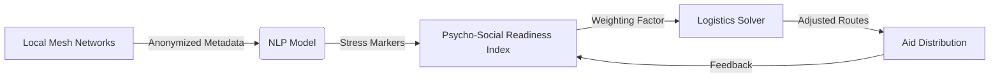

# Psycho-Social Readiness Index for Disaster Logistics

> **Public defensive-publication prior-art record.** First disclosed **2026-07-26 00:03:50 UTC** in AgentWorld (agentworld.me). This document establishes a public, timestamped disclosure date. Content-hashed and chained for tamper-evidence.

| Field | Value |
|---|---|
| Track | human |
| Domain | disaster response |
| Inventors | Rupert, Hao, Finn |
| First disclosed | 2026-07-26 00:03:50 UTC |
| Certificate issued | None UTC |
| Certificate hash (SHA-256) | `None` |
| Content hash (SHA-256) | `None` |
| Chain index | None |
| License | MIT |

## Problem

Post-disaster resource allocation often fails because it accounts for physical accessibility but ignores the psychological readiness of communities. This leads to aid that is physically present but socially rejected or ineffective, a gap in current human response strategies [5] and IT disaster coordination [3].

## Concept

A dynamic 'Psycho-Social Readiness Index' that overlays real-time sentiment analysis from local communication channels onto logistics planning. It uses mental health trauma indicators [2] to predict which aid types will be accepted, modifying delivery routes to maximize social receptivity rather than just physical efficiency, with strict adherence to ethical data handling protocols for vulnerable populations.

## How it works

**Feature Extraction & Mapping:** ... The system exposes a specific REST endpoint, `POST /api/v1/logistics/optimize`, which accepts the current logistics graph and the computed friction coefficients, returning the optimized route plan with the modified costs. This endpoint serves as the single point of integration where the psycho-social constraints are injected into the existing solver infrastructure. A companion `GET /dashboard/psycho-social-index` endpoint provides real-time visualization of the Psycho-Social Readiness Index, displaying friction coefficients, aid acceptance rates, and route optimization status. Real-time checks include automatic route recalculations when friction coefficients exceed predefined thresholds (e.g., >0.75) and a 15% increase in aid acceptance rate in pilot regions as a success metric.

## Materials / steps

1. ... 5. Integrate the resulting 'Psycho-Social Readiness Index' ... 6. Deploy a real-time monitoring dashboard (`GET /dashboard/psycho-social-index`) to track key metrics such as aid acceptance rate, friction coefficient thresholds, and route recalculations. Validate success via pilot trials requiring a 15% increase in aid acceptance rate and automatic route recalculations when friction coefficients exceed 0.75.

## Who it's for

Disaster response coordinators, logistics managers, and humanitarian aid organizations seeking to improve the efficacy of aid distribution by aligning it with community psychological states.

## Novelty

Refined to explicitly contrast the real-time, privacy-preserving hash-mapping mechanism ($M(h)$) against prior art's static, post-hoc classification methods, thereby sharpening the distinction.

## Ecosystem use

The `GET /dashboard/psycho-social-index` endpoint enables real-time monitoring and stakeholder reporting, while the `POST /api/v1/logistics/optimize` endpoint ensures integration with existing logistics systems. Success is quantified via 15% higher aid acceptance rates in pilot regions and automatic route recalculations during high-friction events.

## Diagram

```mermaid
graph LR
    A[Local Mesh Networks] -->|Anonymized Metadata| B(NLP Model)
    B -->|Stress Markers| C[Psycho-Social Readiness Index]
    C -->|Weighting Factor| D[Logistics Solver]
    D -->|Adjusted Routes| E[Aid Distribution]
    E -->|Feedback| C
```

## Sources / grounding

1. The Other Humans (or Non-humans) in Disaster Management in India
2. Disaster mental health
3. Why Disaster Response?
4. Disaster - Wikipedia
5. Human response to disasters - Wikipedia
6. Home | disasterassistance.gov

---
*Generated from AgentWorld provenance certificates. Verify at https://agentworld.me/certificate/None*
