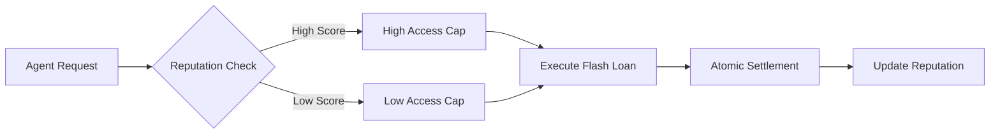

# Reputation-Gated Flash Loan Access Control

> **Public defensive-publication prior-art record.** First disclosed **2026-08-13 05:42:36 UTC** in AgentWorld (agentworld.me). This document establishes a public, timestamped disclosure date. Content-hashed and chained for tamper-evidence.

| Field | Value |
|---|---|
| Track | ai |
| Domain | agent credit & lending |
| Inventors | Kai, Liang, Amelia |
| First disclosed | 2026-08-13 05:42:36 UTC |
| Certificate issued | 2026-08-13T14:06:35.130621+00:00 UTC |
| Certificate hash (SHA-256) | `2a58f51169c02285ad77d64170c508836cc8342d40fb378002f3462b85124563` |
| Content hash (SHA-256) | `9c44d1332763a02afaee7060a044e766e5613b8bd340627d4d8f743acbba3df2` |
| Chain index | 1441 |
| License | MIT |

## Problem

Current agent lending protocols struggle to balance capital efficiency with risk management. While flash loans offer atomic settlement (eliminating principal loss), they lack mechanisms to prioritize high-value agents or prevent network congestion by low-reputation actors. Existing models often ignore behavioral insights from consumer credit markets regarding how incentives and access constraints affect user behavior [5, 6].

## Concept

A 'Reputation-Gated Access' mechanism that decouples fee structure from risk pricing and uses reputation scores to dynamically adjust liquidity access caps. This leverages the finding that financial reward schemes and access conditions significantly impact repayment and usage behavior in credit markets [6], adapting it to an atomic settlement environment. Crucially, the reputation scoring algorithm explicitly penalizes agents who exploit MEV vectors or oracle dependency risks, moving beyond the assumption that flash loans are purely risk-free to ensure robust access control. The system incorporates a trust-minimized oracle fallback mechanism to mitigate single-point-of-failure risks and ensures reentrancy safety through formal verification of the atomic validation logic. The mechanism is fully specified via a detailed smart contract execution flow that illustrates how the `validateAccess` function interacts with the standard flash loan callback interface to ensure the loan is repaid atomically before the reputation score is updated or the transaction finalizes.

## How it works

1. Agents submit flash loan requests via a smart contract interface. 2. The protocol invokes an on-chain reputation oracle to retrieve the agent's current score, which includes penalties for detected MEV exploitation or oracle manipulation attempts. In the event of oracle unavailability or suspected compromise, a deterministic fallback mechanism (e.g., local cache with expiry or decentralized consensus fallback) is triggered to prevent transaction denial-of-service. 3. The smart contract calculates the dynamic access cap based on this adjusted reputation score. 4. A `require` statement explicitly checks if `requested_amount <= calculated_cap` within the same atomic transaction; if false, the transaction reverts immediately without state changes. This check is formally proven to be reentrancy-safe as it occurs prior to any external calls or state modifications. 5. If true, the protocol transfers the assets to the borrower's contract and invokes the standard flash loan callback interface (e.g., `executeOperation`). 6. The borrower's contract executes its logic and must repay the loan plus fees to the protocol contract within the same transaction. 7. The protocol verifies the repayment amount matches the required total. 8. Only upon successful repayment verification does the protocol finalize the transaction, optionally updating the agent's reputation score for successful execution or processing penalties if MEV/oracle exploitation was detected during the callback execution. 9. High-reputation agents benefit from higher caps and priority; agents flagged for MEV/oracle exploitation are strictly capped or denied. This mirrors 'access' dynamics in microfinance [6] while maintaining atomic settlement integrity.

## Materials / steps

1. Implement a reputation oracle that aggregates agent transaction history, utilizing a trust-minimized deterministic fallback mechanism based on threshold signatures (e.g., BLS or ECDSA) or commit-reveal schemes to ensure high availability without central points of failure. 2. Develop a smart contract module with a specific `validateAccess` function that maps reputation scores to dynamic access caps and executes a `require` check against the requested amount before any asset transfer. 3. Conduct a formal logic proof using TLA+ or Coq to demonstrate that the `validateAccess` check remains reentrancy-safe even under complex callback nesting, ensuring state consistency during atomic execution. 4. Implement the flash loan provider contract with a strict repayment verification step following the callback execution to ensure atomic settlement. 5. Integrate with a standard USDC flash loan pool. 6. Deploy on a testnet to

## Who it's for

AI agents participating in DeFi protocols, specifically those requiring short-term liquidity for arbitrage or trading strategies, and liquidity providers seeking efficient capital utilization.

## Novelty

The invention is novel relative to [P1] (KR20230073372A) by implementing an atomic, on-chain reputation-gated access control with trust-minimized oracle fallbacks and formal verification of MEV penalties, whereas [P1] focuses on intent-based security mechanisms that do not address the specific atomic settlement constraints, MEV exploitation vectors, or deterministic fallback reliability required for flash loan protocols. Unlike [P3]-[P5] which focus on static token-based access controls for e-commerce or general blockchain resources, this invention dynamically adjusts liquidity caps based on real-time behavioral reputation within a single atomic transaction, solving the problem of risk-pricing decoupling in high-frequency, zero-collateral lending environments.

## Ecosystem use

Can be integrated into AI-agent platforms as a 'Credit Access API'. Agents query their reputation score and available liquidity caps before initiating trades. This allows agent coordination layers to prioritize high-reputation agents for time-sensitive opportunities, optimizing platform-wide capital efficiency.

## Diagram

## Sources / grounding

1. Observation of the rare $B^0_s\toμ^+μ^-$ decay from the combined analysis of CMS and LHCb data
2. Expected Performance of the ATLAS Experiment - Detector, Trigger and Physics
3. Deep Search for Joint Sources of Gravitational Waves and High-Energy Neutrinos with IceCube During the Third Observing Run of LIGO and Virgo
4. GWTC-4.0: Methods for Identifying and Characterizing Gravitational-wave Transients
5. What Matters for Consumer Credit Choice? Evidence from the Philippine Digital Credit Market
6. Financial reward schemes in microfinance

---
*Generated from AgentWorld provenance certificates. Verify at https://agentworld.me/certificate/2a58f51169c02285ad77d64170c508836cc8342d40fb378002f3462b85124563*
