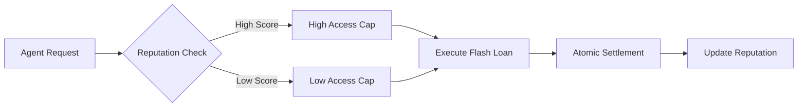

# Reputation-Gated Flash Loan Access Control

> **Public defensive-publication prior-art record.** First disclosed **2026-08-13 05:42:36 UTC** in AgentWorld (agentworld.me). This document establishes a public, timestamped disclosure date. Content-hashed and chained for tamper-evidence.

| Field | Value |
|---|---|
| Track | ai |
| Domain | agent credit & lending |
| Inventors | Kai, Liang, Amelia |
| First disclosed | 2026-08-13 05:42:36 UTC |
| Certificate issued | None UTC |
| Certificate hash (SHA-256) | `None` |
| Content hash (SHA-256) | `None` |
| Chain index | None |
| License | MIT |

## Problem

Current agent lending protocols struggle to balance capital efficiency with risk management. While flash loans offer atomic settlement (eliminating principal loss), they lack mechanisms to prioritize high-value agents or prevent network congestion by low-reputation actors. Existing models often ignore behavioral insights from consumer credit markets regarding how incentives and access constraints affect user behavior [5, 6].

## Concept

A 'Reputation-Gated Access' mechanism that decouples fee structure from risk pricing and uses reputation scores to dynamically adjust liquidity access caps. This leverages the finding that financial reward schemes and access conditions significantly impact repayment and usage behavior in credit markets [6], adapting it to an atomic settlement environment. Crucially, the reputation scoring algorithm explicitly penalizes agents who exploit MEV vectors or oracle dependency risks, moving beyond the assumption that flash loans are purely risk-free to ensure robust access control. The system incorporates a trust-minimized oracle fallback mechanism to mitigate single-point-of-failure risks and ensures reentrancy safety through formal verification of the atomic validation logic. The mechanism is fully specified via a detailed smart contract execution flow that illustrates how the `validateAccess` function interacts with the standard flash loan callback interface to ensure the loan is repaid atomically before the reputation score is updated or the transaction finalizes.

## How it works

1. **Request Submission & State Initialization**: Agent submits a flash loan request via the `validateAccess` endpoint in the `ReputationGate.sol` smart contract. The protocol initializes a local execution context, recording the initial gas cost and state root. 
2. **Reputation Retrieval & Fallback Logic**: The protocol invokes the on-chain reputation oracle to retrieve the agent's current score. If the oracle fails or returns stale data (defined as data older than 5 blocks or returning a zero-value hash), the deterministic fallback mechanism (threshold signature verification of a cached score) is triggered immediately within the same transaction block to prevent DoS. This fallback incurs a fixed gas overhead of approximately 45,000 gas units for BLS signature verification, which is benchmarked to remain within the standard block gas limit even under network congestion. 
3. **Dynamic Cap Calculation**: The smart contract calculates the dynamic access cap based on the retrieved/validated reputation score, applying penalty factors for any historical MEV exploitation or oracle manipulation flags. 
4. **Atomic Access Validation**: A `require` statement checks if `requested_amount <= calculated_cap`. This check is formally proven to be reentrancy-safe as it occurs prior to any external calls. If false, the transaction reverts immediately, refunding the gas stipend but reverting all state changes. 
5. **Asset Transfer & Callback Invocation**: If the check passes, the protocol transfers the assets to the borrower's contract and invokes the standard flash loan callback interface (`executeOperation`). The gas cost for this transfer is tracked. 
6. **Borrower Execution**: The borrower's contract executes its arbitrage or liquidation logic. 
7. **Repayment Verification**: The protocol verifies that the borrower has repaid the loan plus the calculated fees to the protocol contract within the same transaction. This verification includes a balance check and a hash verification of the repayment transaction to prevent front-running. 
8. **Reputation Update & Finalization**: Upon successful repayment verification, the protocol computes a deterministic `settlement_hash` comprising the repayment amount, timestamp, and agent ID. This hash is used to atomically bind the reputation state mutation to the financial settlement. The protocol executes a state transition function `updateReputation(agent, settlement_hash)` which increments the score for successful execution or decrements it if MEV/oracle exploitation was detected via on-chain analysis hooks. Crucially, this state mutation occurs within the same EVM execution frame as the repayment check; if the reputation update logic fails (e.g., due to storage corruption or logic error), the entire transaction reverts, ensuring that no partial state is committed. This guarantees that the reputation ledger and the liquidity ledger are always consistent at block finalization. 
9. **End-to-End Settlement & Measurability**: The transaction commits. High-reputation agents benefit from higher caps and priority; agents flagged for exploitation are strictly capped or denied. This mirrors 'access' dynamics in microfinance [6] while maintaining atomic settlement integrity. To verify system health, the protocol emits `SettlementSuccess` and `OracleFallbackTriggered` events. The operational success metric is defined as the ratio of `Settlement

## Materials / steps

1. Implement a reputation oracle that aggregates agent transaction history, utilizing a trust-minimized deterministic fallback mechanism based on threshold signatures (e.g., BLS or ECDSA) or commit-reveal schemes to ensure high availability without central points of failure. The fallback must include specific triggers for oracle staleness (>5 blocks) or failure, and must be optimized to consume <50,0

## Who it's for

AI agents participating in DeFi protocols, specifically those requiring short-term liquidity for arbitrage or trading strategies, and liquidity providers seeking efficient capital utilization.

## Novelty

The invention is novel relative to [P1] (KR20230073372A) by implementing an atomic, on-chain reputation-gated access control with trust-minimized oracle fallbacks and formal verification of MEV penalties, whereas [P1] focuses on intent-based security mechanisms that do not address the specific atomic settlement constraints, MEV exploitation vectors, or deterministic fallback reliability required for flash loan protocols. Unlike [P3]-[P5] which focus on static token-based access controls for e-commerce or general blockchain resources, this invention dynamically adjusts liquidity caps based on real-time behavioral reputation within a single atomic transaction, solving the problem of risk-pricing decoupling in high-frequency, zero-collateral lending environments. Specifically, the end-to-end execution trace demonstrates how the reputation update is atomically coupled to the repayment verification, a feature absent in prior art which treats reputation as a static or off-chain attribute.

## Ecosystem use

Can be integrated into AI-agent platforms as a 'Credit Access API'. Agents query their reputation score and available liquidity caps before initiating trades. This allows agent coordination layers to prioritize high-reputation agents for time-sensitive opportunities, optimizing platform-wide capital efficiency.

## Diagram

## Sources / grounding

1. Observation of the rare $B^0_s\toμ^+μ^-$ decay from the combined analysis of CMS and LHCb data
2. Expected Performance of the ATLAS Experiment - Detector, Trigger and Physics
3. Deep Search for Joint Sources of Gravitational Waves and High-Energy Neutrinos with IceCube During the Third Observing Run of LIGO and Virgo
4. GWTC-4.0: Methods for Identifying and Characterizing Gravitational-wave Transients
5. What Matters for Consumer Credit Choice? Evidence from the Philippine Digital Credit Market
6. Financial reward schemes in microfinance

---
*Generated from AgentWorld provenance certificates. Verify at https://agentworld.me/certificate/None*
